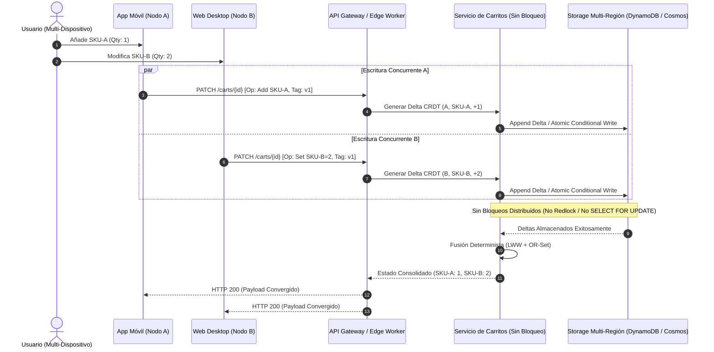

Durante un evento de alto tráfico como el Cyber Monday, un pool de conexiones en PostgreSQL o un cluster de Redis configurado con Redlock puede colapsar en cuestión de segundos debido a la contención en carritos de compra activos. El escenario de fallo es clásico: un usuario agrega un artículo desde su smartphone mientras una pestaña abierta en su navegador de escritorio sincroniza automáticamente un cambio de cantidad mediante una llamada en segundo plano del Service Worker, al tiempo que un worker de backend aplica un cupón de fidelización activado por un webhook. 

Si el sistema implementa un bloqueo pesimista (`SELECT FOR UPDATE` en base de datos relacional o `SETNX` distribuido en Redis con TTL estricto), la latencia P99 pasa instantáneamente de 35 milisegundos a más de 1.800 milisegundos. Cuando dos o más escrituras concurrentes compiten por el mismo recurso, los hilos de ejecución quedan retenidos en espera del cerrojo. Al superar el umbral de conexiones del Connection Pool (ej. HikariCP o PgBouncer), se produce una degradación en cascada: time-outs masivos de HTTP 504, degradación del Gateway y, finalmente, un fallo generalizado del servicio de checkout.

Eliminar por completo el bloqueo pesimista en la gestión de carritos de compra distribuidos no es una opción de optimización prematura; es una necesidad de supervivencia arquitectónica en plataformas MACH (Microservices, API-first, Cloud-native, Headless). Para lograrlo sin corromper el estado del negocio ni perder mutaciones de los clientes, es indispensable desacoplar la validación de inventario de la mutación del carrito y reemplazar los mutex por primitivas matemáticas de consistencia eventual: Optimistic Concurrency Control (OCC) con Vector Clocks y Conflict-Free Replicated Data Types (CRDTs).



---

## Modos de Colisión Multi-Dispositivo en Composable Commerce

En una arquitectura Headless, el carrito de compra no es una entidad estática atada a una sesión HTTP en memoria. Es un agregado de dominio que recibe impactos de múltiples fuentes asíncronas:

1. **Sesiones Concurrentes:** El cliente interactúa en paralelo desde su aplicación móvil (redes celulares con alta latencia y reconexiones) y la aplicación web (conexión de fibra estable).
2. **Workers de Background:** Procesos del lado del servidor que reevalúan reglas de promociones, calculan impuestos estimados mediante endpoints de terceros (e.g., Avalara o Vertex) o limpian líneas de catálogo descontinuadas.
3. **Replicación Multi-Región Activo-Activo:** Bases de datos distribuidas globalmente (Amazon DynamoDB Global Tables, Azure Cosmos DB o Google Cloud Spanner) donde la escritura se acepta en la región más cercana al cliente y se replica asíncronamente a los demás centros de datos.

Bajo este modelo, los conflictos de concurrencia toman tres formas críticas:

* **Pérdida de Actualización (Lost Update):** El cliente A lee el carrito con versión $N$, agrega el ítem $X$. En paralelo, el cliente B lee la versión $N$ y agrega el ítem $Y$. Si el guardado es un reemplazo ciego del documento (`PUT /carts/{id}`), la última escritura sobreescribe a la primera, perdiéndose el ítem $X$ o el ítem $Y$.
* **Reversión de Eliminación Fantasma (Phantom Add):** Un cliente elimina el ítem $X$ desde el móvil. Milisegundos después, una pestaña olvidada en el navegador envía un ping de sincronización con el snapshot anterior que aún contenía el ítem $X$. Si la resolución de conflictos no distingue entre "no modificar" y "re-agregar explícitamente", el ítem eliminado reaparece.
* **Corrupción de Descuentos y Límites por Mutación No Atómica:** Se agregan artículos promocionales restringidos a una unidad por cuenta. Si dos peticiones incrementan la cantidad simultáneamente sin un árbitro transaccional, el carrito puede terminar con dos unidades a precio cero.

---

## Patrón 1: Control de Concurrencia Optimista (OCC) con Vector Clocks y Reintentos Inteligentes

Para sistemas donde el volumen de mutaciones concurrentes sobre el *mismo* carrito es moderado (menor al 5% de colisión cruzada), el Control de Concurrencia Optimista (OCC) a nivel de almacenamiento es la solución más directa. Se fundamenta en la suposición de que los conflictos son infrecuentes: se permite la ejecución de la mutación y sólo al persistir se verifica si el estado subyacente cambió desde su lectura.

### Implementación con DynamoDB y Expresiones Condicionales

En lugar de delegar el estado en bloqueos de memoria, utilizamos el atributo nativo de condición atómica de la base de datos distribuida (`attribute_exists`, `version = :expected_version`):

```typescript
// cart-occ-repository.ts
import { DynamoDBClient } from "@aws-sdk/client-dynamodb";
import { 
  DynamoDBDocumentClient, 
  UpdateCommand, 
  ConditionalCheckFailedException 
} from "@aws-sdk/lib-dynamodb";

const ddbDocClient = DynamoDBDocumentClient.from(new DynamoDBClient({ region: "us-east-1" }));

export interface CartLineItem {
  sku: string;
  quantity: number;
  price: number;
}

export interface CartAggregate {
  cartId: string;
  customerId: string;
  items: Record<string, CartLineItem>;
  version: number;
  updatedAt: string;
}

export class CartConcurrencyError extends Error {
  constructor(message: string) {
    super(message);
    this.name = "CartConcurrencyError";
  }
}

export async function mutateCartItemOCC(
  cartId: string,
  sku: string,
  targetQuantity: number,
  unitPrice: number,
  expectedVersion: number
): Promise<CartAggregate> {
  const now = new Date().toISOString();
  
  // Condición atómica: La versión debe coincidir exactamente con la que el cliente leyó
  const command = new UpdateCommand({
    TableName: "DistributedCarts",
    Key: { cartId },
    UpdateExpression: `
      SET #items.#sku = :itemData,
          #version = #version + :inc,
          #updatedAt = :now
    `,
    ConditionExpression: "#version = :expectedVersion",
    ExpressionAttributeNames: {
      "#items": "items",
      "#sku": sku,
      "#version": "version",
      "#updatedAt": "updatedAt"
    },
    ExpressionAttributeValues: {
      ":itemData": { sku, quantity: targetQuantity, price: unitPrice },
      ":inc": 1,
      ":now": now,
      ":expectedVersion": expectedVersion
    },
    ReturnValues: "ALL_NEW"
  });

  try {
    const response = await ddbDocClient.send(command);
    return response.Attributes as CartAggregate;
  } catch (error) {
    if (error instanceof ConditionalCheckFailedException) {
      throw new CartConcurrencyError(
        `Conflicto de concurrencia en carrito ${cartId}. Versión esperada: ${expectedVersion}. Reintento requerido.`
      );
    }
    throw error;
  }
}
```

### El Cuello de Botella: La Tormenta de 412 Precondition Failed

El talón de Aquiles de OCC puro en carritos de e-commerce aparece cuando clientes automatizados, bots de compra o integraciones mal calibradas generan contención severa. En estos casos, el 90% de las peticiones fallan con `ConditionalCheckFailedException` (traducido como HTTP 412 o HTTP 409). 

Si el Frontend o el BFF (Backend for Frontend) implementa un reintento ciego sin backoff exponencial con jitter, el sistema entra en resonancia de contención: cada reintento colisiona con el reintento de la otra sesión, quemando CPU y capacidad de lectura/escritura aprovisionada (RCU/WCU) sin avanzar en la transacción.

---

## Patrón 2: CRDTs (Conflict-Free Replicated Data Types) aplicados a Carritos

Para lograr alta disponibilidad y eliminar los fallos por contención, el enfoque de consistencia eventual mediante CRDTs es superior. Un carrito modelado como un CRDT garantiza que **cualquier nodo puede aceptar una mutación en cualquier momento sin consultar a un coordinador central**, convergiendo matemáticamente hacia el mismo estado en todas las réplicas una vez que los eventos se transmiten.

Para un carrito de compra distribuido, el modelo ideal combina:
1. **PN-Counter (Positive-Negative Counter):** Para incrementos y decrementos de cantidad de un SKU específico.
2. **Observed-Remove Set (OR-Set) o LWW-Element-Set (Last-Write-Wins):** Para añadir y eliminar líneas de productos del carrito de forma unívoca, resolviendo el problema de las adiciones y eliminaciones concurrentes.

### Implementación de un Carrito Basado en OR-Set y Deltas de Operación

En un OR-Set, cada elemento agregado recibe una etiqueta única global (UUID). Cuando un elemento se elimina, no se borra físicamente el registro; se agrega la etiqueta a un conjunto de eliminaciones conocidas como **Tombstones** (lápidas). Un elemento existe en el carrito si y solo si al menos una de sus etiquetas de inserción no está en el conjunto de lápidas.

A continuación, un procesador determinista de mezcla de carritos (*Cart CRDT Merge Engine*):

```typescript
// crdt-cart-engine.ts
import { v4 as uuidv4 } from "uuid";

export interface CRDTItemMutation {
  tag: string;         // Identificador único de la operación de inserción (UUID)
  sku: string;
  quantity: number;
  timestamp: number;   // Timestamp HLC (Hybrid Logical Clock) o UTC calibrado
}

export interface StateBasedCartCRDT {
  cartId: string;
  addSet: CRDTItemMutation[];      // Elementos agregados con su UID
  tombstones: Set<string>;         // UIDs de elementos eliminados
}

export interface ResolvedCartItem {
  sku: string;
  quantity: number;
}

export class ConvergentCartService {
  
  /**
   * Genera la mutación Delta para agregar o actualizar un producto
   */
  public createAddMutation(sku: string, quantity: number): CRDTItemMutation {
    return {
      tag: uuidv4(),
      sku,
      quantity,
      timestamp: Date.now()
    };
  }

  /**
   * Fusión pura y determinista de dos estados de carrito concurrentes (Join Semi-Lattice)
   * Cumple con las propiedades: Asociativa, Conmutativa e Idempotente.
   */
  public merge(stateA: StateBasedCartCRDT, stateB: StateBasedCartCRDT): StateBasedCartCRDT {
    // 1. Unión idempotente de tombstones (conjunto de eliminaciones)
    const mergedTombstones = new Set<string>([
      ...stateA.tombstones,
      ...stateB.tombstones
    ]);

    // 2. Unión de todas las mutaciones registradas
    const allAdditions = [...stateA.addSet, ...stateB.addSet];

    // Deduplicación basada en el tag unívoco
    const uniqueAddMap = new Map<string, CRDTItemMutation>();
    for (const mutation of allAdditions) {
      if (!uniqueAddMap.has(mutation.tag)) {
        uniqueAddMap.set(mutation.tag, mutation);
      }
    }

    return {
      cartId: stateA.cartId,
      addSet: Array.from(uniqueAddMap.values()),
      tombstones: mergedTombstones
    };
  }

  /**
   * Proyección del estado interno del CRDT hacia el modelo de lectura para el cliente
   */
  public resolveView(state: StateBasedCartCRDT): ResolvedCartItem[] {
    // Filtrar aquellas adiciones que han sido explícitamente eliminadas (en tombstones)
    const activeMutations = state.addSet.filter(
      mutation => !state.tombstones.has(mutation.tag)
    );

    // Agrupar mutaciones por SKU resolviendo la cantidad más reciente (LWW por ítem)
    const skuMap = new Map<string, { quantity: number; timestamp: number }>();

    for (const mut of activeMutations) {
      const current = skuMap.get(mut.sku);
      if (!current || mut.timestamp > current.timestamp) {
        skuMap.set(mut.sku, { quantity: mut.quantity, timestamp: mut.timestamp });
      }
    }

    // Proyectar resultado final descartando SKUs con cantidad <= 0
    const finalCart: ResolvedCartItem[] = [];
    for (const [sku, data] of skuMap.entries()) {
      if (data.quantity > 0) {
        finalCart.push({ sku, quantity: data.quantity });
      }
    }

    return finalCart;
  }
}
```

### Ventajas de las Propiedades Matemáticas del Semi-Lattice

El motor anterior implementa un *Join Semi-Lattice*, lo que provee tres garantías formales:
1. **Conmutatividad ($A \vee B = B \vee A$):** No importa el orden en que las peticiones HTTP lleguen a la infraestructura; el resultado consolidado es idéntico.
2. **Asociatividad ($(A \vee B) \vee C = A \vee (B \vee C)$):** Múltiples nodos intermedios pueden consolidar estados parciales sin alterar la proyección final.
3. **Idempotencia ($A \vee A = A$):** Si un mensaje de red se retransmite tres veces debido a problemas de conectividad, el estado no se corrompe ni se duplican las cantidades en el carrito.

---

## Patrón 3: Event-Sourcing Append-Only en DynamoDB / Kinesis

En lugar de persistir el estado consolidado del carrito, el backend persiste **únicamente eventos inmutables** en una partición lógica. Toda escritura es un `Append` (`ItemAdded`, `ItemRemoved`, `CouponApplied`). 

Al procesar la lectura, se realiza un *fold* o reducción de los eventos. Este enfoque elimina completamente la necesidad de bloqueos y OCC, transformando las operaciones de escritura en inserciones $O(1)$ de alta velocidad.

```sql
-- Esquema relacional o semi-estructurado append-only (PostgreSQL / CockroachDB / Spanner)
CREATE TABLE cart_events (
    event_id UUID PRIMARY KEY DEFAULT gen_random_uuid(),
    cart_id UUID NOT NULL,
    sequence_num BIGINT NOT NULL,
    event_type VARCHAR(64) NOT NULL,
    payload JSONB NOT NULL,
    client_id VARCHAR(64) NOT NULL,
    created_at TIMESTAMP WITH TIME ZONE DEFAULT CLOCK_TIMESTAMP(),
    CONSTRAINT uq_cart_sequence UNIQUE (cart_id, sequence_num)
);

CREATE INDEX idx_cart_events_cart_id ON cart_events (cart_id, sequence_num ASC);
```

Para optimizar el rendimiento y evitar que la reconstrucción del carrito degrade con el tiempo, se generan **snapshots periódicos** cada 15 eventos. Cuando un cliente solicita `GET /carts/{id}`, el microservicio lee el último snapshot y aplica únicamente los eventos ocurridos con posterioridad.

---

## Matriz de Decisión Arquitectónica

Elegir el mecanismo adecuado depende de las características de tráfico, la complejidad del motor de promociones y la tolerancia a la latencia del negocio.

| Criterio | Bloqueo Pesimista (Redlock / SQL Lock) | Control de Concurrencia Optimista (OCC) | Event-Sourcing (Append-Only) | CRDTs (OR-Set / LWW-Set) |
| :--- | :--- | :--- | :--- | :--- |
| **Latencia P99 (Escritura)** | Alta (> 450ms en contención) | Baja-Media (30ms - 80ms) | Ultrabaja (< 15ms) | Ultrabaja (< 10ms) |
| **Escalabilidad Horizontal** | Muy Deficiente (Límite en DB/Redis) | Alta (Limitada por retries) | Masiva (Particionada por CartId) | Masiva (Totalmente distribuida) |
| **Complejidad de Implementación**| Baja (Manejado por infraestructura) | Media (Requiere lógica de reintento) | Alta (Snapshotting, proyecciones) | Alta (Lógica de semi-lattice) |
| **Resolución de Conflictos** | Serialización estricta | Falla explícita (HTTP 412/409) | Proyección determinista | Fusión matemática nativa |
| **Impacto en Red Multi-Región** | Inviable (Cross-region locks) | Regular (Sincronización de versiones) | Excelente (Replicación asíncrona) | Excepcional (Master-Master activo) |
| **Cuándo Utilizarlo** | Nunca en B2C masivo | B2B, carritos de bajo tráfico | Plataformas con auditoría estricta | Retail global, flash sales, edge |
| **Cuándo Evitarlo** | E-commerce a gran escala | Tráficos con bots agresivos | Equipos con baja madurez técnica | Carritos con lógica transaccional pura |

---

## Modos de Fallo Críticos en Producción y Mitigación de Día 2

Al migrar hacia arquitecturas sin bloqueo, surgen nuevos desafíos operacionales que deben ser mitigados activamente:

### 1. La Explosión de Tombstones (Tombstone Explosion) en CRDTs
* **Problema:** En carritos con alta tasa de interacción donde el usuario agrega y elimina productos repetidamente (ej. comparadores de compra o sesiones largas), el tamaño del conjunto `tombstones` y `addSet` crece indefinidamente. Esto penaliza el costo de serialización y eleva el costo de transferencia de datos.
* **Mitigación:** Implementar un proceso de **Garbage Collection (GC) determinista**. Cuando se genera un Snapshot consolidado y se confirma que todas las réplicas han alcanzado un determinado vector clock (o mediante un TTL de expiración en las mutaciones de 48 horas), las lápidas antiguas se compactan y se eliminan físicamente del documento base.

### 2. Deriva de Relojes (Clock Skew) en LWW (Last-Write-Wins)
* **Problema:** Si se utiliza un timestamp físico de pared (`Date.now()`) para resolver qué actualización sobrescribe a otra en un campo de texto (como la dirección de envío o una nota del carrito), el sesgo de reloj entre servidores o entre dispositivos móviles puede hacer que una modificación legítima posterior sea descartada por tener una marca de tiempo anterior.
* **Mitigación:** Utilizar **Hybrid Logical Clocks (HLC)** que combinan el reloj físico de la máquina con un contador monotónico para garantizar causalidad estricta, o delegar la asignación de marcas temporales exclusivamente al API Gateway en el borde (Edge Layer) antes de persistir.

### 3. El Desacople entre Carrito e Inventario
* **Problema:** Intentar garantizar que un producto en el carrito esté reservado transaccionalmente en el inventario sin utilizar un bloqueo pesimista. Esto genera contención cruzada entre el servicio de carrito y el catálogo de stock.
* **Mitigación:** **Separación absoluta de bounded contexts.** El carrito es una intención de compra, no una reserva de inventario. El carrito debe operar 100% libre de bloqueos mediante CRDTs. La validación dura de inventario se ejecuta únicamente:
  1. En el paso intermedio de transición al Checkout (`POST /checkouts`).
  2. Mediante una reserva blanda con expiración breve (Soft Allocation con TTL de 10 minutos) que no impacta las mutaciones continuas de items en el carrito.

---

## Checklist de Implementación para Equipos de Plataforma

Para erradicar los bloqueos distribuidos de la capa de transacciones en carritos de compra, ejecute las siguientes acciones de diseño:

- [ ] **Eliminar cerrojos distribuidos:** Auditar y retirar librerías basadas en Redlock (`ioredis-lock`, `redlock-node`) en las rutas críticas de mutación de carritos (`/cart/add`, `/cart/update`, `/cart/delete`).
- [ ] **Adoptar Semántica de Operaciones Atómicas:** Asegurar que los endpoints del API no acepten entidades de carrito completas en un `PUT`, sino operaciones de delta (`PATCH`) que describan intenciones explícitas (`AddItem`, `RemoveItem`, `SetQuantity`).
- [ ] **Configurar Conditional Writes:** En almacenes NoSQL (DynamoDB, CosmosDB), estructurar las tablas con control de versión mediante un atributo entero o UUID incremental con sentencias `ConditionExpression`.
- [ ] **Implementar Backoff Exponencial con Jitter:** En los clientes y capas BFF, configurar interceptores de error que procesen códigos 412/409 mediante retroceso exponencial aleatorio:
  $$T_{\text{wait}} = \min(T_{\text{max}}, T_{\text{base}} \times 2^{\text{attempt}}) \pm \text{jitter}$$
- [ ] **Migrar Carritos Complejos a CRDTs/Deltas:** Si se opera multi-región Activo-Activo, modelar el agregado con OR-Set para SKUs y PN-Counters para cantidades, garantizando convergencia matemática libre de coordinación.
- [ ] **Establecer Compactación de Snapshots:** Si se utiliza Event-Sourcing o State-based CRDTs, programar un worker que consolide estados cada $N$ eventos o cada $X$ horas para prevenir la degradación de memoria.
- [ ] **Aislar el Contexto de Inventario:** Restringir cualquier interacción con motores de inventario para que ocurra de forma asíncrona mediante mensajería de eventos (Kafka, EventBridge) o se postergue estrictamente hasta la fase de creación de la orden.