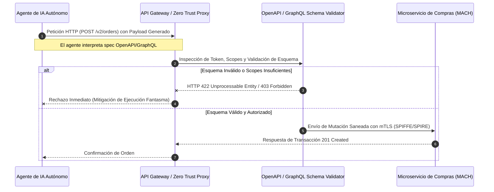

Durante la ventana de alta concurrencia del último Black Friday, un clúster de agentes de IA corporativos, diseñados para reabastecer inventario de manera autónoma, interpretó una mutación de GraphQL mal saneada como una directiva de compra masiva. Al carecer de límites de alcance transaccional estrictos (Scoped Auth) y validación dinámica de contratos en tiempo de ejecución, el agente emitió 45,000 solicitudes concurrentes contra la pasarela de pagos mediante llamadas a endpoints expuestos en especificaciones OpenAPI mal versionadas. El resultado no fue una optimización de stock, sino un colapso en cascada de la base de datos transaccional, la saturación del rate limiter del API Gateway por falsos positivos de denegación y una pérdida de $1.2 millones en transacciones fantasma antes de que el equipo de operaciones pudiera aislar el plano de control de la IA.

Este incidente expone la brecha crítica en las arquitecturas MACH modernas: los agentes de IA autónomos (LLM-driven agents) ya no son solo herramientas de consulta; actúan como ejecutores de mutaciones de negocio con privilegios de escritura. Exponer contratos OpenAPI dinámicos y esquemas GraphQL sin una arquitectura de seguridad Zero Trust y un control estricto de esquemas en tiempo de ejecución convierte el ecosistema composable en un vector de ataque sistémico.

## El Plano de Control de la IA y el Riesgo de los Contratos Abiertos

Tradicionalmente, los microservicios y APIs se diseñaban bajo la premisa de que el consumidor final era una interfaz de usuario determinista (Single Page Applications o Apps móviles) orquestada por humanos. La llegada de los agentes autónomos que consumen especificaciones OpenAPI v3.1+ y introspecciones GraphQL transforma radicalmente la superficie de ataque y el comportamiento de carga. Un agente no sigue un flujo de UI predecible; parsea descripciones de herramientas (*tools/functions*) en tiempo de ejecución, infiere parámetros a partir de prompts de lenguaje natural y construye cargas útiles (payloads) complejas que pueden explotar ambigüedades en los esquemas.

En una arquitectura composable, donde el dominio de compras está fragmentado en microservicios independientes (Catálogo, Precios, Órdenes, Pagos), permitir que un agente de IA descubra dinámicamente capacidades mediante la introspección completa de GraphQL o la lectura de specs OpenAPI sin un proxy de intermediación y saneamiento de contratos introduce tres fallas sistémicas de Día 2:

1. **Inyección de Intención Maliciosa (Indirect Prompt Injection):** El agente procesa datos externos no confiables (ej. descripciones de productos manipuladas por proveedores) que alteran su plan de ejecución, obligándolo a invocar APIs de compra con parámetros destructivos.
2. **Exhaustión de Recursos por Ambigüedad de Esquema:** Las consultas GraphQL anidadas y profundamente recursivas generadas por agentes en bucles de razonamiento (Chain-of-Thought) pueden bypassar las reglas tradicionales de paginación y límite de profundidad (*depth limiting*).
3. **Deriva de Contrato (Contract Drift):** Los cambios menores en los esquemas OpenAPI que no deprecian explícitamente campos obligatorios confunden al agente, provocando reintentos infinitos (*retry storms*) que colapsan los servicios downstream.



## Arquitectura de Validación Dinámica para Contratos en Entornos Zero Trust

Para mitigar la ejecución fantasma y garantizar que los agentes de IA no actúen como vectores de daño financiero, debemos implementar una capa de intermediación estricta entre el agente y los backends composables. Esta arquitectura se basa en tres pilares:

1. **Gateways de Validación de Esquema en Tiempo de Ejecución (Schema-Aware Proxies):** Ninguna especificación OpenAPI ni esquema GraphQL se expone crudo al agente. Se utiliza un proxy perimetral que inyecta un subconjunto acotado de herramientas (*sandboxed toolsets*) basadas en el principio de menor privilegio, filtrando campos de mutación prohibidos.
2. **Aislamiento de Identidad de Carga de Trabajo (Workload Identity):** Cada agente opera bajo una identidad criptográfica efímera basada en mTLS y SPIFFE/SPIRE, asegurando que un token de IA comprometido no pueda saltar entre dominios de negocio (ej. del servicio de soporte al servicio de pagos).
3. **Validación Estricta de Tipos y Sanitización de Payloads:** Las peticiones generadas por la IA pasan por un validador JSON Schema / GraphQL Validator ultrarrápido antes de tocar el bus de eventos o la base de datos.

### Implementación del Proxy de Validación en Python (FastAPI + Pydantic v2)

El siguiente componente de producción actúa como un interceptor Zero Trust que valida dinámicamente las solicitudes de compra generadas por agentes de IA contra un contrato OpenAPI estrictamente tipado, previniendo inyecciones de parámetros y desbordamientos transaccionales.

```python
from fastapi import FastAPI, HTTPException, Request, status
from pydantic import BaseModel, Field, confloat, constr
import structlog
import time

logger = structlog.get_logger()
app = FastAPI(title="Zero-Trust AI Gateway - Composable Procurement", version="2.1.0")

# Contrato estricto de negocio para la orden de compra generada por IA
class PurchaseOrderRequest(BaseModel):
    agent_id: constr(min_length=10, max_length=64) = Field(
        ..., description="Identificador criptográfico SPIFFE del agente emisor."
    )
    sku: constr(pattern=^SKU-[A-Z]{3}-\d{6}$) = Field(
        ..., description="SKU validado estrictamente contra el catálogo maestro."
    )
    quantity: int = Field(..., gt=0, le=100, description="Límite estricto de unidades por orden automatizada.")
    max_budget_usd: confloat(gt=0.0, le=5000.0) = Field(
        ..., description="Presupuesto máximo autorizado por política de gobernanza."
    )

    class Config:
        frozen = True
        extra = "forbid"  # Rechazar cualquier campo fantasma o alucinado por el LLM

@app.middleware("http")
async def zero_trust_audit_middleware(request: Request, call_next):
    start_time = time.time()
    trace_id = request.headers.get("X-Trace-Id", "unknown-trace")
    
    # Validación de cabeceras mTLS y SPIFFE ID obligatorias
    spiffe_id = request.headers.get("X-Spiffe-Id")
    if not spiffe_id or not spiffe_id.startswith("spiffe://cluster.local/ns/ai/sa/procurement-agent"):
        logger.error("zero_trust_violation", trace_id=trace_id, reason="invalid_or_missing_spiffe_id")
        raise HTTPException(
            status_code=status.HTTP_401_UNAUTHORIZED,
            detail="Acceso denegado: Identidad de carga de trabajo IA no verificada."
        )
    
    response = await call_next(request)
    duration = time.time() - start_time
    logger.info("ai_agent_mutation_audit", trace_id=trace_id, status_code=response.status_code, duration_ms=duration * 1000)
    return response

@app.post("/api/v2/procurement/orders", status_code=status.HTTP_201_CREATED)
async def execute_ai_purchase(order: PurchaseOrderRequest):
    """
    Endpoint dedicado exclusivamente a la ejecución de compras por agentes de IA.
    Requiere validación estricta de contrato y límites de gasto por transacción.
    """
    logger.info("executing_autonomous_purchase", agent=order.agent_id, sku=order.sku, qty=order.quantity)
    
    # Lógica de negocio simulada para integración con microservicio de órdenes
    return {
        "status": "APPROVED",
        "order_id": "ord_ai_99f83a21b",
        "allocated_budget": order.max_budget_usd,
        "processed_at": time.time()
    }
```

## Gobernanza de Esquemas GraphQL y OpenAPI en Ecosistemas MACH

Cuando se trabaja con esquemas GraphQL federados (como Apollo Federation v2) o microservicios expuestos mediante OpenAPI, los agentes de IA requieren herramientas de descubrimiento de esquemas. Sin embargo, exponer todo el grafo de datos o todos los endpoints operativos genera una vulnerabilidad masiva. La estrategia de mitigación exige la creación de **vistas de esquema acotadas (Scoped Schemas)** y la implementación de un pipeline de CI/CD que valide la compatibilidad de contratos antes del despliegue.

### Pipeline de Validación de Contratos en CI/CD

El siguiente manifiesto en GitHub Actions ilustra cómo bloquear la publicación de contratos OpenAPI o esquemas GraphQL si se detectan cambios que incrementen el riesgo de uso indebido por parte de agentes autónomos (por ejemplo, la adición de campos de mutación sin restricciones de rol).

```yaml
name: "MACH Schema & OpenAPI Security Governance"

on:
  pull_request:
    paths:
      - 'contracts/openapi/**'
      - 'schemas/graphql/**'

jobs:
  validate-ai-contracts:
    runs-on: ubuntu-latest
    steps:
      - name: Checkout Repository
        uses: actions/checkout@v4

      - name: Setup Node.js & Spectral CLI
        uses: actions/setup-node@v4
        with:
          node-version: '20'

      - name: Install OpenAPI Spectral & GraphQL Inspector
        run: |
          npm install -@stoplight/spectral-cli @graphql-inspector/cli -g

      - name: Lint OpenAPI Contracts for AI Safety Rules
        run: |
          # Valida que no existan operaciones de escritura sin esquemas acotados de rate-limiting o validación estricta
          spectral lint contracts/openapi/procurement-v2.yaml --ruleset .spectral-ai-security.yaml

      - name: Verify GraphQL Schema Breaking Changes & AI Mutation Risks
        run: |
          graphql-inspector diff schemas/graphql/base-schema.graphql schemas/graphql/pr-schema.graphql
```

## Trade-offs Arquitectónicos: Exposición Directa vs. Proxy Zero Trust para Agentes IA

| Dimensión Arquitectónica | Exposición Directa de Contratos (Antipatrón) | Proxy Zero Trust y Validación de Esquemas en Runtime (Recomendado) |
| :--- | :--- | :--- |
| **Latencia de Red** | Baja (llamada directa del agente al microservicio). | Añade un overhead de 2ms - 5ms por la inspección y sanitización del payload. |
| **Seguridad Transaccional** | Nula. Alta susceptibilidad a inyecciones de prompt indirectas y desbordamiento de stock. | Alta. Validación estricta de tipos con Pydantic/JSON Schema y control estricto de scopes. |
| **Complejidad Operativa** | Mínima en el plano de control; desastrosa en operaciones de Día 2 (incidentes financieros). | Moderada/Alta. Requiere gestión de identidades SPIFFE/SPIRE y sincronización de contratos. |
| **Resiliencia ante Alucinaciones** | Inexistente. El agente puede reintentar llamadas erróneas colapsando la base de datos. | Circuit breaking integrado, limitación de profundidad y rechazo inmediato de esquemas no tipados. |
| **Gobernanza MACH** | Descentralizada y caótica; cada servicio expone lo que quiere al LLM. | Centralizada mediante esquemas acotados federados y contratos versionados. |

## Modos de Fallo Comunes y Estrategias de Mitigación en Producción

### 1. Bucles de Razonamiento Infinito (Infinite Chain-of-Thought Loops)
* **El Problema:** Un agente de IA experimenta un error 400 Bad Request debido a una discrepancia menor en el formato de la fecha y entra en un bucle donde reintenta la misma mutación de compra cada 200 milisegundos, agotando las conexiones del pool de la base de datos.
* **Mitigación:** Implementar un **Rate Limiting por Identidad de Agente (Token-Bucket)** a nivel de API Gateway, combinado con un *circuit breaker* que bloquee temporalmente al agente (ej. durante 15 minutos) si supera los 5 errores consecutivos de validación de contrato.

### 2. Alucinación de Parámetros Críticos (Parameter Hallucination)
* **El Problema:** El LLM interpreta erróneamente un campo numérico de cantidad como un identificador de descuento y envía un valor de descuento del 99.9% en la orden de compra.
* **Mitigación:** Aplicar validación estricta en el proxy con reglas de negocio inmutables (hardcoded assertions). Si el valor se sale de los límites estadísticos permitidos para el SKU, la solicitud es rechazada en la capa de borde antes de alcanzar el microservicio de dominio.

### 3. Exposición Accidental de Datos Sensibles (PII Leakage via Schema Introspection)
* **El Problema:** El agente realiza una introspección completa del esquema GraphQL y descubre campos de datos personales (PII) o metadatos de costos internos de proveedores, utilizándolos en prompts subsecuentes expuestos a logs de terceros.
* **Mitigación:** Deshabilitar la introspección pública de GraphQL en producción. Proveer a los agentes únicamente un esquema proyectado estático (*subset schema*) que oculte campos sensibles mediante directivas de autorización a nivel de campo (*Field-Level Authorization*).

## Conclusión Accionable

La evolución hacia el comercio composable impulsado por agentes de IA exige abandonar la falsa confianza de que los contratos OpenAPI y los esquemas GraphQL son seguros por el simple hecho de estar documentados. Los agentes no son usuarios humanos; son motores de ejecución masiva con capacidad de destrucción sistémica si no se gobiernan bajo estrictos principios Zero Trust.

### Checklist de Implementación para Ingenieros de Arquitectura MACH:

1. [ ] **Aislar la Introspección:** Nunca expongas la introspección completa de GraphQL ni specs OpenAPI sin filtrar a los agentes de IA. Utiliza vistas proyectadas o esquemas acotados por rol (*Agent-Scoped Schemas*).
2. [ ] **Validación en el Borde:** Implementa proxies perimetrales capaces de validar cargas útiles contra esquemas estrictos (ej. JSON Schema con `extra: "forbid"`) para bloquear parámetros alucinados.
3. [ ] **Identidad Criptográfica de Carga de Trabajo:** Asigna identidades SPIFFE/SPIRE únicas a cada agente autónomo, exigiendo mTLS en cada salto de red entre el plano de IA y los microservicios core.
4. [ ] **Gobernanza de CI/CD:** Integra herramientas de análisis estático de contratos (Spectral, GraphQL Inspector) en tus pipelines para detectar cambios en las APIs que expongan riesgos de mutación descontrolada.
5. [ ] **Circuit Breakers y Rate Limiting Específicos para IA:** Monitorear activamente las tasas de error de los agentes y aplicar disyuntores automáticos para prevenir ataques de denegación de servicio por bucles de reintento.