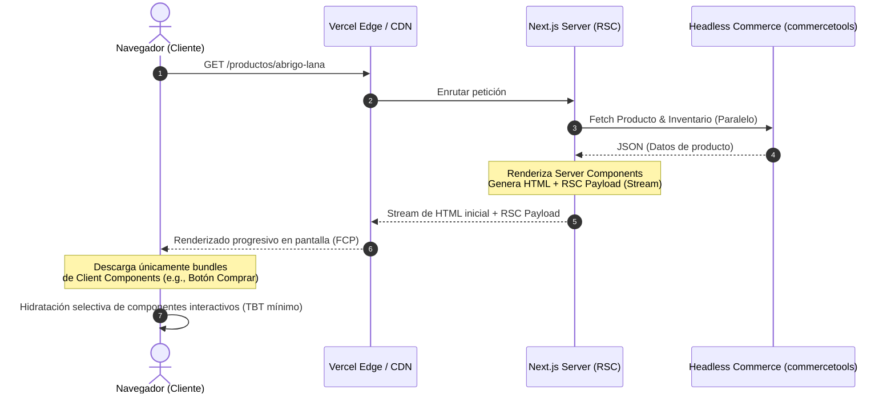

Durante el último evento de ventas masivas de un retailer global de moda con arquitectura headless, el equipo de observabilidad detectó una anomalía crítica: a pesar de tener un *Time to First Byte* (TTFB) óptimo de 80ms en el Edge y un *First Contentful Paint* (FCP) de 1.2 segundos, la tasa de conversión en dispositivos móviles cayó un 24%. Los volcados de rendimiento de Chrome UX Report (CrUX) revelaron el culpable: el *Total Blocking Time* (TBT) superaba los 3,500ms y el *Interaction to Next Paint* (INP) escalaba a 800ms. 

El hilo principal de ejecución (*main thread*) del navegador se encontraba completamente bloqueado. La causa raíz fue el "Monolito de Hidratación" de la SPA (*Single Page Application*) tradicional. Para hacer interactivo un botón de "Añadir al carrito", el motor de renderizado del cliente se vio obligado a descargar, parsear y ejecutar megabytes de JavaScript con el fin de reconstruir y reconciliar el árbol virtual del DOM de toda la página, incluyendo componentes puramente estáticos como el menú de navegación, las políticas de devolución y las descripciones de producto.

En arquitecturas composables de alta densidad de contenido, la hidratación tradicional de "todo o nada" es un cuello de botella insostenible. Para resolver este problema de raíz, las arquitecturas modernas deben migrar hacia patrones de **Hidratación Parcial** y **React Server Components (RSC)**, permitiendo que el JavaScript se ejecute en el servidor o en el Edge, y que solo los componentes verdaderamente interactivos se descarguen e hidraten en el cliente.

---

## El Flujo de Renderizado y Ejecución: SSR Tradicional vs. RSC

Para entender cómo RSC y la hidratación selectiva resuelven este cuello de botella, es necesario analizar el ciclo de vida de una petición. En el SSR tradicional, el servidor genera HTML estático, pero el cliente sigue necesitando todo el código fuente de los componentes para realizar la hidratación. Con RSC, el servidor genera una estructura serializada (el *RSC Payload*) que describe el árbol de componentes. El cliente puede renderizar este árbol de forma progresiva sin necesidad de descargar el código fuente de los componentes de servidor.



Este flujo reduce drásticamente el *Bundle Size* enviado al navegador. Los componentes que interactúan con bases de datos, sistemas de archivos o APIs de terceros se ejecutan exclusivamente en el servidor, eliminando sus dependencias del paquete de JavaScript final que se envía al cliente.

---

## Implementación de Producción: PDP con RSC e Hidratación Selectiva

A continuación, implementaremos una página de detalle de producto (PDP) de alto rendimiento utilizando Next.js App Router (arquitectura nativa de RSC) y comunicación con un motor de Composable Commerce. 

El objetivo es asegurar que el motor de renderizado de Markdown (utilizado para las descripciones de producto) y las llamadas directas a la API de catálogo se queden estrictamente en el servidor, mientras que el selector de tallas y el botón de compra se hidraten de forma aislada.

### 1. El Componente de Servidor (RSC Principal)

Este componente se ejecuta exclusivamente en el servidor. Obtiene los datos de la API, procesa la descripción pesada y renderiza la estructura base.

```typescript
// app/products/[slug]/page.tsx
import { Suspense } from 'react';
import { notFound } from 'next/navigation';
import { getProductBySlug } from '@/lib/commerce-api';
import { ProductDescription } from '@/components/ProductDescription';
import { InteractiveCartSection } from '@/components/InteractiveCartSection';
import { RecommendedProducts, RecommendedProductsSkeleton } from '@/components/RecommendedProducts';

interface ProductPageProps {
  params: {
    slug: string;
  };
}

// Forzamos la ejecución en el Edge Runtime para minimizar la latencia de red con la API
export const runtime = 'edge';

export default async function ProductPage({ params }: ProductPageProps) {
  const { slug } = params;
  
  // Fetch de datos directamente desde el Server Component
  const product = await getProductBySlug(slug);

  if (!product) {
    notFound();
  }

  return (
    <main className="mx-auto max-w-7xl px-4 sm:px-6 lg:px-8 py-12">
      <div className="lg:grid lg:grid-cols-2 lg:items-start lg:gap-x-8">
        {/* Galería de Imágenes (Estática en servidor) */}
        <div className="flex flex-col-reverse">
          <div className="aspect-h-1 aspect-w-1 w-full">
            
          </div>
        </div>

        {/* Información del Producto */}
        <div className="mt-10 px-4 sm:mt-16 sm:px-0 lg:mt-0">
          <h1 className="text-3xl font-bold tracking-tight text-gray-900">{product.name}</h1>
          
          <div className="mt-3">
            <p className="text-3xl tracking-tight text-gray-900">
              {new Intl.NumberFormat('es-ES', { style: 'currency', currency: product.price.currency }).format(product.price.amount)}
            </p>
          </div>

          {/* Componente de Servidor que procesa Markdown pesado */}
          <div className="mt-6">
            <h3 className="sr-only">Descripción</h3>
            <ProductDescription content={product.descriptionHtml} />
          </div>

          {/* Límite de Hidratación: Solo esta sección será interactiva en el cliente */}
          <div className="mt-8">
            <InteractiveCartSection 
              productId={product.id} 
              variants={product.variants} 
            />
          </div>
        </div>
      </div>

      {/* Carga diferida y streaming de componentes secundarios */}
      <section className="mt-16 border-t border-gray-200 py-16">
        <h2 className="text-2xl font-bold tracking-tight text-gray-900">Productos Recomendados</h2>
        <Suspense fallback={<RecommendedProductsSkeleton />}>
          <RecommendedProducts categoryId={product.categoryId} />
        </Suspense>
      </section>
    </main>
  );
}
```

### 2. El Componente de Servidor para Procesamiento de Contenido

Este componente procesa HTML/Markdown utilizando una librería pesada (`isomorphic-dompurify` y `marked`). Al ser un RSC, estas dependencias **nunca** se envían al navegador del usuario, ahorrando más de 150KB de JS en el bundle.


```typescript
// components/ProductDescription.tsx
import { parse } from 'marked';
import DOMPurify from 'isomorphic-dompurify';

interface ProductDescriptionProps {
  content: string;
}

export function ProductDescription({ content }: ProductDescriptionProps) {
  // El parseo de Markdown y la sanitización ocurren estrictamente en el servidor
  const rawHtml = parse(content);
  const cleanHtml = DOMPurify.sanitize(rawHtml);

  return (
    <div 
      className="space-y-6 text-base text-gray-700"
      dangerouslySetInnerHTML={{ __html: cleanHtml }}
    />
  );
}
```


### 3. El Componente de Cliente (Isla de Interactividad)

Utilizamos la directiva `'use client'` para definir el límite de hidratación. Este componente se descarga e hidrata de forma aislada.

```typescript
// components/InteractiveCartSection.tsx
'use client';

import { useState, useTransition } from 'react';
import { useCart } from '@/hooks/useCart'; // Contexto de cliente para el carrito

interface Variant {
  id: string;
  name: string;
  stock: number;
}

interface InteractiveCartSectionProps {
  productId: string;
  variants: Variant[];
}

export function InteractiveCartSection({ productId, variants }: InteractiveCartSectionProps) {
  const [selectedVariant, setSelectedVariant] = useState<string>(variants[0]?.id || '');
  const { addToCart } = useCart();
  const [isPending, startTransition] = useTransition();

  const handleAddToCart = () => {
    if (!selectedVariant) return;

    // useTransition permite mantener la UI responsiva mientras se procesa la acción
    startTransition(async () => {
      await addToCart({
        productId,
        variantId: selectedVariant,
        quantity: 1,
      });
    });
  };

  return (
    <div className="flex flex-col gap-4">
      <div>
        <span className="text-sm font-medium text-gray-900">Selecciona una variante:</span>
        <div className="mt-2 flex gap-3">
          {variants.map((variant) => (
            <button
              key={variant.id}
              onClick={() => setSelectedVariant(variant.id)}
              disabled={variant.stock === 0}
              className={`px-4 py-2 text-sm font-semibold rounded-md border ${
                selectedVariant === variant.id
                  ? 'border-indigo-600 bg-indigo-50 text-indigo-600'
                  : 'border-gray-300 bg-white text-gray-700 hover:bg-gray-50'
              } ${variant.stock === 0 ? 'opacity-50 cursor-not-allowed' : ''}`}
            >
              {variant.name}
            </button>
          ))}
        </div>
      </div>

      <button
        onClick={handleAddToCart}
        disabled={isPending || !selectedVariant}
        className="mt-4 flex w-full items-center justify-center rounded-md border border-transparent bg-indigo-600 px-8 py-3 text-base font-medium text-white hover:bg-indigo-700 focus:outline-none focus:ring-2 focus:ring-indigo-500 focus:ring-offset-2 disabled:bg-gray-400"
      >
        {isPending ? 'Añadiendo...' : 'Añadir al Carrito'}
      </button>
    </div>
  );
}
```

---

## Matriz de Decisión: Patrones de Hidratación y Renderizado

No existe una solución única para todas las páginas de un e-commerce. Un catálogo masivo con millones de SKUs requiere una estrategia diferente a la de un checkout transaccional.

| Patrón Arquitectónico | TTFB | TBT / INP | Tamaño del Bundle (JS) | Complejidad de Implementación | Caso de Uso Ideal | Cuándo Evitarlo |
| :--- | :--- | :--- | :--- | :--- | :--- | :--- |
| **Full SSR (Tradicional)** | Medio | Alto | Grande | Baja | Páginas altamente dinámicas con estado compartido global. | Páginas de contenido estático o PDPs de alto tráfico. |
| **Islands Architecture (Astro)** | Excelente | Muy Bajo | Mínimo | Media | Blogs, CMS corporativos, PLPs de lectura intensiva. | Aplicaciones transaccionales con estado altamente interconectado. |
| **React Server Components (RSC)** | Excelente | Bajo | Bajo-Medio | Alta | PDPs, Homepages personalizadas, Dashboards de usuario. | Aplicaciones que dependen críticamente de librerías CSS-in-JS heredadas. |
| **Static Site Generation (SSG)** | Excelente | Alto | Grande | Baja | Páginas de términos de servicio, FAQs, landing pages estáticas. | Catálogos dinámicos con inventario en tiempo real fluctuante. |

---

## Modos de Fallo en Producción y Estrategias de Mitigación

La transición a RSC e hidratación parcial introduce nuevos paradigmas y, con ellos, nuevos modos de fallo que pueden degradar la experiencia de usuario o romper la consistencia de la aplicación.

### 1. El Infierno de las "Fugas de Hidratación" (Hydration Mismatch)

**Problema:** Ocurre cuando el HTML generado por el servidor difiere del primer renderizado en el cliente. Esto es común al renderizar fechas, precios localizados basados en la zona horaria del navegador, o al usar variables globales como `window`.

**Impacto:** El navegador descarta el DOM pre-renderizado y lo reconstruye desde cero, disparando el TBT y anulando los beneficios de rendimiento de SSR/RSC.

```typescript
// ERROR COMÚN: Provoca Hydration Mismatch
export function LocalTime() {
  // El servidor renderizará la hora del servidor (UTC), el cliente la hora local
  const time = new Date().toLocaleTimeString();
  return <span>{time}</span>;
}
```

**Mitigación:** Aislar el estado dinámico del cliente mediante `useEffect` o desactivar el SSR para ese componente específico utilizando carga dinámica con `ssr: false`.

```typescript
// SOLUCIÓN CORRECTA: Retrasar el renderizado dinámico al cliente
'use client';

import { useState, useEffect } from 'react';

export function LocalTime() {
  const [time, setTime] = useState<string | null>(null);

  useEffect(() => {
    setTime(new Date().toLocaleTimeString());
  }, []);

  if (!time) return <span className="animate-pulse">Cargando hora...</span>;

  return <span>{time}</span>;
}
```

### 2. El Antipadrón del "Payload de RSC Inflado" (RSC Payload Bloat)

**Problema:** Pasar objetos de datos masivos y no estructurados desde un Server Component a un Client Component a través de `props`.

```typescript
// ANTIPATRÓN: Pasar todo el objeto de producto de commercetools con metadatos internos
export default async function ProductPage() {
  const product = await getProductFromAPI();
  return <InteractiveCartSection rawProductData={product} />; // <- Payload masivo en el HTML
}
```

**Impacto:** El payload de RSC se serializa e inserta directamente en el HTML como un bloque JSON (`<script type="application/json">`). Si pasas datos innecesarios (como logs, metadatos de API o descripciones de variantes no seleccionadas), el tamaño del HTML se duplica, afectando negativamente el FCP y el consumo de ancho de banda en redes móviles.

**Mitigación:** Implementar un patrón de transferencia de datos (DTO) para enviar estrictamente lo que el componente de cliente necesita para funcionar.

```typescript
// SOLUCIÓN: Proyectar el objeto a un DTO mínimo
export default async function ProductPage() {
  const product = await getProductFromAPI();
  
  const clientProductDto = {
    id: product.id,
    variants: product.variants.map(v => ({
      id: v.id,
      name: v.attributes.size,
      stock: v.availability.quantity
    }))
  };

  return <InteractiveCartSection productId={clientProductDto.id} variants={clientProductDto.variants} />;
}
```

### 3. Ruptura de Estado Compartido entre Islas

**Problema:** Al fragmentar la interfaz en múltiples islas de hidratación independientes, se pierde la capacidad de utilizar un único Context Provider global de React (como Redux o Zustand tradicional) que envuelva toda la aplicación, ya que esto convertiría a todos los componentes descendientes en Client Components, anulando los beneficios de RSC.

**Mitigación:** Utilizar un patrón de comunicación basado en eventos nativos del navegador (`CustomEvent`) o sincronización de estado a través de parámetros de búsqueda de URL (URL State) gestionados por el enrutador.

```typescript
// components/MiniCart.tsx (Isla de Cliente 1)
'use client';

import { useEffect, useState } from 'react';

export function MiniCart() {
  const [itemCount, setItemCount] = useState(0);

  useEffect(() => {
    const handleCartUpdate = (event: CustomEvent<{ count: number }>) => {
      setItemCount(event.detail.count);
    };

    window.addEventListener('cart-updated' as any, handleCartUpdate);
    return () => window.removeEventListener('cart-updated' as any, handleCartUpdate);
  }, []);

  return <div className="icon-cart">Items: {itemCount}</div>;
}

// components/InteractiveCartSection.tsx (Isla de Cliente 2)
'use client';

export function InteractiveCartSection() {
  const handleAddToCart = () => {
    // Lógica de API...
    const event = new CustomEvent('cart-updated', { detail: { count: 5 } });
    window.dispatchEvent(event);
  };

  return <button onClick={handleAddToCart}>Añadir</button>;
}
```

---

## Checklist de Implementación para Arquitectos Enterprise

Si estás liderando la migración de un storefront headless monolítico hacia una arquitectura de hidratación parcial con RSC, sigue esta hoja de ruta técnica:

- [ ] **Auditoría de Dependencias de Terceros:** Identifica librerías que dependan de APIs del navegador (`window`, `document`) o de contextos globales de React. Clasifícalas y planifica su aislamiento en componentes marcados con `'use client'`.
- [ ] **Definición de Límites de Suspensión (Suspense Boundaries):** Envuelve componentes que realicen llamadas de red lentas (como recomendaciones personalizadas o reseñas de clientes) en bloques `<Suspense>` con skeletons optimizados para evitar que bloqueen el renderizado de la estructura principal de la página.
- [ ] **Implementación de DTOs Estrictos:** Establece un estándar de desarrollo donde ningún objeto crudo de las APIs de Composable Commerce (commercetools, Shopify, Contentful) se pase directamente a componentes de cliente. Todo debe ser mapeado a interfaces de TypeScript mínimas.
- [ ] **Configuración de Presupuestos de Rendimiento (Performance Budgets):** Configura herramientas como Lighthouse CI o WebPageTest en tu pipeline de CI/CD para bloquear pull requests que incrementen el TBT por encima de 150ms en perfiles de emulación móvil de gama baja.
- [ ] **Estrategia de Caché en el Edge:** Asegura que los Server Components se ejecuten en entornos Edge (como Cloudflare Workers o Vercel Edge Runtime) y que utilicen directivas de caché `stale-while-revalidate` para garantizar respuestas en milisegundos de un dígito.