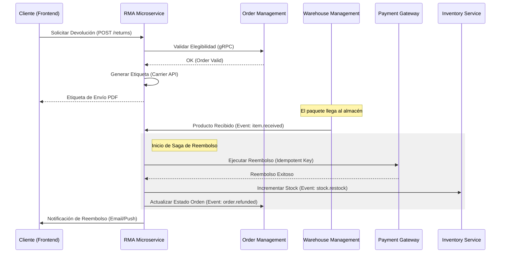

Eran las 3:00 AM del 27 de diciembre cuando el sistema de conciliación financiera de un retailer Tier-1, operando sobre una arquitectura Composable recientemente migrada, comenzó a emitir alertas críticas de "Double Refund Detected". En menos de dos horas, el desacoplamiento entre el microservicio de Order Management (OMS), la plataforma de pagos (Stripe) y el sistema de gestión de almacenes (WMS) había generado reembolsos duplicados por un valor superior a los 150,000 USD. El problema no era un bug de código tradicional, sino una condición de carrera en la propagación de eventos de logística inversa: el WMS confirmó la recepción de un producto devuelto, disparando un evento de reembolso, mientras que un agente de servicio al cliente, ante la latencia del sistema, procesaba manualmente el mismo reembolso desde el panel de control del OMS.

Este escenario es el "Día 2" de cualquier implementación de Composable Commerce que subestima la complejidad de la logística inversa. Mientras que el flujo de *checkout* (logística directa) es lineal y optimizado, la devolución es inherentemente caótica, asíncrona y multi-actor. En una arquitectura MACH, donde no existe una "única fuente de verdad" monolítica, gestionar el ciclo de vida de una devolución requiere una orquestación de estados extremadamente rigurosa para evitar la erosión del margen operativo.

## El Desafío de la Fragmentación del Estado en Devoluciones

En un monolito, la devolución es una transacción de base de datos que actualiza las tablas `orders`, `inventory` y `payments` de forma atómica (ACID). En el mundo Composable, la "devolución" es un concepto distribuido. El estado del inventario vive en un servicio de Inventory, el estado del pago en un PSP (Payment Service Provider), y la intención del cliente en un Headless CMS o un servicio de RMA (Return Merchandise Authorization) especializado.

El principal cuello de botella surge en la **validación de elegibilidad dinámica**. No se trata solo de si el producto está dentro de los 30 días de garantía; se trata de calcular en tiempo real si el costo del flete inverso, el estado del inventario en el nodo logístico más cercano y el *lifetime value* del cliente justifican una devolución física o un "returnless refund".

### Arquitectura de Referencia: Event-Driven Returns Engine

Para resolver la inconsistencia, debemos implementar un motor de estados que actúe como orquestador de la saga de devolución. A continuación, se presenta el flujo de una devolución iniciada por el cliente, procesada mediante una arquitectura orientada a eventos (EDA).



## Implementación Técnica: Patrón Saga y Compensación

En logística inversa, no podemos usar transacciones distribuidas (2PC) debido a la latencia de los sistemas externos (como transportistas o pasarelas de pago). La solución es el **Patrón Saga Orquestada**. El servicio de RMA actúa como el orquestador, gestionando los pasos y, lo más importante, las transacciones de compensación si algo falla.

### Ejemplo de Implementación: Orquestador de Reembolsos en TypeScript

Este fragmento de código ilustra cómo manejar la idempotencia y la lógica de reintentos en un entorno de microservicios para evitar el escenario de "Double Refund".

```typescript
import { PaymentProvider, InventoryService, EventBus } from './services';

interface ReturnContext {
  returnId: string;
  orderId: string;
  amount: number;
  idempotencyKey: string;
}

class ReturnOrchestrator {
  constructor(
    private payment: PaymentProvider,
    private inventory: InventoryService,
    private events: EventBus
  ) {}

  async processRefund(ctx: ReturnContext) {
    // 1. Registro de intención para evitar ejecuciones concurrentes
    const isLocked = await this.acquireLock(ctx.returnId);
    if (!isLocked) throw new Error("Return already in process");

    try {
      // 2. Ejecución del reembolso con Idempotency Key de la orden
      // Esto asegura que si la API de pago se llama dos veces, solo se procesa una vez
      const refundResult = await this.payment.refund({
        amount: ctx.amount,
        reason: 'CUSTOMER_RETURN',
        idempotencyKey: ctx.idempotencyKey 
      });

      if (refundResult.status === 'SUCCESS') {
        // 3. Actualización de inventario (asíncrona pero garantizada)
        await this.events.publish('inventory.update_needed', {
          orderId: ctx.orderId,
          action: 'RESTOCK'
        });

        // 4. Notificación al OMS para cierre de ciclo
        await this.events.publish('order.status_changed', {
          orderId: ctx.orderId,
          newStatus: 'RETURNED_AND_REFUNDED'
        });
      }
    } catch (error) {
      // 5. Lógica de compensación o reintento
      console.error(`Critical failure in return ${ctx.returnId}:`, error);
      await this.handleRefundFailure(ctx);
    } finally {
      await this.releaseLock(ctx.returnId);
    }
  }

  private async acquireLock(id: string): Promise<boolean> {
    // Implementación con Redis SETNX
    return true; 
  }
}
```

## Trade-offs Arquitectónicos en Logística Inversa

No existe una solución única. La elección entre centralizar la lógica en el OMS o crear un microservicio de RMA dedicado depende de la complejidad de la cadena de suministro.

| Criterio | OMS-Centric (Monolítico/Suite) | RMA Microservice (Composable) | Impacto en Producción |
| :--- | :--- | :--- | :--- |
| **Consistencia** | Alta (Transaccional) | Eventual (Sagas) | El riesgo de inconsistencia aumenta en Composable. |
| **Flexibilidad** | Baja (Reglas rígidas) | Muy Alta (Custom Logic) | Vital para estrategias de "Keep it" (reembolso sin devolución). |
| **Escalabilidad** | Vertical | Horizontal e Independiente | Crítico durante picos de devoluciones post-navideños. |
| **Integración** | Limitada a conectores nativos | API-First (Cualquier Carrier) | Facilita el cambio de proveedores logísticos (3PL). |
| **Costo Ops** | Bajo inicialmente | Alto (Requiere Observabilidad) | Composable requiere tracing distribuido para rastrear un paquete. |

## Modos de Fallo Críticos y Mitigación

### 1. El "Zombie Inventory" (Desincronización de Stock)
**Problema:** El WMS marca el producto como recibido, pero el servicio de inventario falla al actualizarse. El producto está físicamente en el estante pero no disponible para la venta.
**Mitigación:** Implementar un proceso de **Reconciliación de Inventario Nocturna**. Un job programado compara los estados de "Received" en el WMS contra el stock disponible en el servicio de inventario y emite alertas sobre discrepancias superiores al 1%.

### 2. Latencia en la Confirmación del Carrier
**Problema:** El cliente entrega el paquete, pero el webhook del transportista (FedEx, DHL, etc.) tarda 4 horas en llegar. El cliente llama a soporte frustrado porque no ve su devolución "iniciada".
**Mitigación:** **Optimistic UI Updates** en el frontend de la cuenta del cliente. Al escanear el paquete en el punto de entrega, el cliente puede subir una foto del comprobante, lo que dispara un estado intermedio "En Tránsito - Verificado por Cliente" que reduce la ansiedad y la carga en el call center.

### 3. Reembolsos de Productos Fraudulentos
**Problema:** En arquitecturas automatizadas, el reembolso se dispara al recibir el paquete. Si el cliente envió una piedra en lugar de un iPhone, el dinero ya salió de la cuenta de la empresa.
**Mitigación:** **Inspección Basada en Riesgo (Risk-based Inspection)**. Utilizar un motor de reglas para decidir:
- Si el cliente tiene un "Trust Score" alto -> Reembolso inmediato al primer escaneo.
- Si el producto es de alto valor (>500 USD) -> Bloquear reembolso hasta inspección física manual en WMS.

## Estrategias de Datos: El Registro de Auditoría Inmutable

En una arquitectura de comercio desacoplado, la trazabilidad es la única defensa ante auditorías financieras. Cada cambio de estado en la devolución debe persistirse en un **Event Store** inmutable. No basta con guardar el estado actual (`status: "refunded"`); es imperativo guardar el historial completo de transiciones, quién las autorizó y qué IDs de transacción de terceros están asociados.

```sql
-- Ejemplo de esquema para auditoría de logística inversa
CREATE TABLE return_audit_log (
    audit_id UUID PRIMARY KEY,
    return_id UUID NOT NULL,
    previous_state VARCHAR(50),
    new_state VARCHAR(50),
    trigger_source VARCHAR(100), -- e.g., 'WMS_WEBHOOK', 'CS_AGENT_ID_123'
    external_tx_id VARCHAR(255), -- ID de Stripe o FedEx
    payload JSONB,               -- Datos crudos recibidos
    created_at TIMESTAMP WITH TIME ZONE DEFAULT CURRENT_TIMESTAMP
);
```

## Conclusión: Checklist de Implementación para Ingeniería

Para escalar la logística inversa en un entorno Composable sin comprometer la integridad financiera, los equipos de arquitectura deben validar los siguientes puntos:

1.  **Idempotencia en Capa de Pagos:** ¿Todas las llamadas a reembolsos incluyen una `idempotency_key` única derivada del ID de devolución?
2.  **Manejo de Webhooks Desordenados:** ¿El sistema puede procesar un evento de "Paquete Entregado" antes que uno de "Paquete Recogido" sin corromper el estado?
3.  **Observabilidad Distribuida:** ¿Existe un `trace_id` que una la solicitud del frontend, el evento en el bus y la llamada final al WMS?
4.  **Circuit Breakers en APIs de Carriers:** Si la API de etiquetas de envío cae, ¿el sistema tiene un mecanismo de fallback o una cola de reintentos con backoff exponencial?
5.  **Políticas de Reembolso Dinámicas:** ¿El motor de reglas permite diferenciar el flujo de devolución según el margen del producto o el historial del cliente?

La logística inversa no es el final del ciclo de vida de una orden; en Composable Commerce, es el punto donde la robustez de la arquitectura se pone a prueba. Ignorar la complejidad de la consistencia eventual en este flujo es una receta para el desastre financiero. La clave está en tratar cada devolución no como un registro, sino como una **máquina de estados distribuida y altamente auditable**.