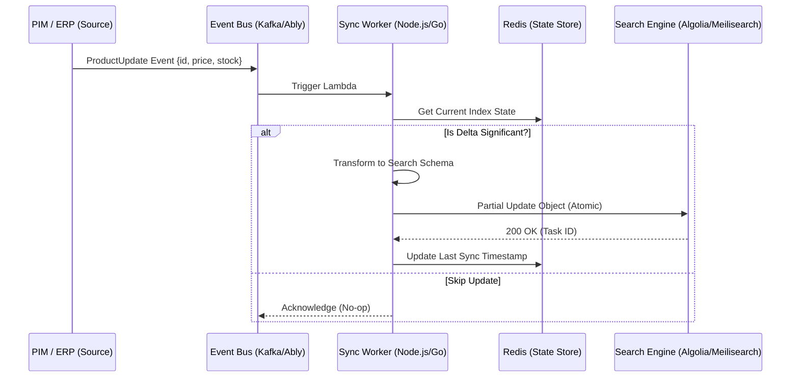

El escenario es un "Black Friday" en una plataforma de e-commerce de alto tráfico. El sistema de gestión de inventario (OMS) marca un producto crítico como "Agotado", pero debido a un cuello de botella en el pipeline de indexación, el motor de búsqueda sigue mostrando el producto como disponible y con un descuento agresivo durante 120 segundos adicionales. El resultado: 15,000 intentos de compra fallidos, una degradación masiva de la experiencia de usuario (UX) y una presión insostenible sobre los microservicios de checkout que deben validar el stock en tiempo real. Este "Gap de Consistencia" es el talón de Aquiles de las arquitecturas Composable donde la búsqueda (Search-as-a-Service) está desacoplada de la fuente de verdad de los datos (PIM/ERP).

En implementaciones Enterprise, el desafío no es simplemente "conectar" Algolia o Meilisearch a un frontend; el verdadero reto radica en la orquestación de catálogos dinámicos donde los precios cambian por segmento de usuario, el stock fluctúa por milisegundos y las reglas de relevancia deben adaptarse a señales de negocio en tiempo real sin disparar los costos operativos ni degradar el *Time-to-First-Byte* (TTFB).

## El Dilema de la Indexación: ¿Push, Pull o Event-Driven?

En una arquitectura monolítica tradicional, la búsqueda suele ser una extensión de la base de datos (ej. Full-text search en PostgreSQL). En el mundo MACH, la búsqueda es un ciudadano de primera clase, independiente y altamente optimizado. Sin embargo, esta independencia introduce latencia de propagación.

Para mitigar el problema del "inventario fantasma", debemos abandonar los procesos de indexación por lotes (batch) nocturnos y movernos hacia una arquitectura de **Indexación Basada en Eventos (Event-Driven Indexing)**. El objetivo es que cualquier mutación en el estado del catálogo (cambio de precio, descripción o stock) se propague al motor de búsqueda en menos de 500ms.

### Arquitectura de Referencia: Pipeline de Sincronización Reactiva

El siguiente diagrama ilustra cómo desacoplar la ingesta de datos del motor de búsqueda utilizando un bus de eventos y funciones transformadoras (Lambda/Edge Functions) para normalizar los datos antes de llegar a Algolia o Meilisearch.



## Implementación Técnica: Worker de Sincronización de Alto Rendimiento

Para garantizar que la búsqueda sea "instantánea" no solo en la interfaz sino en la veracidad de los datos, el Worker de sincronización debe manejar actualizaciones parciales. Enviar el objeto completo del producto en cada cambio de stock es un anti-patrón que consume ancho de banda y créditos de operación innecesarios.

A continuación, presentamos una implementación en TypeScript diseñada para ejecutarse en un entorno de Serverless Functions, capaz de manejar actualizaciones atómicas en Algolia y Meilisearch de forma concurrente.

```typescript
import algoliasearch from 'algoliasearch';
import { MeiliSearch } from 'meilisearch';

// Interfaces para tipado estricto de catálogo
interface ProductUpdate {
  id: string;
  price?: number;
  stock_level: number;
  is_active: boolean;
  last_modified: string;
}

const algoliaClient = algoliasearch(process.env.ALGOLIA_APP_ID!, process.env.ALGOLIA_API_KEY!);
const meiliClient = new MeiliSearch({ host: process.env.MEILI_HOST!, apiKey: process.env.MEILI_KEY! });

/**
 * Procesa eventos de cambio en el catálogo con lógica de deduplicación y 
 * actualizaciones parciales para optimizar costos y performance.
 */
export const syncProductToSearch = async (event: ProductUpdate): Promise<void> => {
  const indexName = 'production_catalog';
  
  // 1. Transformación de datos: Mapeo de campos de negocio a campos de búsqueda
  const searchPayload = {
    objectID: event.id, // Algolia requiere objectID
    id: event.id,       // Meilisearch usa id por defecto
    price: event.price,
    in_stock: event.stock_level > 0,
    _tags: event.stock_level < 5 ? ['low_stock'] : [],
    updated_at_timestamp: Math.floor(new Date(event.last_modified).getTime() / 1000)
  };

  try {
    // 2. Ejecución en paralelo para arquitecturas híbridas o migración progresiva
    const syncTasks = [
      // Actualización parcial en Algolia (Solo envía los campos que cambiaron)
      algoliaClient.initIndex(indexName).partialUpdateObject(searchPayload, {
        createIfNotExists: true
      }),
      
      // Actualización en Meilisearch (Asíncrona por naturaleza)
      meiliClient.index(indexName).updateDocuments([searchPayload])
    ];

    const results = await Promise.allSettled(syncTasks);
    
    results.forEach((res, idx) => {
      if (res.status === 'rejected') {
        console.error(`Error en Provider ${idx === 0 ? 'Algolia' : 'Meilisearch'}:`, res.reason);
        // Aquí se implementaría el envío a una Dead Letter Queue (DLQ)
      }
    });

  } catch (error) {
    // Error crítico de red o autenticación
    throw new Error(`Critical Sync Failure: ${error.message}`);
  }
};
```

## Trade-offs Arquitectónicos: Algolia vs. Meilisearch

La elección entre un motor SaaS (Algolia) y uno autohospedado o gestionado (Meilisearch) no debe basarse solo en el costo, sino en la topología de la red y la complejidad de las reglas de negocio.

| Característica | Algolia (SaaS) | Meilisearch (Open Source / Cloud) |
| :--- | :--- | :--- |
| **Latencia de Búsqueda** | Ultra-baja (Edge Network Global) | Baja (Depende de la región del cluster) |
| **Latencia de Indexación** | < 100ms (Casi instantáneo) | Asíncrona (Task Queue interna) |
| **Costo** | Basado en registros y búsquedas (Escalado caro) | Basado en infraestructura (Predecible) |
| **Relevancia** | Configuración visual avanzada (AI-powered) | Basada en reglas (Programática) |
| **Multi-tenancy** | Nativo vía Secured API Keys | Requiere lógica a nivel de índice o filtros |
| **Uso Ideal** | E-commerce Global, B2C masivo | Catálogos regionales, B2B, SaaS internos |

### El Factor de "Geosearch" y Latencia de Borde

Algolia brilla en arquitecturas Headless globales porque replica los índices en más de 70 centros de datos. Si un usuario en Tokio busca un producto, la consulta no viaja a `us-east-1`. Meilisearch, por otro lado, es excelente para casos donde la soberanía de datos es crítica o cuando el volumen de actualizaciones es tan alto que los costos de Algolia se vuelven prohibitivos (ej. un marketplace con 10 millones de SKUs y cambios de precio cada minuto).

## Modos de Fallo y Estrategias de Resiliencia en Producción

En un entorno de producción, el pipeline de búsqueda fallará. Es una certeza estadística. La clave es cómo el sistema se recupera sin intervención manual.

### 1. El Problema de la "Bomba de Indexación" (Throttling)
Si el PIM lanza una actualización masiva de precios (ej. 1 millón de productos), el Worker puede saturar las APIs del motor de búsqueda.
*   **Mitigación:** Implementar un **Rate Limiter** en el Worker y utilizar **Batching Dinámico**. En lugar de procesar 1 evento por Lambda, agrupar eventos en ventanas de 5 segundos o 1,000 registros antes de hacer el "push" al motor de búsqueda.

### 2. Desincronización por Fallos Parciales
Un evento se procesa, pero la API de búsqueda devuelve un error 5xx. El mensaje se pierde y el índice queda desactualizado permanentemente.
*   **Mitigación:** **Idempotencia y DLQ**. Cada mensaje en el Bus de Eventos debe tener un `version_id`. El Worker debe verificar si la versión que intenta indexar es superior a la que ya existe en el motor de búsqueda (usando un atributo `last_updated` en el documento). Si falla, el mensaje va a una Dead Letter Queue para reintento automático con *exponential backoff*.

### 3. El "Cold Start" del Índice
Al crear un nuevo índice o migrar de proveedor, la relevancia suele ser pobre porque no hay datos de telemetría.
*   **Mitigación:** **Shadow Indexing**. Ejecutar el nuevo motor de búsqueda en paralelo al actual, enviando las consultas de los usuarios a ambos pero solo mostrando los resultados del motor principal. Comparar los *Click-Through Rates* (CTR) mediante logs antes de hacer el switch definitivo.

## Optimización de Relevancia: Más allá de la Búsqueda de Texto

La búsqueda moderna no se trata de encontrar "zapatos rojos", sino de encontrar los "zapatos rojos que este usuario específico tiene más probabilidad de comprar y que tienen mayor margen de contribución".

### Filtrado Dinámico por Disponibilidad (Stock-Aware Search)
Un error común es filtrar productos sin stock directamente en la query de búsqueda. Esto puede sesgar los resultados y mostrar páginas vacías.
*   **Patrón Recomendado:** Utilizar `optionalFilters` (en Algolia) o `rankingRules` personalizadas (en Meilisearch). En lugar de ocultar el producto, se le asigna una penalización de ranking para que aparezca al final de los resultados. Esto mantiene el SEO y permite al usuario suscribirse a alertas de stock.

```json
// Ejemplo de configuración de ranking en Meilisearch
{
  "rankingRules": [
    "words",
    "typo",
    "attribute",
    "proximidad",
    "in_stock:desc", // Los productos en stock siempre primero
    "margin:desc"    // Criterio de negocio secundario
  ]
}
```

## Checklist de Implementación para Equipos de Ingeniería

Para asegurar una implementación de búsqueda composable de nivel enterprise, siga este checklist:

1.  [ ] **Desacoplamiento Total:** ¿El frontend consume directamente la API del motor de búsqueda (con API Keys de solo lectura) o pasa por un backend innecesario? (Evite el "Proxy Pattern" si busca latencia < 50ms).
2.  [ ] **Seguridad de Atributos:** ¿Se han configurado los `unretrievableAttributes` para evitar que datos sensibles (costo de compra, margen, stock exacto interno) se filtren en el JSON de respuesta?
3.  [ ] **Estrategia de Reintento:** ¿Existe una Dead Letter Queue (DLQ) para manejar fallos en la indexación?
4.  [ ] **Monitoreo de Latencia de Indexación:** ¿Tenemos una métrica que mida el tiempo desde que el PIM emite el evento hasta que el objeto es consultable en el motor de búsqueda?
5.  [ ] **Circuit Breaker:** Si el motor de búsqueda cae, ¿el frontend tiene un *fallback* (ej. búsqueda básica contra el microservicio de productos o una caché estática)?
6.  [ ] **Analítica de Búsquedas Vacías:** ¿Se están capturando las búsquedas que devuelven 0 resultados para informar al equipo de compras sobre demanda no satisfecha?

## Conclusión

La búsqueda composable no es un componente "plug-and-play"; es un sistema distribuido que requiere una gestión rigurosa de la consistencia de datos. Mientras que Algolia ofrece una experiencia de borde inigualable para marcas globales, Meilisearch proporciona una flexibilidad y control de costos superior para arquitecturas regionales o de alta densidad de datos. La verdadera ventaja competitiva no reside en el motor elegido, sino en la robustez del pipeline de eventos que garantiza que lo que el usuario ve en su pantalla sea una representación exacta y en tiempo real de la realidad del negocio.