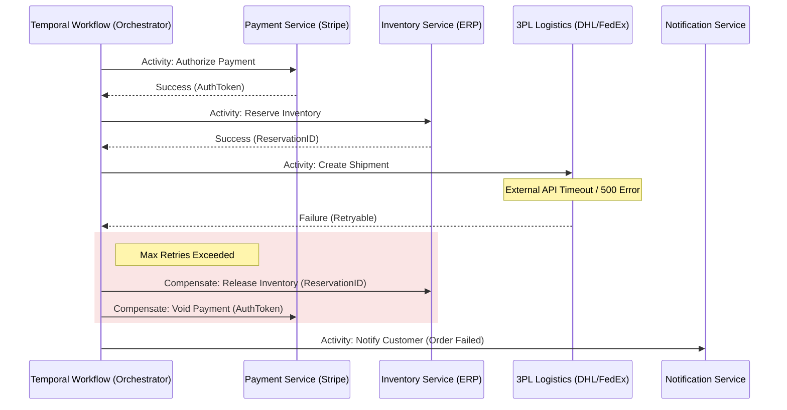

Son las 3:15 AM durante el pico de ventas del "Cyber Monday". Tu sistema de Order Management (OMS) acaba de procesar 5,000 pedidos por minuto. De repente, el servicio de logística de un tercero (3PL) devuelve un error 503 persistente. Diez minutos después, el servicio de inventario reporta un desfase: hay 1,200 productos bloqueados en estado "Reserved" que no tienen una orden de pago confirmada asociada. Los eventos de compensación en tu arquitectura coreografiada basada en Kafka se han perdido en una cola de "Dead Letter" debido a una condición de carrera (race condition) no detectada en el consumidor de pagos. Tienes "órdenes zombi" esparcidas por cinco microservicios y tres proveedores SaaS externos. La consistencia eventual se ha convertido en una pesadilla de integridad de datos que costará miles de dólares en conciliación manual.

Este escenario no es una excepción; es la consecuencia inevitable de escalar el **Patrón Saga Coreografiado** en ecosistemas de supply chain multi-vendor donde la visibilidad del estado global es inexistente. En arquitecturas MACH, donde dependemos de múltiples APIs externas con diferentes SLAs y semánticas de error, la coreografía pura a menudo colapsa bajo su propia complejidad operativa.

## El Colapso de la Coreografía: El "Infierno de Eventos"

En una saga coreografiada, cada microservicio publica un evento y otros reaccionan a él. No hay un director de orquesta. Si bien esto desacopla los servicios a nivel de tiempo y espacio, introduce un acoplamiento lógico extremadamente peligroso.

### Puntos de Falla Críticos en Supply Chain
1.  **Falta de Observabilidad Centralizada:** No hay un solo lugar para preguntar "¿En qué estado está el pedido X?". Debes consultar logs distribuidos y reconstruir la línea de tiempo.
2.  **Complejidad de Compensación Cíclica:** Si el servicio de envío falla, debe emitir un evento `ShippingFailed`, que el servicio de inventario debe escuchar para liberar stock, y el de pagos para reembolsar. Si el reembolso falla, ¿quién reintenta? ¿Quién vigila al vigilante?
3.  **Race Conditions en Estados Distribuidos:** En cadenas de suministro de alta concurrencia, un evento de "Cancelación" puede llegar antes que el de "Aprobación" debido a latencias en el broker de mensajería, dejando el sistema en un estado inconsistente permanente.

## La Alternativa: Orquestación Determinista con Temporal.io

La orquestación moderna no es el antiguo BPEL (Business Process Execution Language) de los años 2000. Herramientas como **Temporal.io** introducen el concepto de "Workflow as Code". A diferencia de un orquestador tradicional que guarda el estado en una base de datos relacional mediante pasos discretos, Temporal garantiza la ejecución duradera y determinista de funciones de código.

En una Saga Orquestada con Temporal, el flujo de negocio se define en un `Workflow`. Si un paso falla, el orquestador sabe exactamente qué pasos previos deben compensarse, gestionando reintentos infinitos, timeouts y estados de espera (sleeps) que pueden durar meses, sin consumir recursos de CPU activos.

### Arquitectura de Referencia: Multi-Vendor Supply Chain



## Implementación Técnica: Workflow de Pedido Multi-Vendor

A continuación, presentamos una implementación simplificada utilizando el SDK de TypeScript de Temporal. El enfoque clave aquí es la separación entre la lógica de orquestación (Workflow) y la lógica de ejecución (Activities).

### 1. Definición de Actividades (Lógica con Efectos Secundarios)

Las actividades son las que interactúan con el mundo exterior (APIs de terceros, DBs). Temporal intercepta estas llamadas para asegurar que sean idempotentes y reintentables.

```typescript
// activities.ts
export const activities = {
  async authorizePayment(orderId: string, amount: number): Promise<string> {
    const response = await stripe.paymentIntents.create({ amount, currency: 'usd', metadata: { orderId } });
    return response.id;
  },
  async reserveInventory(sku: string, qty: number): Promise<string> {
    const res = await erpClient.post('/inventory/reserve', { sku, qty });
    return res.data.reservationId;
  },
  async createShipment(orderData: any): Promise<string> {
    // Simulación de una API de 3PL inestable
    const res = await logisticsProvider.ship(orderData);
    return res.trackingNumber;
  },
  async compensatePayment(paymentId: string): Promise<void> {
    await stripe.paymentIntents.cancel(paymentId);
  },
  async releaseInventory(reservationId: string): Promise<void> {
    await erpClient.post(`/inventory/release/${reservationId}`);
  }
};
```

### 2. El Workflow: La Verdadera Máquina de Estados

El workflow define el "qué", no el "cómo". Es código puramente determinista.

```typescript
// workflows.ts
import { proxyActivities, sleep } from '@temporalio/workflow';
import type { activities } from './activities';

const { 
  authorizePayment, reserveInventory, createShipment, 
  compensatePayment, releaseInventory 
} = proxyActivities<typeof activities>({
  startToCloseTimeout: '1 minute',
  retry: {
    initialInterval: '1s',
    backoffCoefficient: 2,
    maximumAttempts: 5,
  },
});

export async function orderSagaWorkflow(order: any): Promise<string> {
  const compensations: Function[] = [];

  try {
    // Paso 1: Pago
    const paymentId = await authorizePayment(order.id, order.total);
    compensations.push(() => compensatePayment(paymentId));

    // Paso 2: Inventario
    const reservationId = await reserveInventory(order.sku, order.qty);
    compensations.push(() => releaseInventory(reservationId));

    // Paso 3: Logística (Aquí es donde suele fallar el mundo real)
    const trackingNumber = await createShipment(order);
    
    return `Order complete: ${trackingNumber}`;

  } catch (err) {
    // Ejecución de compensaciones en orden inverso (LIFO)
    for (const compensate of compensations.reverse()) {
      await compensate();
    }
    throw new Error(`Saga Failed: ${err.message}`);
  }
}
```

## Comparativa de Trade-offs: Coreografía vs. Orquestación

| Criterio | Saga Coreografiada (Event-Driven) | Saga Orquestada (Temporal.io) |
| :--- | :--- | :--- |
| **Acoplamiento** | Bajo (acoplamiento de tiempo), Alto (lógico). | Medio (dependencia del orquestador). |
| **Observabilidad** | Muy difícil. Requiere Distributed Tracing (Jaeger/Zipkin). | Nativa. El estado del workflow es visible en tiempo real. |
| **Manejo de Errores** | Complejo. Requiere lógica de compensación en cada servicio. | Centralizado en el Workflow. Fácil de razonar. |
| **Escalabilidad** | Alta, pero con riesgo de "Event Storms". | Alta, limitada por el throughput del cluster de Temporal. |
| **Curva de Aprendizaje** | Baja al inicio, exponencialmente difícil al crecer. | Alta al inicio (conceptos de determinismo). |
| **Ideal para...** | Flujos simples de 2-3 pasos internos. | Procesos críticos, multi-vendor, de larga duración. |

## Modos de Fallo en Producción y Mitigación

Incluso con un orquestador como Temporal, los sistemas distribuidos presentan desafíos únicos que deben abordarse en el diseño de las actividades.

### 1. El Problema de la Idempotencia
Si una actividad de `authorizePayment` se ejecuta, pero la red falla antes de que el orquestador reciba la confirmación, Temporal reintentará la actividad. Si la API de Stripe no es tratada con un `Idempotency-Key`, cobrarás dos veces al cliente.
*   **Mitigación:** Todas las actividades deben usar claves de idempotencia derivadas del `WorkflowID` o `OrderID`.

### 2. Envenenamiento de la Cola (Poison Pills)
Un bug en el código del Workflow que cause un error no recuperable (ej: intentar acceder a una propiedad `undefined`) hará que el worker falle continuamente.
*   **Mitigación:** Implementar validación de esquemas estricta (Zod/JSON Schema) al inicio del Workflow y usar "Versioning" de Temporal para desplegar cambios en workflows activos sin romper el determinismo.

### 3. Agotamiento de Recursos en Compensación
¿Qué pasa si la compensación también falla? (ej: el ERP de inventario está caído mientras intentas liberar stock).
*   **Mitigación:** Las actividades de compensación deben tener políticas de reintento mucho más agresivas o incluso infinitas. En casos extremos, Temporal permite alertar a un operador humano para intervención manual mientras mantiene el estado del workflow "congelado".

## Estrategia de Implementación: Checklist para Arquitectos

Para migrar de un caos coreografiado a una orquestación robusta en una cadena de suministro multi-vendor, siga estos pasos:

1.  **Identificar el Bounded Context Crítico:** No orqueste todo. Empiece por el flujo de "Order-to-Cash", que es donde la inconsistencia de datos tiene mayor impacto financiero.
2.  **Definir el Grafo de Compensación:** Para cada acción exitosa, documente explícitamente cuál es su acción inversa y si esa acción es "conmutable" (puede ocurrir en cualquier orden).
3.  **Externalizar el Estado:** Asegúrese de que sus microservicios sean apátridas (stateless) respecto al flujo. El estado reside en Temporal; los servicios solo ejecutan comandos.
4.  **Implementar Heartbeats para Tareas Largas:** Si una actividad de almacén (picking) tarda horas, use `heartbeats` de Temporal para asegurar que el worker sigue vivo.
5.  **Simulación de Fallos (Chaos Engineering):** Antes de ir a producción, inyecte latencia y errores 500 en las actividades de los proveedores externos para validar que el flujo de compensación se activa correctamente.

La promesa de los microservicios era la independencia, pero la realidad de la empresa es la interdependencia. La orquestación con Temporal.io no rompe el desacoplamiento de MACH; lo hace viable al proporcionar la red de seguridad transaccional que la coreografía de eventos pura simplemente no puede garantizar a escala enterprise.