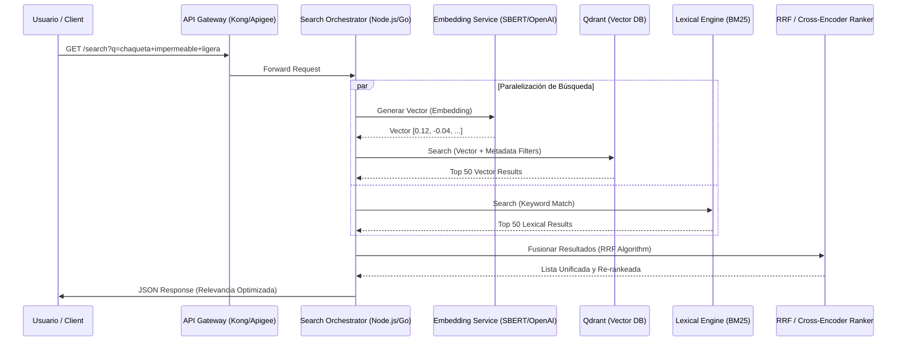

El colapso de la relevancia en buscadores tradicionales durante eventos de alto tráfico no es un problema de CPU, sino de semántica y precisión estructural. En una implementación reciente para un marketplace global con más de 120 millones de SKUs, nos enfrentamos a un "muro de conversión": mientras que Elasticsearch devolvía resultados exactos para términos técnicos como "iPhone 15 Pro Max 256GB", fallaba estrepitosamente ante consultas de intención como "dispositivo móvil premium para fotografía nocturna". Por el contrario, un motor puramente vectorial (Dense Retrieval) resolvía la intención pero ignoraba los números de parte (Part Numbers) y SKUs específicos, devolviendo modelos de años anteriores simplemente porque el "contexto" era similar. Este dilema de "Precisión vs. Relevancia Semántica" es el principal cuello de botella en las Operaciones de Día 2 de cualquier arquitectura de Composable Commerce que aspire a liderar el mercado en 2026.

La solución no es elegir uno sobre el otro, sino implementar una **Arquitectura de Búsqueda Híbrida** capaz de orquestar señales léxicas (BM25) y vectoriales (HNSW) en menos de 150ms, garantizando al mismo tiempo que los datos sensibles de precios B2B y disponibilidad no se filtren a través de los embeddings en un entorno Zero Trust.

## El Desafío de la Dualidad: Léxico vs. Semántico

En catálogos de gran escala, el motor de búsqueda debe lidiar con dos tipos de consultas radicalmente distintas que compiten por los mismos recursos de infraestructura:

1.  **Consultas de Navegación/Exactas:** El usuario sabe qué quiere ("SKU-99283-X", "Nike Air Max 90"). Aquí, el *keyword matching* es rey.
2.  **Consultas de Descubrimiento/Inspiración:** El usuario describe una necesidad ("zapatos cómodos para caminar en ciudad lluviosa"). Aquí, los modelos de lenguaje (LLMs) y los embeddings vectoriales son indispensables.

El problema crítico surge al intentar fusionar estos resultados. Si simplemente concatenamos las listas, el *score* de relevancia de un motor vectorial (usualmente similitud de coseno entre 0 y 1) no es comparable con el *score* BM25 de un motor léxico (que puede ser cualquier número positivo). Sin una estrategia de **Reciprocal Rank Fusion (RRF)** o un **Cross-Encoder** para el re-ranking, la experiencia del usuario se degrada en una mezcla incoherente de productos.

### Arquitectura de Referencia: Hybrid Retrieval Pipeline

La siguiente arquitectura describe un flujo de trabajo Composable donde la ingesta de datos se desacopla de la inferencia, utilizando Qdrant como motor de búsqueda vectorial de alto rendimiento y un motor léxico (como Typesense o Elasticsearch) para la precisión de palabras clave.



## Implementación Técnica: Fusión de Rangos Recíprocos (RRF)

Para resolver la disparidad de *scoring*, implementamos RRF. Este algoritmo no depende de los valores absolutos de los scores, sino de la posición (rank) de cada documento en las listas devueltas por los diferentes motores.

A continuación, un ejemplo de implementación de un orquestador en TypeScript que integra **Qdrant** para la parte vectorial y un motor léxico simulado, aplicando RRF para la consolidación:

```typescript
/**
 * Search Orchestrator: Hybrid Retrieval with RRF
 * Optimized for low-latency MACH architectures.
 */

interface SearchResult {
  id: string;
  score: number;
  metadata: any;
}

async function hybridSearch(query: string, limit: number = 20): Promise<SearchResult[]> {
  const k = 60; // Constante de suavizado para RRF

  // 1. Ejecución en paralelo para minimizar latencia
  const [vectorResults, lexicalResults] = await Promise.all([
    getVectorResults(query),
    getLexicalResults(query)
  ]);

  const scores: Map<string, number> = new Map();

  // 2. Aplicar RRF a resultados vectoriales
  vectorResults.forEach((res, index) => {
    const rank = index + 1;
    const currentScore = scores.get(res.id) || 0;
    scores.set(res.id, currentScore + (1 / (k + rank)));
  });

  // 3. Aplicar RRF a resultados léxicos
  lexicalResults.forEach((res, index) => {
    const rank = index + 1;
    const currentScore = scores.get(res.id) || 0;
    scores.set(res.id, currentScore + (1 / (k + rank)));
  });

  // 4. Ordenar por el nuevo score híbrido
  const fusedResults = Array.from(scores.entries())
    .map(([id, score]) => ({
      id,
      score,
      // En producción, recuperaríamos la metadata de un caché de segundo nivel (Redis)
      metadata: findMetadata(id, vectorResults, lexicalResults) 
    }))
    .sort((a, b) => b.score - a.score)
    .slice(0, limit);

  return fusedResults;
}

// Ejemplo de consulta a Qdrant usando filtrado por atributos (Payload Filtering)
async function getVectorResults(query: string): Promise<SearchResult[]> {
  const embedding = await generateEmbedding(query);
  
  // Qdrant permite filtrar por tenant_id o visibilidad en la misma consulta vectorial
  // cumpliendo con principios de Seguridad Zero Trust.
  const response = await qdrantClient.search("products", {
    vector: embedding,
    filter: {
      must: [{ key: "status", match: { value: "active" } }]
    },
    limit: 50,
    with_payload: true
  });

  return response.map(hit => ({
    id: hit.id.toString(),
    score: hit.score,
    metadata: hit.payload
  }));
}
```

## Comparativa de Trade-offs: Qdrant vs. Pinecone en Escenarios Enterprise

La elección de la base de datos vectorial es crítica para el rendimiento de las Operaciones de Día 2. Mientras que Pinecone ofrece una experiencia *Serverless* casi sin fricción, Qdrant proporciona un control granular sobre la infraestructura, vital para optimizar costos en catálogos de más de 100M de vectores.

| Característica | Qdrant (Self-hosted/Managed) | Pinecone (Serverless/Pod-based) | Recomendación de Arquitecto |
| :--- | :--- | :--- | :--- |
| **Arquitectura de Indexación** | HNSW (Hierarchical Navigable Small World) | Propietaria (basada en grafos) | Qdrant para mayor transparencia en el tuning de HNSW. |
| **Filtrado de Payload** | Nativo, extremadamente rápido (In-place filtering) | Soportado, pero con latencia variable en Serverless | Qdrant si el filtrado por atributos (precio, stock) es dinámico. |
| **Escalabilidad Horizontal** | Sharding manual/automático vía Raft | Automática (Serverless) | Pinecone para equipos pequeños; Qdrant para control de costos FinOps. |
| **Seguridad (Zero Trust)** | Soporta mTLS, RBAC granular y despliegue On-prem | Cloud-native, aislamiento lógico | Qdrant si los datos no pueden salir de la VPC de la empresa. |
| **Latencia (p99)** | < 50ms (con optimización de cuantización) | 100ms - 200ms (depende de la región) | Qdrant para casos de uso de e-commerce en tiempo real. |

## Seguridad Zero Trust en el Pipeline de IA

Un error común es asumir que los vectores son "anónimos". Sin embargo, mediante ataques de inversión de embeddings, es posible reconstruir parte del texto original. En una arquitectura Composable segura, debemos aplicar tres capas de defensa:

1.  **Sanitización de Inferencia:** Antes de enviar el texto al modelo de embedding (especialmente si es una API externa como OpenAI), se deben filtrar PII (Personally Identifiable Information) mediante herramientas como Presidio.
2.  **Aislamiento de Tenencia (Multi-tenancy):** En Qdrant, utilice `payload_groups` o colecciones separadas para asegurar que un usuario de la "Organización A" nunca reciba resultados de la "Organización B", incluso si la similitud vectorial es alta.
3.  **Filtrado Post-Inferencia (RBAC):** La base de datos vectorial no debe ser la fuente de verdad para la autorización. El orquestador debe validar los permisos de visibilidad del producto contra un servicio de inventario/autorización antes de renderizar el resultado final.

## Modos de Fallo Comunes y Mitigación en Producción

### 1. El Problema del "Cold Start" en Embeddings
Cuando se añaden nuevos productos al catálogo, el proceso de generación de embeddings puede tardar. Si un usuario busca el producto inmediatamente, el motor vectorial no lo encontrará.
*   **Mitigación:** Implementar un flujo de "Búsqueda Degradada". Si el vector no existe, el motor léxico toma el 100% del peso de la búsqueda hasta que el worker de IA notifique la indexación del vector.

### 2. Embedding Drift (Deriva de Embeddings)
Al actualizar el modelo de lenguaje (ej: pasar de `text-embedding-3-small` a un modelo superior), todos los vectores existentes en la base de datos se vuelven obsoletos instantáneamente.
*   **Mitigación:** Mantener una arquitectura de "Blue/Green Indexing". Crear una nueva colección en Qdrant, indexar con el nuevo modelo en segundo plano, y realizar el *switch* en el orquestador una vez completado.

### 3. Explosión de Costos de Memoria (RAM)
HNSW mantiene el grafo en memoria para garantizar baja latencia. Para 100M de vectores de 1536 dimensiones, esto puede requerir terabytes de RAM.
*   **Mitigación:** Utilizar **Scalar Quantization (SQ)** o **Product Quantization (PQ)**. Qdrant permite comprimir los vectores de `float32` a `int8`, reduciendo el consumo de memoria hasta en un 75% con una pérdida mínima de precisión (recall < 1%).

## Checklist de Implementación para Equipos de Ingeniería

Para asegurar una transición exitosa hacia una búsqueda híbrida a escala, siga estos pasos:

- [ ] **Definir la Métrica de Éxito:** No use solo latencia. Mida el **NDCG (Normalized Discounted Cumulative Gain)** para evaluar la calidad del ranking híbrido.
- [ ] **Implementar Telemetría de Vectores:** Monitorear la distancia media de los resultados (cosine distance). Si la distancia aumenta repentinamente, el modelo de embedding podría estar fallando en capturar el contexto actual del catálogo.
- [ ] **Optimizar el Payload:** No almacene todo el objeto del producto en la base de datos vectorial. Guarde solo el `product_id` y atributos necesarios para el filtrado (price_range, category_id, store_id).
- [ ] **Configurar HNSW Tuning:** Ajuste `m` (número de conexiones por nodo) y `ef_construct` (precisión durante la creación del índice) según la relación latencia/precisión requerida.
- [ ] **Validar Zero Trust:** Asegurar que las claves de API para los servicios de embedding tengan scopes limitados y que el tráfico entre el orquestador y la DB vectorial viaje sobre mTLS (Mutual TLS).

La búsqueda híbrida no es una tendencia, es la respuesta técnica a la complejidad inherente de los datos modernos. Al combinar la robustez del análisis léxico con la intuición del análisis vectorial, las organizaciones pueden finalmente cerrar la brecha entre lo que el usuario escribe y lo que realmente desea encontrar.