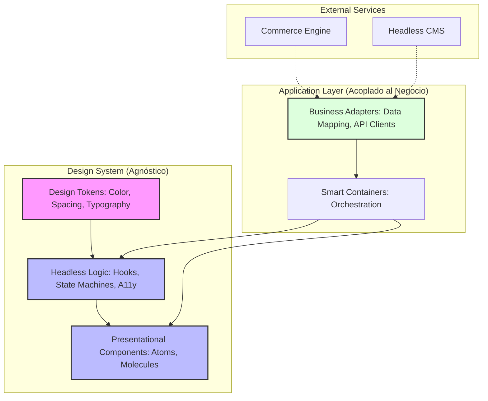

El colapso de una estrategia de Composable Commerce no suele ocurrir en el backend; ocurre en la capa de presentación cuando el "Sistema de Diseño" se convierte en un monolito distribuido. Imagine este escenario de Operaciones de Día 2: su organización ha migrado exitosamente a microservicios y un CMS Headless, pero al intentar lanzar una segunda marca o una nueva región geográfica, el equipo de ingeniería descubre que el componente `ProductCard` está intrínsecamente ligado al esquema de datos de una API específica y contiene lógica de validación de inventario hardcodeada. 

Este acoplamiento genera una fricción insostenible. Cada cambio en el contrato de la API de checkout requiere actualizaciones en cascada en múltiples librerías de componentes, y la reutilización de la UI en diferentes canales (web, mobile web, kioscos) se vuelve imposible sin duplicar lógica de negocio. El verdadero reto arquitectónico no es crear componentes visualmente consistentes, sino diseñar un **Sistema de Diseño Headless** que actúe como una infraestructura pura de interacción, totalmente agnóstica de las reglas de negocio y los modelos de datos del dominio.

## El Problema: El "Smart Component" como Anti-patrón de Escala

En implementaciones enterprise, el error más común es permitir que los componentes de UI "sepan demasiado". Un componente de `CartSummary` que realiza su propio `fetch` a un endpoint de `/api/v1/cart` es un fallo de arquitectura. Este enfoque viola el principio de responsabilidad única y destruye la composabilidad.

Cuando la lógica de negocio (cálculo de impuestos, reglas de descuento, validaciones de stock) se filtra en la capa de UI, el Sistema de Diseño deja de ser una herramienta de aceleración para convertirse en un cuello de botella. La solución radica en la inversión de control: el sistema de diseño proporciona el **comportamiento y la accesibilidad** (Headless), mientras que la aplicación consumidora inyecta la **lógica y los datos** (Business Logic).

## Arquitectura de Referencia: Desacoplamiento en Capas

Para lograr un sistema verdaderamente desacoplado, debemos estructurar la arquitectura de frontend en cuatro capas distintas, donde el Sistema de Diseño solo ocupa las dos primeras.



### 1. Capa de Tokens (Source of Truth)
Los Design Tokens son la unidad mínima de consistencia. En una arquitectura MACH, estos deben ser consumibles vía API o paquetes NPM versionados, permitiendo que marcas hermanas compartan la misma estructura lógica de tokens pero con valores diferentes (Multi-theming).

### 2. Capa Headless (Comportamiento)
Aquí reside la lógica de interacción: gestión de foco, estados de teclado (Aria), y máquinas de estado para componentes complejos como modales o comboboxes. Esta capa no tiene CSS ni HTML semántico predefinido.

### 3. Capa de Presentación (UI Pura)
Componentes que reciben *props* primitivas. No conocen qué es un "Producto" o un "Pedido"; solo conocen strings, números y funciones de callback.

## Implementación Técnica: El Patrón de Inyección de Dominio

Para evitar que un componente de UI dependa de un modelo de datos de backend, utilizamos **Interfaces de Dominio Mínimas** y **Patrones de Adaptador**. A continuación, un ejemplo de cómo desacoplar un componente de lista de productos en TypeScript.

### Definición del Componente Headless (UI Library)

```typescript
// @my-org/ui-kit/ProductTile.tsx

interface ProductTileProps {
  title: string;
  price: string;
  imageUrl: string;
  badgeText?: string;
  onAction: () => void;
  renderAction: (props: any) => React.ReactNode; // Slot pattern para flexibilidad
}

/**
 * Este componente es 100% agnóstico. 
 * No sabe si el precio viene de Commercetools o Shopify.
 */
export const ProductTile = ({ 
  title, 
  price, 
  imageUrl, 
  onAction, 
  renderAction 
}: ProductTileProps) => {
  return (
    <div className="ds-product-card">
      
      <h3 className="ds-title">{title}</h3>
      <span className="ds-price">{price}</span>
      <div className="ds-actions">
        {renderAction({ onClick: onAction })}
      </div>
    </div>
  );
};
```

### Implementación del Adaptador (Application Layer)

```typescript
// apps/ecommerce-web/adapters/productAdapter.ts

import { CommercetoolsProduct } from '@my-org/api-types';

/**
 * El adaptador transforma el modelo complejo del backend 
 * al modelo simple requerido por el Sistema de Diseño.
 */
export const mapCTProductToUI = (product: CommercetoolsProduct) => {
  return {
    title: product.name['es-ES'],
    price: `${product.masterVariant.prices[0].value.centAmount / 100}€`,
    imageUrl: product.masterVariant.images[0].url,
    id: product.id
  };
};

// apps/ecommerce-web/components/ProductCardContainer.tsx

import { ProductTile } from '@my-org/ui-kit';
import { useCart } from '../hooks/useCart';

export const ProductCardContainer = ({ rawProduct }: { rawProduct: any }) => {
  const { addToCart } = useCart();
  const uiProps = mapCTProductToUI(rawProduct);

  return (
    <ProductTile 
      {...uiProps}
      onAction={() => addToCart(uiProps.id)}
      renderAction={(props) => (
        <button {...props} className="btn-primary">
          Añadir al Carrito
        </button>
      )}
    />
  );
};
```

## Trade-offs Arquitectónicos: ¿Cuándo ir Headless?

No todos los proyectos requieren este nivel de abstracción. El desacoplamiento extremo introduce una sobrecarga cognitiva y de desarrollo inicial.

| Criterio | Sistema de Diseño Monolítico | Sistema de Diseño Headless |
| :--- | :--- | :--- |
| **Velocidad Inicial** | Muy alta (Copy-paste / Componentes listos) | Lenta (Requiere definir contratos y adaptadores) |
| **Mantenibilidad** | Baja (Efectos secundarios impredecibles) | Muy alta (Cambios aislados en lógica o UI) |
| **Multi-marca** | Difícil (Requiere overrides de CSS pesados) | Nativa (Cambio de tokens y adaptadores) |
| **Performance** | Riesgo de "Bloat" (Lógica no usada) | Óptima (Tree-shaking agresivo) |
| **Curva de Aprendizaje** | Baja | Alta (Requiere entender patrones de inversión de control) |

## Modos de Fallo en Producción y Mitigación

### 1. La Trampa de la "Prop Explosion"
A medida que intentamos hacer un componente más genérico, terminamos con componentes que aceptan 50 props diferentes.
*   **Mitigación:** Utilizar el **Patrón de Componentes Compuestos** (Compound Components). En lugar de `<Select options={...} color="..." onSelect={...} />`, utilizar:
    ```tsx
    <Select>
      <Select.Trigger />
      <Select.Content>
        <Select.Item value="1">Opción 1</Select.Item>
      </Select.Content>
    </Select>
    ```

### 2. Inconsistencia de Datos en el Edge
Cuando los adaptadores de datos se ejecutan en el cliente, pueden ocurrir parpadeos de contenido (layout shift) si la transformación es pesada.
*   **Mitigación:** Realizar el mapeo de datos en el **BFF (Backend for Frontend)** o mediante **React Server Components (RSC)**. El componente de UI recibe el objeto ya transformado desde el servidor, eliminando lógica de computación en el navegador del usuario.

### 3. Desincronización de Versiones
En una arquitectura de micro-frontends, diferentes equipos pueden usar diferentes versiones de la librería headless, causando comportamientos inconsistentes.
*   **Mitigación:** Implementar un **Federated Design System** utilizando Module Federation, permitiendo que la versión "core" de los componentes se comparta en tiempo de ejecución, manteniendo la autonomía de los equipos para extender la lógica de negocio.

## Estrategia de Implementación para Equipos de Ingeniería

Para transicionar de un sistema acoplado a uno agnóstico, siga este checklist de arquitectura:

1.  **Auditoría de Dependencias:** Identifique componentes que importen hooks de estado global (Redux, Apollo, Query) o clientes de API directamente. Estos son sus primeros candidatos para refactorización.
2.  **Definición de Contratos de UI:** Antes de codificar, defina la interfaz de datos mínima que el componente necesita para renderizarse. Si un componente de "Usuario" solo muestra el nombre, su prop debe ser `name: string`, no `user: UserObject`.
3.  **Externalización de la Lógica de Validación:** Las reglas de negocio (ej: "¿puede este usuario ver este precio?") deben residir en servicios de dominio o hooks de aplicación, nunca dentro del componente del Sistema de Diseño.
4.  **Adopción de Headless Primitives:** No reinvente la rueda de la accesibilidad. Utilice librerías como **Radix UI**, **React Aria** o **Headless UI** como base para su sistema de diseño, construyendo su capa visual y de negocio encima de ellas.
5.  **Testing de Contratos:** Implemente tests de regresión visual (Storybook + Chromatic) para la capa de presentación y tests unitarios rigurosos para los adaptadores de datos.

## Conclusión

El diseño de sistemas de diseño headless no es un ejercicio estético, es una decisión de **eficiencia operativa**. En el ecosistema MACH, la agilidad se mide por la capacidad de cambiar el motor de comercio o el CMS sin tener que reconstruir la experiencia del usuario. Al desacoplar la lógica de negocio de la UI, transformamos el frontend de un bloque monolítico frágil en una serie de piezas intercambiables, listas para escalar ante las demandas de un mercado composable.