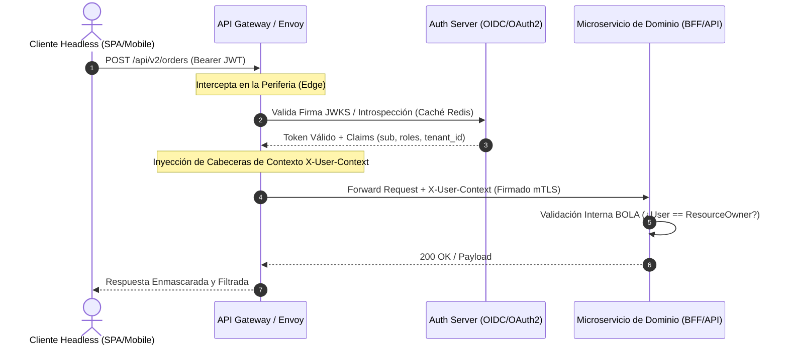

Durante la ventana de despliegue de medianoche para una campaña masiva de *flash sales* en una plataforma de comercio composable (MACH), el API Gateway registró un pico anómalo de tráfico: 450,000 peticiones por segundo dirigidas a microservicios de inventario y precios. No se trataba de un ataque volumétrico de denegación de servicio (DDoS) tradicional, sino de una explotación coordinada de *Broken Object Level Authorization* (BOLA) combinada con el reuso malicioso de JSON Web Tokens (JWT) robados mediante secuestro de sesiones en el frontend headless. Los atacantes alteraron sistemáticamente los identificadores de recursos en los endpoints REST y GraphQL, omitiendo los controles de contexto de inquilino (*tenant*) y desbordando las bases de datos de lectura con consultas masivas sin paginación cursor-based. Este escenario de Operaciones de Día 2 expone la realidad de las arquitecturas distribuidas: desvincular el monolito no elimina la superficie de ataque, sino que la multiplica exponencialmente a través de cientos de contratos API expuestos en la periferia de la nube.

## Anatomía de la Explotación: OWASP API Top 10 en Ecosistemas Composable

En una arquitectura basada en microservicios independientes que se comunican mediante APIs REST y federación de GraphQL, la seguridad perimetral tradicional basada en firewalls de red deja de ser efectiva. Los atacantes modernos explotan fallas lógicas a nivel de aplicación, donde cada microservicio asume erróneamente que el API Gateway ya validó la autorización granular del recurso.

El vector de ataque más crítico en entornos enterprise es **API1:2023 - Broken Object Level Authorization (BOLA)**. Ocurre cuando un servicio expone endpoints que aceptan identificadores de objetos (UUIDs o enteros secuenciales) sin verificar si el usuario autenticado posee privilegios explícitos sobre dicho objeto. En un ecosistema de comercio, esto permite que un cliente con ID `user_9821` extraiga el historial de pedidos, direcciones y métodos de pago de `user_0042` simplemente iterando el parámetro en la URL o en la mutación de GraphQL.

Otro vector prevalente en implementaciones aceleradas es **API4:2023 - Unrestricted Resource Consumption**. Las APIs headless orientadas a clientes móviles y web sufren de la falta de límites estrictos en el procesamiento de cargas útiles y consultas complejas. Los atacantes aprovechan la flexibilidad de GraphQL para construir consultas anidadas recursivas que agotan las reservas de *pool* de conexiones del servicio de persistencia, o bien envían cargas JSON masivas que fuerzan ataques de denegación de servicio internos (*Denial of Wallet* en servicios Serverless).

### Flujo de Validación de Identidad y Autorización en la Periferia MACH

Para mitigar estas brechas, el patrón arquitectónico moderno exige interceptar la petición en el API Gateway antes de que toque los microservicios de dominio, aplicando una validación criptográfica estricta y propagación de contexto mediante claims firmados.



## Arquitectura de Gestión Segura de Tokens JWT

El manejo deficiente de tokens JWT es la causa raíz de la mayoría de las filtraciones de sesiones en arquitecturas modernas. Errores comunes de implementación incluyen el uso de algoritmos simétricos débiles (`HS256`) con claves compartidas entre múltiples microservicios, la ausencia de rotación de claves públicas/privadas (JWKS), y la inclusión de información sensible en los claims del payload (PII como correos electrónicos o números de tarjetas enmascarados).

### Configuración Hardened de Validación JWT en Go

A nivel de código en los microservicios o middlewares del API Gateway, la validación de tokens debe ser estricta: rechazar explícitamente el algoritmo `"none"`, validar el emisor (`iss`), la audiencia (`aud`), el tiempo de expiración (`exp`) y garantizar que se utilice criptografía asimétrica (`RS256` o `EdDSA`).

```go
package security

import (
	"context"
	"crypto/rsa"
	"errors"
	"fmt"
	"net/http"
	"strings"
	"time"

	"github.com/golang-jwt/jwt/v5"
)

type TokenValidator struct {
	publicKey *rsa.PublicKey
	issuer    string
	audience  string
}

type contextKey string

const UserContextKey contextKey = "userContext"

type UserClaims struct {
	UserID   string   `json:"sub"`
	TenantID string   `json:"tenant_id"`
	Roles    []string `json:"roles"`
	jwt.RegisteredClaims
}

func NewTokenValidator(pubKey *rsa.PublicKey, issuer, audience string) *TokenValidator {
	return &TokenValidator{
		publicKey: pubKey,
		issuer:    issuer,
		audience:  audience,
	}
}

func (tv *TokenValidator) Middleware(next http.Handler) http.Handler {
	return http.HandlerFunc(func(w http.ResponseWriter, r *http.Request) {
		authHeader := r.Header.Get("Authorization")
		if authHeader == "" || !strings.HasPrefix(authHeader, "Bearer ") {
			http.Error(w, "Unauthorized: Missing or malformed token", http.StatusUnauthorized)
			return
		}

		tokenString := strings.TrimPrefix(authHeader, "Bearer ")

		claims := &UserClaims{}
		token, err := jwt.ParseWithClaims(tokenString, claims, func(token *jwt.Token) (interface{}, error) {
			// Prevenir ataque de confusión de algoritmo (Algorithm Confusion Attack)
			if _, ok := token.Method.(*jwt.SigningMethodRSA); !ok {
				return nil, fmt.Errorf("unexpected signing method: %v", token.Header["alg"])
			}
			return tv.publicKey, nil
		})

		if err != nil || !token.Valid {
			http.Error(w, fmt.Sprintf("Unauthorized: Invalid token: %v", err), http.StatusUnauthorized)
			return
		}

		// Validaciones estrictas de Claims estándar
		if claims.Issuer != tv.issuer {
			http.Error(w, "Unauthorized: Invalid issuer", http.StatusUnauthorized)
			return
		}

		// Inyección de contexto seguro para el dominio interno
		ctx := context.WithValue(r.Context(), UserContextKey, claims)
		next.ServeHTTP(w, r.WithContext(ctx))
	})
}
```

### Gestión de Revocación y Listas de Bloqueo Distribuidas

Los tokens JWT son inherentemente sin estado (*stateless*), lo que dificulta la revocación inmediata ante un cierre de sesión explícito o un reporte de compromiso de credenciales. La práctica de producción recomendada consiste en implementar una **Lista Negra Distribuida basada en Redis** utilizando el identificador único del token (`jti` - *JWT ID*) configurado con un TTL equivalente al tiempo restante de vida (`exp - now()`) del token.

```python
import redis
import jwt
from fastapi import HTTPException, Security, status
from fastapi.security import HTTPBearer, HTTPAuthorizationCredentials

redis_client = redis.Redis(host='redis-cluster.internal', port=6379, db=0)
security_scheme = HTTPBearer()

async def verify_jwt_not_revoked(credentials: HTTPAuthorizationCredentials = Security(security_scheme)):
    token = credentials.credentials
    try:
        # Decodificación inicial sin verificar firma (solo para extraer jti y exp)
        unverified_claims = jwt.decode(token, options={"verify_signature": False})
        jti = unverified_claims.get("jti")
        
        if not jti:
            raise HTTPException(status_code=status.HTTP_401_UNAUTHORIZED, detail="Token sin identificador JTI válido")
            
        # Verificar si el JTI está en la lista negra distribuida
        if redis_client.exists(f"bl_jti:{jti}"):
            raise HTTPException(status_code=status.HTTP_401_UNAUTHORIZED, detail="Token revocado explícitamente")
            
        return unverified_claims
    except jwt.PyJWTError:
        raise HTTPException(status_code=status.HTTP_401_UNAUTHORIZED, detail="Error al procesar el token de acceso")
```

---

## Mitigación de los Vectores Restantes del OWASP API Top 10 (2023)

Además de BOLA y la gestión de tokens, un diseño de API enterprise debe contemplar defensas automatizadas para los siguientes vectores críticos dentro de la especificación OWASP:

1. **API2:2023 - Broken Authentication:** Las credenciales y flujos de autenticación deben incorporar limitación de tasa basada en IP y usuario en los endpoints de *login*, además de exigir intercambio de códigos mediante PKCE (*Proof Key for Code Exchange*) para clientes públicos (SPAs y aplicaciones móviles).
2. **API3:2023 - Broken Object Property Level Authorization:** Evitar la exposición masiva de atributos (*Mass Assignment*). Los modelos de datos de entrada y salida deben estar estrictamente tipados y filtrados (utilizando DTOs o esquemas de validación como Pydantic o Zod), impidiendo que un usuario modifique campos administrativos (`is_admin: true`) inyectando propiedades adicionales en las peticiones PATCH o PUT.
3. **API5:2023 - Broken Function Level Authorization:** Los roles y permisos no deben validarse únicamente en la capa de presentación o en el Gateway. Cada microservicio de dominio debe aplicar políticas de control de acceso basadas en atributos (ABAC) o roles (RBAC) evaluadas contra los claims inyectados en la cabecera `X-User-Context`.
4. **API7:2023 - Server-Side Request Forgery (SSRF):** Los microservicios que consumen recursos externos (como pasarelas de pago de terceros o importadores de catálogos mediante URLs) deben validar y desinfectar las URLs de destino, bloqueando rangos de direcciones IP privadas (RFC 1918) y redes locales para prevenir exfiltración de metadatos de la nube.

---

## Tabla Comparativa: Estrategias de Mitigación y Trade-offs Arquitectónicos

| Enfoque de Seguridad | Pros | Contras | Cuándo Usar | Cuándo Evitar |
| :--- | :--- | :--- | :--- | :--- |
| **Introspección Centralizada de Tokens (OAuth2 Introspection)** | Revocabilidad instantánea; control centralizado absoluto en el Auth Server. | Alta latencia de red en cada petición; punto único de fallo (SPOF) en el Auth Server. | Aplicaciones financieras o de alto riesgo donde la revocación inmediata es mandatoria. | Arquitecturas de alta escala masiva (millones de RPS) donde la latencia agregada es inaceptable. |
| **Tokens JWT Autocontenidos con Redis Blacklist (JTI)** | Baja latencia en microservicios; revocación selectiva eficiente mediante TTL en Redis. | Requiere infraestructura distribuida de caché altamente disponible; sincronización de estado. | E-commerce y plataformas MACH con alto volumen de lectura y sesiones activas concurrentes. | Entornos edge puramente serverless sin persistencia de caché centralizada de bajo costo. |
| **Arquitectura Zero Trust mTLS + SPIFFE/SPIRE entre Servicios** | Cifrado de extremo a extremo; autenticación criptográfica automática a nivel de red interna. | Complejidad operacional extrema de Día 2; gestión de infraestructura PKI y certificados efímeros. | Comunicación interna entre microservicios en nubes públicas distribuidas (Kubernetes multicluster). | Sistemas monolíticos o arquitecturas pequeñas donde la sobrecarga de gestión de mTLS supera el riesgo. |

---

## Modos de Fallo Comunes y Estrategias de Recuperación en Producción

### 1. Rotación de Claves JWKS y Fallo de Sincronización
* **Modo de Fallo:** El servidor de autenticación rota sus llaves privadas de firma RSA/ECDSA, pero los microservicios o el API Gateway mantienen en caché la llave pública antigua. Como resultado, todas las peticiones legítimas son rechazadas con error `401 Unauthorized` tras la rotación.
* **Estrategia de Recuperación:** Implementar un mecanismo de caché con *fallback* asíncrono y soporte para múltiples *Key IDs* (`kid`). El validador de JWT debe consultar el punto final `.well-known/jwks.json` y aceptar firmas de llaves anteriores durante una ventana de gracia superpuesta (ej. 24 horas) antes de purgar completamente las llaves obsoletas.

### 2. Agotamiento de Recursos por Consultas Maliciosas (DoS)
* **Modo de Fallo:** Un cliente malintencionado envía peticiones masivas con filtros complejos o paginación excesiva (ej. `limit=1000000`), colapsando el *pool* de conexiones de la base de datos relacional o de documentos.
* **Estrategia de Recuperación:** 
  - Limitar obligatoriamente la paginación a través de cursores (*Cursor-based pagination*) con un tamaño de página máximo inalterable en la capa de API.
  - Implementar contadores de complejidad estática para consultas de GraphQL o validación de profundidad máxima (*Query Depth Limiting*).
  - Aplicar políticas de *Rate Limiting* adaptativo en el API Gateway basadas en el consumo de CPU/Memoria del backend (algoritmo de *Token Bucket* distribuido).

---

## Conclusión Accionable: Checklist de Implementación para Equipos de Ingeniería

Para garantizar la resiliencia y el cumplimiento normativo de las APIs en una arquitectura MACH, los equipos de desarrollo y plataforma deben integrar el siguiente checklist automatizado en sus pipelines de CI/CD:

1. [ ] **Validación Criptográfica Estricta:** Asegurar que ningún microservicio acepte el algoritmo `"none"` ni claves simétricas débiles; exigir rotación asimétrica mediante JWKS con validación estricta de `iss`, `aud` y `exp`.
2. [ ] **Mitigación Activa de BOLA:** Implementar pruebas automatizadas de autorización a nivel de objeto en las etapas de pruebas de integración (ej. verificar que `User A` obtenga un error `403 Forbidden` al intentar acceder a recursos de `User B`).
3. [ ] **Control de Consumo de Recursos:** Configurar límites estrictos de tamaño de carga útil en el API Gateway y aplicar paginación obligatoria basada en cursores en todos los endpoints de listado de catálogos y transacciones.
4. [ ] **Propagación Segura de Contexto:** Reemplazar la confianza implícita de red por la propagación explícita de cabeceras de contexto firmadas (`X-User-Context`) validadas en cada límite de servicio interno.
5. [ ] **Escaneo OWASP Automatizado:** Integrar herramientas de análisis estático (SAST) y pruebas dinámicas de seguridad de aplicaciones (DAST/API Fuzzing) en el pipeline de despliegue continuo para detectar desviaciones en los contratos OpenAPI antes de llegar a producción.