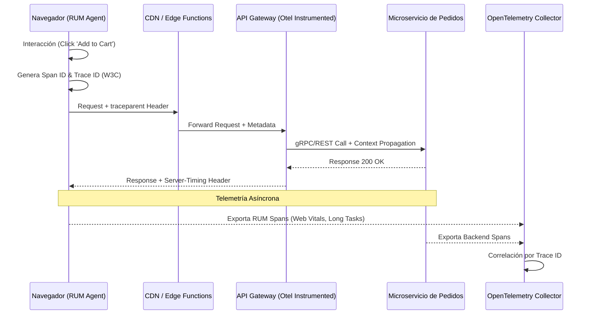

El dashboard de Grafana muestra un mar de color verde: el API Gateway reporta un p99 de 150ms, los microservicios de inventario y checkout operan con una tasa de error del 0.01%, y el escalado automático de Kubernetes responde sin fricciones. Sin embargo, el equipo de Negocio reporta una caída del 22% en la tasa de conversión durante la última hora de una venta relámpago (Flash Sale). Los logs del backend no muestran nada inusual. Lo que el equipo de infraestructura ignora es que, en el dispositivo del usuario, el hilo principal (Main Thread) de JavaScript está bloqueado por 4.5 segundos debido a una contención de recursos entre el script de hidratación del framework, tres píxeles de marketing mal configurados y un micro-frontend de recomendaciones que está disparando re-renders infinitos.

Este es el "punto ciego" de la observabilidad tradicional en arquitecturas Headless. En un entorno Composable Commerce, la experiencia del usuario final no es simplemente la suma de las latencias de las APIs; es un ecosistema distribuido que se ejecuta en hardware que el arquitecto no controla. Sin una estrategia de **Real User Monitoring (RUM)** integrada con telemetría distribuida, estamos operando a ciegas, optimizando milisegundos en el servidor mientras perdemos segundos críticos en el navegador.

## El Abismo entre el Backend y el DOM: El Desafío de la Correlación

En una arquitectura monolítica, el servidor renderizaba el HTML y el monitoreo de red era suficiente para entender el desempeño. En el mundo MACH, el frontend es una aplicación pesada (SPA/PWA) o una compleja amalgama de Server Components e hidratación parcial. El problema técnico fundamental es la **pérdida de contexto**. Cuando un usuario hace clic en "Finalizar Compra" y la petición falla, necesitamos saber exactamente qué traza de backend corresponde a esa interacción específica del DOM, bajo qué condiciones de red (4G vs. WiFi lento) y con qué carga de CPU en el dispositivo móvil.

La solución no es simplemente instalar un script de Google Analytics. Requerimos una arquitectura de telemetría que implemente el estándar **W3C Trace Context**, permitiendo que los encabezados de trazabilidad (`traceparent`, `tracestate`) viajen desde el evento `onClick` en el navegador hasta la consulta SQL en el microservicio de base de datos.

### Arquitectura de Telemetría de Extremo a Extremo

El siguiente diagrama ilustra cómo la telemetría debe fluir desde el cliente hasta el colector centralizado, unificando las métricas de rendimiento real con las trazas distribuidas.



## Implementación Técnica: OpenTelemetry Web y Correlación de Trazas

Para cerrar la brecha, debemos instrumentar el frontend utilizando el SDK de OpenTelemetry para la web. A diferencia de las herramientas RUM comerciales cerradas, OTel nos permite una granularidad total y la capacidad de inyectar metadatos de negocio (ej: `cart_value`, `user_tier`) en cada traza.

### Configuración del Tracer Provider en el Frontend (TypeScript)

Este ejemplo muestra cómo configurar un proveedor de trazas que capture automáticamente las interacciones del usuario y las peticiones `fetch`, propagando el contexto hacia el backend.

```typescript
import { WebTracerProvider } from '@opentelemetry/sdk-trace-web';
import { BatchSpanProcessor } from '@opentelemetry/sdk-trace-base';
import { OTLPTraceExporter } from '@opentelemetry/exporter-trace-otlp-http';
import { XMLHttpRequestInstrumentation } from '@opentelemetry/instrumentation-xml-http-request';
import { FetchInstrumentation } from '@opentelemetry/instrumentation-fetch';
import { ZoneContextManager } from '@opentelemetry/context-zone';
import { registerInstrumentations } from '@opentelemetry/instrumentation';

const provider = new WebTracerProvider();

// Exportador hacia nuestro colector central (vía OTLP/HTTP)
const exporter = new OTLPTraceExporter({
  url: 'https://telemetry.internal.acme.com/v1/traces',
  headers: { 'X-API-Key': process.env.NEXT_PUBLIC_OTEL_KEY }
});

provider.addSpanProcessor(new BatchSpanProcessor(exporter, {
  maxQueueSize: 100,
  scheduledDelayMillis: 5000,
}));

provider.register({
  contextManager: new ZoneContextManager(),
});

// Instrumentación automática de red
registerInstrumentations({
  instrumentations: [
    new FetchInstrumentation({
      propagateTraceHeaderCorsUrls: [ /api\.acme\.com/g ],
      clearTimingResources: true,
    }),
    new XMLHttpRequestInstrumentation(),
  ],
});

export const tracer = provider.getTracer('headless-storefront-rum');
```

### Captura de "Long Tasks" y TBT (Total Blocking Time)

El rendimiento real no se mide solo en tiempo de carga. El **Total Blocking Time (TBT)** es crítico en Headless debido a la hidratación de React/Vue. Podemos capturar tareas largas que bloquean el hilo principal y enviarlas como eventos de telemetría:

```typescript
const observer = new PerformanceObserver((list) => {
  list.getEntries().forEach((entry) => {
    const span = tracer.startSpan('long-task-detected', {
      startTime: entry.startTime,
      attributes: {
        'performance.duration': entry.duration,
        'performance.entry_type': entry.entryType,
        'performance.attribution': JSON.stringify(entry.attribution),
      },
    });
    // Finalizamos el span inmediatamente ya que es un evento puntual
    span.end(entry.startTime + entry.duration);
  });
});

observer.observe({ entryTypes: ['longtask'] });
```

## Métricas de Rendimiento Real (RUM) vs. Monitoreo Sintético

Es un error común confiar únicamente en Lighthouse o monitoreo sintético (bots que cargan la página desde un centro de datos). El monitoreo sintético es determinista y excelente para detectar regresiones en el CI/CD, pero el RUM es el que revela la verdad del usuario en condiciones subóptimas.

| Característica | Monitoreo Sintético (Lighthouse/Puppeteer) | Real User Monitoring (RUM) |
| :--- | :--- | :--- |
| **Entorno** | Controlado (Emulación de CPU/Red) | Variable (Dispositivos reales, redes inestables) |
| **Contexto de Usuario** | Ninguno (Sesiones anónimas) | Completo (Usuarios autenticados, carritos llenos) |
| **Interacciones** | Scripts predefinidos | Flujos de navegación impredecibles |
| **Propósito** | Benchmarking y Gatekeeping en CI/CD | Diagnóstico de producción y métricas de negocio |
| **Limitación** | No detecta problemas de CDN regionales | Alta complejidad de datos y ruido estadístico |

## Trade-offs Arquitectónicos: El Costo de la Visibilidad

Implementar una estrategia de telemetría RUM exhaustiva no es gratuito. Existen compromisos técnicos que todo Principal Architect debe evaluar:

1.  **Sobrecarga del Cliente (Performance Overhead):** Ejecutar un agente de telemetría consume CPU y memoria. En dispositivos de gama baja, un agente mal configurado puede degradar el TBT que intenta medir.
    *   *Mitigación:* Utilizar muestreo (sampling) agresivo en el cliente. No necesitamos el 100% de las trazas de usuarios sanos, sino el 100% de las trazas de errores y un 5% de las exitosas.
2.  **Volumetría de Datos y Costos:** En una tienda con 1 millón de visitas diarias, generar trazas para cada interacción puede disparar los costos de almacenamiento en plataformas como Honeycomb, Datadog o New Relic.
    *   *Mitigación:* Implementar **Tail-based Sampling** en el OpenTelemetry Collector. Descartar trazas irrelevantes en el colector antes de enviarlas al almacenamiento persistente.
3.  **Privacidad y PII (Personally Identifiable Information):** La telemetría puede capturar accidentalmente correos electrónicos, tokens de sesión o direcciones en las URLs o payloads.
    *   *Mitigación:* Implementar procesadores de "scrubbing" en el SDK del cliente y en el colector para anonimizar datos antes de que salgan del perímetro del navegador.

## Modos de Fallo Comunes en Producción

### 1. El "Efecto Observador" en la Hidratación
Si el script de telemetría se carga de forma síncrona al inicio del `<head>`, puede retrasar el First Contentful Paint (FCP).
*   **Recuperación:** Cargar el SDK de telemetría de forma asíncrona (`async/defer`) y utilizar un buffer interno para capturar eventos tempranos antes de que el SDK esté listo.

### 2. CORS y Propagación de Encabezados
Al intentar propagar `traceparent` a APIs de terceros (ej: un CMS Headless o un motor de búsqueda como Algolia), el navegador bloqueará la petición por políticas de CORS si el servicio externo no permite explícitamente esos encabezados.
*   **Mitigación:** Configurar el SDK para propagar encabezados solo a dominios internos controlados o utilizar un **Edge Proxy** que inyecte la trazabilidad.

### 3. Desalineación de Relojes (Clock Skew)
Los dispositivos de los usuarios tienen relojes internos que pueden variar significativamente. Esto hace que las trazas parezcan ocurrir en el futuro o tengan duraciones negativas cuando se comparan con los logs del servidor.
*   **Mitigación:** OpenTelemetry maneja esto calculando el offset relativo, pero es vital usar marcas de tiempo de alta resolución (`performance.now()`) en lugar de `Date.now()`.

## Estrategia de Mitigación: El Patrón "Server-Timing"

Para reducir la carga en el cliente y mejorar la correlación sin enviar payloads masivos, podemos utilizar el encabezado de respuesta HTTP `Server-Timing`. Esto permite que el backend comunique al agente RUM en el navegador cuánto tiempo tomó cada microservicio, permitiendo que el frontend lo registre como parte de su propia telemetría.

```yaml
# Ejemplo de encabezado Server-Timing enviado por el API Gateway
Server-Timing: db;dur=52.3, auth;dur=10.5, total;dur=62.8
```

El navegador puede leer estos datos mediante la API de Performance:

```typescript
const entry = performance.getEntriesByType('resource')
  .find(e => e.name.includes('/api/checkout'));

if (entry && entry.serverTiming) {
  entry.serverTiming.forEach((timing) => {
    console.log(`${timing.name}: ${timing.duration}ms`);
    // Enviar a nuestro colector RUM para correlación
  });
}
```

## Conclusión: Checklist de Implementación para Equipos de Ingeniería

Para transformar la observabilidad de una tienda Headless de reactiva a proactiva, el equipo de arquitectura debe validar los siguientes puntos:

- [ ] **Unificación de IDs:** ¿El `trace_id` generado en el navegador es el mismo que llega a los logs de la base de datos?
- [ ] **Muestreo Inteligente:** ¿Estamos aplicando un muestreo del 100% para errores (4xx, 5xx) y un muestreo probabilístico para transacciones exitosas?
- [ ] **Métricas de Interacción:** ¿Estamos midiendo el *Interaction to Next Paint* (INP) como métrica principal de responsividad?
- [ ] **Sanitización de Datos:** ¿Existe un proceso automatizado para eliminar PII de las URLs y encabezados en las trazas?
- [ ] **Correlación de Negocio:** ¿Podemos filtrar trazas por ID de carrito o ID de sesión de usuario para reproducir errores reportados por soporte?
- [ ] **Impacto de Terceros:** ¿La telemetría captura el impacto de scripts externos (GTM, Píxeles) en el tiempo de bloqueo del hilo principal?

La observabilidad en el Composable Commerce no termina en la frontera de nuestra infraestructura. El verdadero rendimiento se mide en el dispositivo del cliente, y solo mediante la correlación estricta entre el DOM y el microservicio podemos garantizar que nuestra arquitectura MACH realmente está entregando la agilidad y velocidad que el negocio demanda.