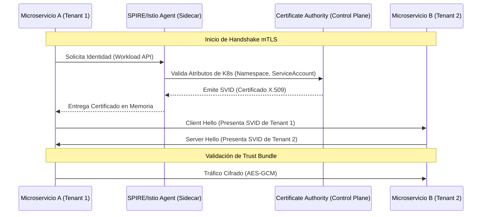

El escenario es una pesadilla recurrente en operaciones de Día 2: un microservicio de telemetría vulnerable en un entorno de pre-producción, alojado en el mismo clúster elástico que el motor de pagos, es comprometido mediante una vulnerabilidad de ejecución remota de código (RCE). Debido a una configuración de red excesivamente permisiva y a la confianza implícita en la red interna del clúster, el atacante realiza un movimiento lateral, intercepta tráfico plano entre servicios y extrae tokens de autenticación de cabeceras HTTP. En menos de diez minutos, el radio de explosión (*blast radius*) se extiende desde un componente no crítico hasta el núcleo transaccional. Este fallo no es de desarrollo, sino de arquitectura: la dependencia de la seguridad perimetral y la ausencia de una identidad de carga de trabajo (*workload identity*) verificable criptográficamente.

En clústeres Kubernetes multi-tenant de escala enterprise, confiar en las `NetworkPolicies` basadas en etiquetas de IP o selectores de pods es insuficiente. Las IPs en Kubernetes son efímeras y las etiquetas pueden ser manipuladas. La verdadera gobernanza Zero Trust exige que cada flujo de comunicación, sin excepción, sea autenticado, cifrado y autorizado basándose en una identidad fuerte y no en la ubicación de red.

## El Abismo de la Confianza Implícita en Redes SDN

El modelo tradicional de seguridad en Kubernetes asume que si un paquete llega desde dentro del clúster, es legítimo. Sin embargo, en arquitecturas MACH donde cientos de microservicios de diferentes dominios (Checkout, Inventory, Search, Auth) coexisten, la segmentación lógica por *Namespaces* no garantiza aislamiento criptográfico.

La implementación de **Mutual TLS (mTLS)** resuelve el problema de la suplantación de identidad y la interceptación, pero introduce una complejidad operativa masiva: la gestión del ciclo de vida de los certificados (rotación, revocación y distribución) para miles de pods que nacen y mueren en segundos. Aquí es donde la gobernanza se vuelve el cuello de botella: ¿Cómo garantizamos que el Tenant A no pueda comunicarse con el Tenant B incluso si ambos están en el mismo nodo físico?

### Arquitectura de Identidad con SPIFFE y Service Mesh

Para resolver esto, desacoplamos la identidad del servicio de la infraestructura subyacente utilizando el estándar SPIFFE (*Secure Production Identity Framework for Everyone*). En este modelo, cada carga de trabajo recibe un SVID (*SPIFFE Verifiable Identity Document*) en forma de certificado X.509.



## Implementación Técnica: Aplicando mTLS Estricto con Istio

En un entorno multi-tenant, no podemos permitir el modo "Permissive" de mTLS, ya que permite que servicios sin sidecars envíen tráfico en texto plano. Debemos forzar el modo "STRICT" a nivel global o por namespace, asegurando que cualquier intento de conexión no cifrada sea rechazado por el proxy Envoy antes de llegar a la aplicación.

### Configuración de PeerAuthentication para Aislamiento de Tenants

El siguiente manifiesto define una política de seguridad que obliga a todos los servicios en el namespace `pro-payments` a aceptar únicamente conexiones cifradas con certificados válidos emitidos por la CA del clúster.

```yaml
apiVersion: security.istio.io/v1beta1
kind: PeerAuthentication
metadata:
  name: default-strict-policy
  namespace: pro-payments
spec:
  mtls:
    mode: STRICT # Rechaza cualquier tráfico que no sea mTLS
---
apiVersion: security.istio.io/v1beta1
kind: AuthorizationPolicy
metadata:
  name: allow-only-checkout
  namespace: pro-payments
spec:
  selector:
    matchLabels:
      app: payment-gateway
  action: ALLOW
  rules:
  - from:
    - source:
        principals: ["cluster.local/ns/pro-checkout/sa/checkout-service-account"]
    to:
    - operation:
        methods: ["POST"]
        paths: ["/v1/charge"]
```

Este enfoque de "Deny by Default" es el pilar de Zero Trust. No solo ciframos el canal, sino que limitamos quién puede hablar con quién basándonos en el `Principal` de SPIFFE, que incluye el Namespace y la ServiceAccount, eliminando la posibilidad de que un servicio comprometido en el namespace `dev-tools` alcance el API de pagos.

## Gobernanza de Políticas con OPA (Open Policy Agent)

La gobernanza manual de archivos YAML es propensa al error humano. Para escalar en una organización con múltiples equipos de ingeniería, necesitamos "Policy as Code". OPA, actuando como un *Admission Controller* en Kubernetes, puede interceptar despliegues que violen nuestras reglas de seguridad Zero Trust.

### Regla Rego: Prohibir Namespaces sin mTLS Habilitado

Este fragmento de código Rego para Gatekeeper asegura que ningún administrador de un Tenant pueda crear un Namespace que no tenga activada la política de `PeerAuthentication` estricta.

```rego
package k8s_mtls_enforcement

violation[{"msg": msg}] {
  input.review.kind.kind == "Namespace"
  name := input.review.object.metadata.name
  not namespace_has_mtls_policy(name)
  msg := sprintf("El Namespace '%v' debe tener una política PeerAuthentication en modo STRICT.", [name])
}

namespace_has_mtls_policy(ns_name) {
  policy := data.inventory.namespace[ns_name]["security.istio.io/v1beta1"]["PeerAuthentication"]
  policy[_].spec.mtls.mode == "STRICT"
}
```

## Trade-offs Arquitectónicos: Rendimiento vs. Seguridad

Implementar mTLS y Zero Trust no es gratuito. Existe un "impuesto" de latencia y consumo de recursos que debe ser evaluado cuidadosamente en el diseño de la solución.

| Dimensión | mTLS con Sidecar (Envoy) | mTLS CNI-Native (Cilium/eBPF) | Application-Level mTLS |
| :--- | :--- | :--- | :--- |
| **Latencia (p99)** | Alta (+2ms a +5ms por salto) | Baja (<1ms gracias a eBPF) | Mínima (sin saltos extra) |
| **Complejidad Ops** | Alta (Inyección de sidecars) | Media (Requiere kernel moderno) | Extrema (Gestión manual de certs) |
| **Visibilidad L7** | Excelente (HTTP/gRPC metrics) | Buena (vía Hubble) | Nula (Tráfico opaco para la red) |
| **Gobernanza** | Centralizada (Control Plane) | Centralizada (Cilium Policies) | Descentralizada (Difícil de auditar) |
| **Uso de CPU/RAM** | Significativo (1GB+ por nodo) | Mínimo (Kernel space) | Variable según lenguaje |

### El auge de eBPF y mTLS "Sidecar-less"

Para arquitecturas de ultra-baja latencia (ej: trading o procesamiento de eventos en tiempo real), el modelo de sidecar de Istio puede ser prohibitivo. Tecnologías como **Cilium** están revolucionando este espacio al mover el cifrado al nivel del kernel mediante eBPF y WireGuard o IPsec. Esto permite obtener los beneficios de Zero Trust sin penalizar el rendimiento de la pila de red del espacio de usuario.

## Modos de Fallo Comunes en Producción y Mitigación

### 1. Agotamiento de Entropía y Latencia de Handshake
En clústeres con alta volatilidad (churn) de pods, la generación constante de claves privadas puede agotar la entropía del sistema, ralentizando los handshakes TLS.
*   **Mitigación:** Utilizar proveedores de entropía por hardware o asegurar que los nodos tengan configurado `virtio-rng`.

### 2. Certificados Expirados por Desincronización del Reloj
Si los nodos del clúster tienen una deriva de tiempo (*clock skew*), un certificado emitido puede ser considerado inválido inmediatamente.
*   **Mitigación:** Implementar monitoreo estricto de NTP/Chrony y alertas de Prometheus sobre la métrica `pilot_dest_check_expiry_timestamp`.

### 3. El Problema del "Chicken and Egg" en el Bootstrapping
Para que un pod obtenga su identidad SPIFFE, debe autenticarse ante el servidor de identidades. Si el servidor de identidades requiere mTLS para ser accedido, tenemos una dependencia circular.
*   **Mitigación:** Utilizar el mecanismo de *Node Attestation* de Kubernetes, donde el Kubelet firma una solicitud de identidad basada en el token proyectado del pod (`serviceAccountToken`).

## Estrategia de Implementación: Checklist para Ingeniería

Para transicionar un clúster multi-tenant hacia un modelo Zero Trust sin romper la continuidad del negocio, siga este orden de operaciones:

1.  **Auditoría de Tráfico (Modo Observabilidad):** Desplegar el Service Mesh en modo `PERMISSIVE`. Utilizar herramientas como Kiali para mapear todas las dependencias actuales entre microservicios.
2.  **Identidad Fuerte:** Configurar un `Trust Domain` único por clúster y asegurar que cada Tenant utilice una `ServiceAccount` dedicada, nunca la `default`.
3.  **Implementación de mTLS Gradual:**
    *   Activar `STRICT` en namespaces de infraestructura primero.
    *   Mover servicios críticos (Pagos, Datos Personales) a `STRICT`.
    *   Finalmente, aplicar la política global.
4.  **Automatización de Políticas:** Integrar Gatekeeper/OPA en el pipeline de CI/CD para rechazar manifiestos que no incluyan selectores de seguridad adecuados.
5.  **Rotación Agresiva:** Configurar la validez de los certificados X.509 a periodos cortos (ej: 24 horas) para minimizar el impacto en caso de exfiltración de una clave privada.

## Conclusión

La gobernanza Zero Trust en Kubernetes no es un producto que se compra, sino una disciplina arquitectónica que se construye. En el ecosistema MACH, donde la agilidad y la composición de servicios son la norma, la seguridad no puede ser un obstáculo perimetral, sino una propiedad intrínseca de cada bit que viaja por la red. Al implementar mTLS basado en identidad y no en topología, transformamos el clúster de una red abierta y vulnerable en una fortaleza criptográfica donde cada microservicio es un ciudadano verificado, auditable y aislado. La pregunta para su próxima revisión de arquitectura no debe ser "¿Cómo protegemos la red?", sino "¿Cómo garantizamos que ninguna carga de trabajo confíe en otra por defecto?".