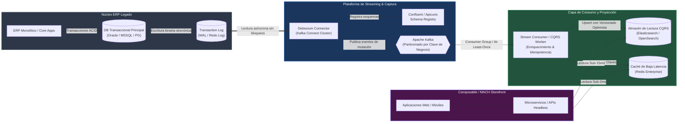
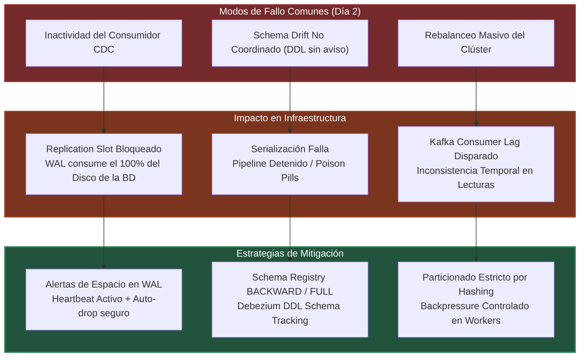

Durante un pico de tráfico concurrente en una plataforma de comercio composable, una consulta analítica o una oleada de peticiones de disponibilidad de inventario dirigida directamente al ERP transaccional (SAP S/4HANA, Oracle EBS o Microsoft Dynamics) puede degradar la base de datos central a niveles catastróficos. La contención de bloqueos a nivel de fila (`enqueue locks`, contención en tablas `VBAP`/`MSEG` o bloqueos pesimistas de tablas de pedidos) satura los pools de conexiones transaccionales, disparando la utilización de CPU por encima del 95% y paralizando las líneas de despacho del almacén físico.

El intento tradicional de mitigar esto mediante procesos batch basados en polling cada cinco minutos (`SELECT * FROM inventory WHERE last_modified >= ...`) introduce dos fallas de diseño: una sobrecarga de I/O insostenible por escaneo recurrente de índices y una ventana de consistencia eventual inaceptablemente amplia que induce a la sobreventa de inventario. Por otro lado, implementar *dual-writes* a nivel de aplicación (escribir simultáneamente en el ERP y en Elasticsearch/PostgreSQL) introduce anomalías no deterministas de red donde la escritura secundaria falla de forma silenciosa, rompiendo la consistencia de datos de forma irreversible.

La solución de desacoplamiento de Día 2 en arquitecturas MACH es la implementación de **Change Data Capture (CDC) basado en logs** mediante **Debezium** y **Apache Kafka**. Este patrón intercepta las mutaciones a nivel del motor transaccional sin penalización de latencia en la capa de aplicación, propagando eventos atómicos hacia almacenes de lectura especializados mediante una arquitectura Command Query Responsibility Segregation (CQRS).

---

## Topología de Arquitectura: Del Log Transaccional al Almacén de Lectura

A diferencia de los mecanismos invasivos basados en triggers de SQL o polling de marcas de tiempo, el CDC basado en logs opera leyendo las secuencias del motor de base de datos antes de que se consoliden en páginas de disco: el *Write-Ahead Log* (WAL) en PostgreSQL, los *Redo Logs* en Oracle, o el *Transaction Log* en Microsoft SQL Server.



### Principios Fundamentales del Pipeline
1. **Zero Runtime Overhead:** El motor de la base de datos no experimenta bloqueos de lectura provocados por consultas externas; la replicación se ejecuta mediante el mismo mecanismo nativo de los standbys de alta disponibilidad.
2. **Orden Garantizado por Partición:** Todos los cambios que afectan a un agregador específico (por ejemplo, `inventory_item_id`) se dirigen de forma determinista a la misma partición de Kafka utilizando la clave primaria de la tabla, garantizando que no existan carreras de orden fuera de secuencia.
3. **Desacoplamiento Estricto:** Si el consumidor o el almacén de lectura colapsan, el pipeline retiene el *offset* en el log transaccional de Kafka sin degradar el tiempo de respuesta del ERP.

---

## Configuración de Producción: Conector Debezium sobre Kafka Connect

El siguiente descriptor JSON ilustra una configuración de Kafka Connect para capturar mutaciones en la tabla de existencias de un ERP desplegado sobre PostgreSQL, utilizando serialización estructurada con Confluent Schema Registry y transformaciones integradas de un solo mensaje (SMT - *Single Message Transforms*).

```json
{
  "name": "debezium-postgresql-erp-inventory-connector",
  "config": {
    "connector.class": "io.debezium.connector.postgresql.PostgresConnector",
    "tasks.max": "1",
    "plugin.name": "pgoutput",
    "database.hostname": "erp-db-primary.internal.enterprise.net",
    "database.port": "5432",
    "database.user": "cdc_debezium_svc",
    "database.password": "${file:/secrets/credentials.properties:erp_db_password}",
    "database.dbname": "enterprise_erp",
    "database.server.name": "erp_cdc",
    "table.include.list": "public.inventory_stock,public.warehouse_locations",
    "tombstones.on.delete": "true",
    "decimal.handling.mode": "double",

    "slot.name": "debezium_composable_inventory_slot",
    "slot.drop.on.stop": "false",
    "publication.name": "debezium_inventory_publication",
    "publication.autocreate.mode": "filtered",

    "heartbeat.interval.ms": "5000",
    "heartbeat.action.query": "UPDATE public.cdc_heartbeat SET last_heartbeat = NOW() WHERE client_id = 'debezium_inventory';",

    "key.converter": "io.confluent.connect.avro.AvroConverter",
    "key.converter.schema.registry.url": "http://schema-registry.internal.enterprise.net:8081",
    "value.converter": "io.confluent.connect.avro.AvroConverter",
    "value.converter.schema.registry.url": "http://schema-registry.internal.enterprise.net:8081",

    "transforms": "unwrap,reroute",
    "transforms.unwrap.type": "io.debezium.transforms.ExtractNewRecordState",
    "transforms.unwrap.drop.tombstones": "false",
    "transforms.unwrap.delete.handling.mode": "rewrite",
    "transforms.unwrap.add.fields": "op,table,lsn,source.ts_ms",

    "transforms.reroute.type": "io.debezium.transforms.ByLogicalTableRouter",
    "transforms.reroute.topic.regex": ".*inventory_stock",
    "transforms.reroute.topic.replacement": "erp.mutations.inventory-stock.v1",

    "errors.tolerance": "all",
    "errors.deadletterqueue.topic.name": "erp.cdc.inventory.dlq",
    "errors.deadletterqueue.topic.replication.factor": "3",
    "errors.deadletterqueue.context.headers.enable": "true"
  }
}
```

### Puntos Críticos de la Configuración:
* **Heartbeat Mechanism (`heartbeat.interval.ms`):** Evita la saturación del WAL cuando las tablas monitoreadas tienen baja tasa de cambio pero el resto de la base de datos escribe continuamente. Si no se fuerza el avance del LSN (*Log Sequence Number*), PostgreSQL no podrá truncar los segmentos del WAL, lo que derivaría en el colapso del almacenamiento de la base de datos primaria.
* **ExtractNewRecordState SMT:** Extrae el estado plano del registro directamente del sobre complejo de Debezium (que por defecto incluye `before`, `after`, `source` y `op`), inyectando metadatos operativos como el LSN y la marca temporal de origen (`source.ts_ms`), esenciales para el control de concurrencia optimista posterior.

---

## Consumo y Proyección Idempotente en Almacenes de Lectura

Los eventos capturados por CDC operan bajo una semántica de entrega de **al menos una vez** (*at-least-once delivery*). Los reintentos del conector, los rebalanceos del clúster de Kafka Connect o la reconexión de consumidores pueden inyectar eventos duplicados o ligeramente desfasados. El consumidor aguas abajo debe garantizar idempotencia estricta mediante el descarte de mutaciones obsoletas utilizando el LSN o el timestamp transaccional de origen.

El siguiente servicio en TypeScript/Node.js implementa un consumidor de Kafka para OpenSearch con verificación de versionado optimista (*Optimistic Concurrency Control*):

```typescript
import { Kafka, EachMessagePayload } from 'kafkajs';
import { Client as OpenSearchClient } from '@opensearch-project/opensearch';

interface DebeziumInventoryPayload {
  sku: string;
  warehouse_id: string;
  available_quantity: number;
  reserved_quantity: number;
  __op: 'c' | 'u' | 'd' | 'r'; // create, update, delete, snapshot read
  __lsn: number;
  __source_ts_ms: number;
  __deleted?: string;
}

const kafka = new Kafka({
  clientId: 'cqrs-inventory-projection-worker',
  brokers: ['kafka-broker-1:9092', 'kafka-broker-2:9092'],
  ssl: true,
});

const osClient = new OpenSearchClient({
  node: 'https://opensearch-cluster.internal.enterprise.net:9200',
  auth: {
    username: process.env.OPENSEARCH_USER || '',
    password: process.env.OPENSEARCH_PASSWORD || '',
  },
});

const consumer = kafka.consumer({ 
  groupId: 'inventory-cqrs-projection-group-v1',
  sessionTimeout: 30000,
  heartbeatInterval: 3000
});

async function runProjectionPipeline(): Promise<void> {
  await consumer.connect();
  await consumer.subscribe({ 
    topic: 'erp.mutations.inventory-stock.v1', 
    fromBeginning: false 
  });

  await consumer.run({
    eachBatchAutoResolve: true,
    eachMessage: async ({ message }: EachMessagePayload) => {
      if (!message.value || !message.key) {
        return;
      }

      const payload: DebeziumInventoryPayload = JSON.parse(message.value.toString());
      const documentId = `${payload.warehouse_id}_${payload.sku}`;
      const indexName = 'composable-inventory-read-v1';

      // Manejo de eliminaciones lógicas/físicas
      if (payload.__deleted === 'true' || payload.__op === 'd') {
        try {
          await osClient.delete({
            index: indexName,
            id: documentId,
          });
        } catch (error: any) {
          if (error.meta?.statusCode !== 404) {
            throw error;
          }
        }
        return;
      }

      // Proyección Idempotente usando version_type: 'external_gte'
      // El LSN de la base de datos se utiliza como versión estricta del documento
      try {
        await osClient.index({
          index: indexName,
          id: documentId,
          version: payload.__lsn,
          version_type: 'external_gte',
          body: {
            sku: payload.sku,
            warehouseId: payload.warehouse_id,
            availableQuantity: payload.available_quantity,
            reservedQuantity: payload.reserved_quantity,
            totalPhysicalQuantity: payload.available_quantity + payload.reserved_quantity,
            lastSyncedAt: new Date().toISOString(),
            sourceEventTimestamp: new Date(payload.__source_ts_ms).toISOString(),
            engineLsn: payload.__lsn,
          },
        });
      } catch (error: any) {
        // Conflicto de versión (409): Un evento más reciente ya fue proyectado
        if (error.meta?.statusCode === 409) {
          console.warn(
            `[OUT_OF_ORDER_IGNORED] Documento ${documentId} ya posee una versión superior o igual a LSN: ${payload.__lsn}`
          );
          return;
        }
        throw error; // Forzar reintento en el consumidor para errores transitorios (5xx, red)
      }
    },
  });
}

runProjectionPipeline().catch((err) => {
  console.error('Fallo crítico en el pipeline de proyección CDC:', err);
  process.exit(1);
});
```

---

## Matriz Comparativa: Métodos de Sincronización de Datos Enterprise

La selección del mecanismo de sincronización determina la escalabilidad del sistema, el aislamiento de fallas y la integridad de los datos.

| Dimensión Arquitectónica | Log-Based CDC (Debezium + Kafka) | Dual-Write (Aplicativo) | Triggers de Base de Datos | Polling por Lotes (Batch Queries) |
| :--- | :--- | :--- | :--- | :--- |
| **Impacto en el CPU/Memoria del ERP** | **Insignificante (< 2%)**. Lee del disco/WAL, sin contención de transacciones. | Nulo en BD, pero incrementa latencia de red y retiene conexiones del ERP. | **Alto**. Ejecuta lógica síncrona en cada `INSERT`/`UPDATE`, incrementando locks. | **Catastrófico**. Escaneo masivo de tablas/índices genera saturación periódica de I/O. |
| **Riesgo de Inconsistencia de Datos** | Nulo. La captura es atómica; lo que se escribe en el commit del log se procesa. | **Severo**. Fallos parciales de red dejan un almacén actualizado y el otro no. | Bajo a nivel relacional, pero alto si el trigger empuja datos hacia sockets externos. | Moderado a Alto. Pérdida de mutaciones intermedias entre ventanas de ejecución. |
| **Latencia de Propagación** | Sub-segundo (comúnmente entre **150ms y 600ms** de punta a punta). | Inmediata (pero introduce latencia agregada a la transacción inicial). | Inmediata a nivel de base de datos; variable en la extracción externa. | Alta (definida por el cron: 5 min, 1 hora, o procesos nocturnos). |
| **Captura de Estados Intermedios** | **Completa**. Registra cada una de las mutaciones ocurridas en la tabla. | Parcial. Propenso a omitir actualizaciones si el servicio secundario falla. | Completa, pero penaliza exponencialmente el rendimiento del motor. | **Nula**. Solo captura el estado final al momento de ejecutarse la consulta. |
| **Complejidad de Mantenimiento Día 2** | Media/Alta (requiere operar Kafka Connect, Schema Registry y monitorizar WAL). | Baja inicialmente; inmanejable ante discrepancias y *data reconciliations*. | Alta. Dependencia de lógica propietaria en el motor de base de datos y migración frágil. | Baja en infraestructura inicial; alta en optimización de consultas lentas. |
| **Escenarios de Uso Ideales** | Desacoplamiento de monolitos, CQRS a gran escala, microservicios composable. | Sistemas de baja criticidad sin requisitos de consistencia determinista. | Auditorías locales internas dentro de la misma base de datos relacional. | Generación de data lakes históricos sin requerimientos operativos de tiempo real. |

---

## Modos de Fallo en Producción y Mitigación Operativa

Implementar CDC con Debezium y Kafka a nivel enterprise traslada la complejidad desde la capa de cómputo hacia la capa de streaming. Omitir la monitorización de estas dependencias puede provocar incidentes críticos en producción.



### 1. Saturación del Disco Transaccional por Bloqueo del Replication Slot
En bases de datos como PostgreSQL, un replication slot retiene los segmentos del WAL hasta que el conector confirma su procesamiento mediante el ACK del offset. Si el clúster de Kafka Connect se detiene o pierde conectividad con Kafka pero la base de datos continúa recibiendo escrituras, el tamaño del WAL crecerá sin límite hasta agotar el almacenamiento físico de la base de datos maestra.

* **Mitigación Operativa:**
  - Configurar alertas críticas al superar el 70% del espacio en disco del volumen de transacciones de la base de datos.
  - Implementar el parámetro `max_slot_wal_keep_size` en PostgreSQL (disponible desde PG 13) para desacoplar el replication slot antes de que el almacenamiento colapse por completo, priorizando la disponibilidad del ERP sobre la replicación de CDC.
  - Generar *heartbeats* recurrentes para mantener el avance de las confirmaciones de lectura durante periodos de inactividad transaccional.

### 2. Schema Drift Incompatible (Evolución de DDL No Coordinada)
Un equipo de soporte del ERP ejecuta un `ALTER TABLE` modificando el tipo de dato de una columna o eliminando un campo estructural sin avisar al equipo de arquitectura de plataforma. Esto puede generar errores inmediatos de deserialización en los conectores de Debezium, congelando el procesamiento de eventos.

* **Mitigación Operativa:**
  - Configurar **Confluent Schema Registry** con modo de compatibilidad estricto (`BACKWARD` o `FULL`).
  - Activar el aislamiento de fallos en el conector utilizando `errors.tolerance = all` acoplado obligatoriamente a una Dead Letter Queue (DLQ) para que los registros no procesables no bloqueen el progreso del pipeline.
  - Habilitar el seguimiento de cambios de esquema en Debezium mediante su tópico dedicado de esquemas DDL (`database.schema.history.kafka.topic`), permitiendo que el stream conserve trazabilidad temporal de los cambios estructurales.

### 3. Duplicación y Concurrencia Fuera de Secuencia (Out-of-Order Execution)
Si un consumidor se cae mientras procesa un lote de eventos, Kafka reasignará las particiones a otro nodo. Si los eventos no tienen marcas de concurrencia optimista, una actualización antigua recibida por un reintento puede sobrescribir una actualización más moderna que ya había sido materializada en el almacén de lectura.

* **Mitigación Operativa:**
  - **Prohibir el uso del timestamp de ingestión de Kafka** como criterio de versionado; este valor refleja el momento de llegada al broker, no el momento del commit transaccional en el ERP.
  - Utilizar estrictamente el identificador atómico del motor origen: el **Log Sequence Number (LSN)** en PostgreSQL/SQL Server, o el **System Change Number (SCN)** en Oracle.
  - Aplicar la validación de control de concurrencia externa directamente en la base de datos de proyección (`external_gte` en Elasticsearch/OpenSearch o sentencias de actualización condicionadas en SQL: `WHERE new_lsn >= current_lsn`).

---

## Checklist de Implementación para Equipos de Ingeniería

Antes de promover un conector Debezium y un pipeline de proyección a ambientes productivos, el equipo de plataforma debe validar los siguientes puntos:

### Aislamiento y Configuración de la Base de Datos Fuente
- [ ] La base de datos tiene habilitado el nivel de logging requerido (`wal_level = logical` en PostgreSQL, `supplemental logging` en Oracle, `CDC enabled` en MS SQL Server).
- [ ] El usuario del conector tiene únicamente privilegios de lectura sobre el log de replicación y la tabla de heartbeat, sin permisos de modificación en tablas de negocio.
- [ ] Se implementó un parámetro de tope de retención de logs (`max_slot_wal_keep_size` o equivalente) para impedir el colapso del almacenamiento ante desconexiones prolongadas.
- [ ] La tabla de Heartbeat emite mutaciones periódicas automatizadas para avanzar el LSN independientemente del volumen de negocio.

### Plataforma de Streaming (Kafka & Debezium Connect)
- [ ] Los tópicos de Kafka cuentan con particionado determinista basado exclusivamente en la clave primaria (`Primary Key`) del agregador.
- [ ] La retención de los tópicos de CDC está definida por política compactada (`cleanup.policy=compact`) o temporalmente acotada según los SLAs de reconstrucción de proyecciones.
- [ ] El Schema Registry está configurado con validación de compatibilidad activada (`BACKWARD` o `FULL`).
- [ ] El conector Debezium tiene definida una Dead Letter Queue (DLQ) con cabeceras de contexto de error habilitadas.

### Almacenes de Lectura y Proyección CQRS
- [ ] Los consumidores de proyección implementan control de concurrencia optimista basado en LSN/SCN, rechazando mutaciones fuera de orden.
- [ ] El almacenamiento de lectura destino maneja escrituras idempotentes (`upsert` nativo o reemplazo condicional).
- [ ] Se dispone de un procedimiento automatizado de reconstrucción total (*full re-indexing/snapshotting*) mediante el mecanismo de señalización de instantáneas ad-hoc de Debezium (`debezium.signals.channel.type`) sin reiniciar el conector ni bloquear el ERP.
- [ ] Existen métricas y tableros operativos que monitorizan el retraso del consumidor (*Consumer Lag*) y la latencia transaccional de extremo a extremo (`source.ts_ms` vs `consumer_applied_ts`).