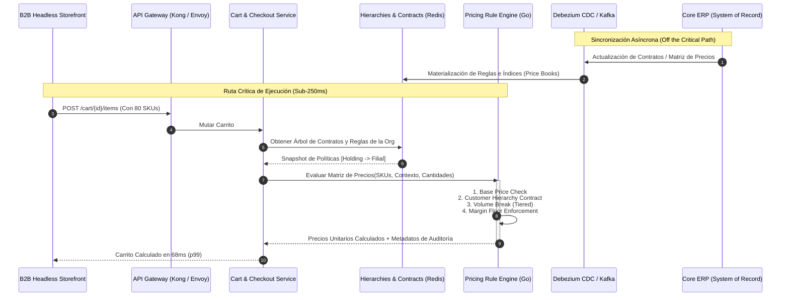

Un cliente corporativo añade 120 líneas de pedido a su cesta en un portal B2B headless y el tiempo de respuesta del endpoint `/api/v2/carts/{id}/calculate` se dispara a 4,8 segundos en el percentil 99 (p99). El backend monolítico heredado o el ERP subyacente colapsa intentando resolver, en una sola transacción síncrona, una jerarquía de cuentas de 6 niveles (Holding $\rightarrow$ Región $\rightarrow$ Filial $\rightarrow$ Centro de Costes $\rightarrow$ Departamento $\rightarrow$ Comprador), combinando simultáneamente contratos de precio negociados, descuentos por volumen acumulado, reglas de margen dinámico por categoría y techos presupuestarios aprobados.

En modelos B2C, la resolución de precios se resuelve trivialmente con catálogos cacheados en un CDN distribuido. En arquitecturas Composable B2B, cada llamada es contextual y única para la sesión del comprador. Delegar este cálculo al ERP en tiempo de ejecución destruye el SLA de la API y agota los pools de conexiones de la base de datos transaccional.

Para sostener una experiencia transaccional sub-segundo ($<250$ ms en p99) con millones de combinaciones SKU/cliente, la arquitectura debe desacoplar el modelado de cuentas corporativas, pre-indexar contratos mediante pipelines asíncronos y ejecutar la lógica de tarificación en un motor de reglas in-memory distribuido.

---

## Modelado de Jerarquías Corporativas: Más Allá del Árbol Adyacente

El anti-patrón más destructivo en plataformas B2B tradicionales consiste en utilizar el patrón de *Adjacency List* (`parent_id` autoreferenciado en la tabla de organizaciones) para recorrer jerarquías complejas en tiempo de petición web mediante llamadas recursivas (`Common Table Expressions` o CTEs) hacia la base de datos relacional:

```sql
-- ANTI-PATRÓN: Recorrido recursivo CTE en la ruta crítica del carrito
WITH RECURSIVE AccountHierarchy AS (
    SELECT id, parent_id, price_contract_id, 1 as depth
    FROM b2b_organizations
    WHERE id = :buyer_organization_id
    UNION ALL
    SELECT o.id, o.parent_id, o.price_contract_id, h.depth + 1
    FROM b2b_organizations o
    INNER JOIN AccountHierarchy h ON o.id = h.parent_id
)
SELECT * FROM AccountHierarchy ORDER BY depth DESC;
```

Bajo concurrencia masiva (múltiples compradores navegando catálogos de miles de referencias), este enfoque genera bloqueos de lectura, alta contención de CPU y latencias impredecibles si las jerarquías cambian o superan los 4 niveles de anidación.

### Patrón de Tabla de Clausura (Closure Table)

Para lograr consultas de ancestros y herencia en tiempo $O(1)$ sin sobrecargar el motor relacional, desacoplamos la estructura organizacional en un microservicio de Cuentas B2B respaldado por el patrón de **Closure Table**. Este almacena explícitamente todas las rutas de ancestro-descendiente junto con la distancia relativa:

```sql
CREATE TABLE organization_hierarchy_closure (
    ancestor_id UUID NOT NULL,
    descendant_id UUID NOT NULL,
    depth INT NOT NULL,
    PRIMARY KEY (ancestor_id, descendant_id),
    FOREIGN KEY (ancestor_id) REFERENCES organizations(id) ON DELETE CASCADE,
    FOREIGN KEY (descendant_id) REFERENCES organizations(id) ON DELETE CASCADE
);

CREATE INDEX idx_closure_descendant_depth ON organization_hierarchy_closure (descendant_id, depth ASC);
```

Cuando un comprador autenticado interactúa con el carrito, la resolución de todos los contratos aplicables de sus ancestros se ejecuta con un único `JOIN` indexado:

```sql
SELECT 
    c.ancestor_id,
    c.depth,
    p.contract_id,
    p.priority,
    p.allow_override
FROM organization_hierarchy_closure c
JOIN organization_contracts p ON c.ancestor_id = p.organization_id
WHERE c.descendant_id = :buyer_org_id
ORDER BY c.depth ASC, p.priority DESC;
```

Este esquema desacopla completamente el almacenamiento transaccional de cuentas del motor de precios, permitiendo que la lista aplanada de contratos efectivos de una organización se serialice en una estructura in-memory (como Redis Enterprise o Valkey) con un TTL determinista invalidado vía eventos de dominio (`OrganizationStructureChanged`, `ContractAssigned`).

---

## Topología de Arquitectura de Baja Latencia

Para evitar dependencias síncronas con el ERP corporativo (SAP S/4HANA, Microsoft Dynamics 365 o NetSuite), la arquitectura implementa un **Pricing Rule Engine (PRE)** stateless que opera sobre una memoria de trabajo distribuida, sincronizada mediante Change Data Capture (CDC).



### Componentes Clave

1. **Hierarchy & Contract Projector**: Un consumidor Kafka que procesa eventos de cambios de asignación y materializa la lista unificada de contratos e identificadores fiscales en estructuras JSON compactas dentro de Redis.
2. **Dynamic Price Index (DPI)**: Almacén de valores de claves donde la clave primaria es un hash del `SKU` + `ContractID`. No hay consultas dinámicas de agregación; solo lecturas $O(1)$.
3. **Deterministic Pricing Engine (PRE)**: Microservicio en Go de alto rendimiento que evalúa matrices de descuento, escalados cuantitativos y márgenes mínimos en memoria usando ASTs (Abstract Syntax Trees) o compilación nativa de reglas.

---

## Algoritmo de Evaluación de Precios B2B en Go

El siguiente componente muestra un motor de cálculo determinista diseñado para evaluar árboles de herencia, descuentos por volumen y márgenes de seguridad para múltiples líneas de pedido de forma concurrente, asegurando cero asignaciones de memoria innecesarias (`zero-allocation-oriented`).

```go
package pricing

import (
	"context"
	"errors"
	"math"
	"sync"
)

type PriceRuleType string

const (
	RuleFixedContractPrice PriceRuleType = "FIXED_CONTRACT"
	RulePercentageDiscount PriceRuleType = "PERCENTAGE_DISCOUNT"
	RuleVolumeBreak        PriceRuleType = "VOLUME_BREAK"
)

type TierBreak struct {
	MinQuantity int     `json:"min_qty"`
	MaxQuantity int     `json:"max_qty"`
	UnitPrice   float64 `json:"unit_price"`
}

type PricingRule struct {
	RuleID       string        `json:"rule_id"`
	Type         PriceRuleType `json:"type"`
	ContractID   string        `json:"contract_id"`
	SKU          string        `json:"sku"`
	Value        float64       `json:"value"` // Precio fijo o porcentaje
	Tiers        []TierBreak   `json:"tiers,omitempty"`
	FloorPrice   float64       `json:"floor_price"` // Margen mínimo inquebrantable
	InheritedLvl int           `json:"inherited_level"` // 0 = Org Directa, 1 = Padre, etc.
}

type LineItemInput struct {
	SKU      string  `json:"sku"`
	Quantity int     `json:"quantity"`
	BaseList float64 `json:"base_list_price"`
}

type CalculatedLineItem struct {
	SKU           string  `json:"sku"`
	FinalPrice    float64 `json:"final_price"`
	AppliedRuleID string  `json:"applied_rule_id"`
	Savings       float64 `json:"savings"`
}

type Engine struct {
	ruleStore RuleRepository
}

type RuleRepository interface {
	GetRulesForHierarchy(ctx context.Context, orgID string, skus []string) (map[string][]PricingRule, error)
}

func NewPricingEngine(repo RuleRepository) *Engine {
	return &Engine{ruleStore: repo}
}

// CalculateCartPrices procesa las líneas del pedido concurrentemente con un límite de contexto.
func (e *Engine) CalculateCartPrices(ctx context.Context, orgID string, items []LineItemInput) ([]CalculatedLineItem, error) {
	if len(items) == 0 {
		return nil, errors.New("empty cart items")
	}

	skus := make([]string, len(items))
	for i, item := range items {
		skus[i] = item.SKU
	}

	// 1. Obtener reglas indexadas para toda la jerarquía en un solo batch I/O
	rulesMap, err := e.ruleStore.GetRulesForHierarchy(ctx, orgID, skus)
	if err != nil {
		return nil, err
	}

	results := make([]CalculatedLineItem, len(items))
	var wg sync.WaitGroup
	errChan := make(chan error, len(items))

	// 2. Evaluación vectorial en paralelo
	for i, item := range items {
		wg.Add(1)
		go func(idx int, itm LineItemInput) {
			defer wg.Done()
			
			skuRules := rulesMap[itm.SKU]
			resolved, err := evaluateItemRules(itm, skuRules)
			if err != nil {
				errChan <- err
				return
			}
			results[idx] = resolved
		}(i, item)
	}

	wg.Wait()
	close(errChan)

	if len(errChan) > 0 {
		return nil, <-errChan
	}

	return results, nil
}

// evaluateItemRules resuelve la precedencia: Contrato Directo > Contrato Heredado > Volumen > Base
func evaluateItemRules(item LineItemInput, rules []PricingRule) (CalculatedLineItem, error) {
	finalPrice := item.BaseList
	appliedRuleID := "BASE_CATALOG"
	lowestLevel := math.MaxInt32

	for _, rule := range rules {
		// La regla más cercana al comprador (menor InheritedLvl) tiene precedencia estructural
		if rule.InheritedLvl > lowestLevel {
			continue
		}

		switch rule.Type {
		case RuleFixedContractPrice:
			if rule.Value < finalPrice || rule.InheritedLvl < lowestLevel {
				finalPrice = rule.Value
				appliedRuleID = rule.RuleID
				lowestLevel = rule.InheritedLvl
			}

		case RuleVolumeBreak:
			for _, tier := range rule.Tiers {
				if item.Quantity >= tier.MinQuantity && (tier.MaxQuantity == 0 || item.Quantity <= tier.MaxQuantity) {
					if tier.UnitPrice < finalPrice || rule.InheritedLvl < lowestLevel {
						finalPrice = tier.UnitPrice
						appliedRuleID = rule.RuleID
						lowestLevel = rule.InheritedLvl
					}
					break
				}
			}

		case RulePercentageDiscount:
			discounted := item.BaseList * (1.0 - (rule.Value / 100.0))
			if discounted < finalPrice || rule.InheritedLvl < lowestLevel {
				finalPrice = discounted
				appliedRuleID = rule.RuleID
				lowestLevel = rule.InheritedLvl
			}
		}

		// Hard constraint: Prevenir márgenes negativos forzando el precio suelo (FloorPrice)
		if rule.FloorPrice > 0 && finalPrice < rule.FloorPrice {
			finalPrice = rule.FloorPrice
		}
	}

	// Redondeo estándar a dos decimales sin pérdida de precisión de punto flotante
	finalPrice = math.Round(finalPrice*100) / 100

	return CalculatedLineItem{
		SKU:           item.SKU,
		FinalPrice:    finalPrice,
		AppliedRuleID: appliedRuleID,
		Savings:       math.Round((item.BaseList-finalPrice)*100) / 100,
	}, nil
}
```

---

## Sincronización y Consistencia Eventual con el ERP

El ERP sigue siendo el *System of Record* (SoR) para las condiciones financieras y los contratos marco. Sin embargo, su incapacidad de atender miles de peticiones HTTP por segundo exige un pipeline de streaming unidireccional respaldado por Kafka y **Transactional Outbox Pattern**:

```
[ERP SAP S/4HANA] 
       │ (Tablas de Contratos: KONV, A004, KNVV)
       ▼
[Debezium CDC] 
       │ (JSON CDC Events)
       ▼
[Kafka Topic: b2b.pricing.contracts.v1]
       │ Partition Key: OrganizationID
       ▼
[Go Projector Microservice]
       │ Pre-cálculo de estructuras y combinación jerárquica
       ▼
[Redis Cluster / Cache Distribuida]
       Key: org:{org_id}:sku:{sku_id} -> Value: Flat Pricing Snapshot
```

### Invalidation vs Pre-materialization

En B2B existen dos patrones para almacenar los precios derivados:

1. **Pre-materialización Completa ($SKU \times Org$):** Funciona únicamente cuando el catálogo es inferior a $100.000$ SKUs y las organizaciones no superan los $5.000$. Más allá de esto, genera una explosión combinatoria de almacenamiento que satura la memoria.
2. **Materialización Híbrida Just-in-Time (JIT) con Invalidation Eviction:** El enfoque escalable. Se materializan los *Price Books* y *Contratos* como listas independientes en memoria. El motor de reglas compone el precio en $<5$ ms utilizando el pipeline en Go visto anteriormente, y el resultado final del carrito se cachea transitoriamente con una clave criptográfica calculada sobre la versión de los contratos activos:

$$\text{CacheKey} = \text{Hash}(\text{OrgID} + \text{CartContentHash} + \text{ContractVersionTag})$$

Si cambia un contrato en el ERP, se incrementa el `ContractVersionTag` de la organización raíz. Esto invalida instantáneamente todas las evaluaciones derivadas sin ejecutar barridos masivos de borrado (`KEYS *` o `SCAN`) en Redis.

---

## Matriz de Trade-offs Arquitectónicos

La siguiente tabla evalúa los modelos de cálculo de precios B2B para sistemas enterprise:

| Enfoque Arquitectónico | Latencia (p99) | Escalabilidad Horizontal | Consistencia de Datos | Complejidad de Implementación | Cuándo Utilizarlo | Cuándo Evitarlo |
| :--- | :--- | :--- | :--- | :--- | :--- | :--- |
| **Delegación Síncrona al ERP** | $2.500 - 8.000$ ms | Nula (Atada a licencias de cores del ERP) | Fuerte / Inmediata | Mínima (Proxy simple) | Tiendas B2B de volumen ultra bajo ($<10$ pedidos/hora) y reglas complejas imposibles de mapear. | Catálogos masivos, picos de tráfico B2B o carritos con $>30$ líneas. |
| **Pre-materialización Completa ($N \times M$)** | $<15$ ms | Muy Alta (Lecturas simples en cache) | Eventual (Riesgo de *cache drift*) | Media (Pipelines de batches intensivos) | Catálogos reducidos con jerarquías poco profundas ($<3$ niveles) y precios poco volátiles. | Catálogos de $>500.000$ SKUs combinados con miles de filiales corporativas independientes. |
| **Motor de Reglas Desacoplado + Closure Tables (Híbrido)** | $<80$ ms | Lineal (Stateless workers escalados vía KEDA) | Eventual con Tagging Criptográfico | Alta (Requiere Go/Rust, CDC y diseño de eventos) | Estándar Enterprise MACH con múltiples subsidiarias, aprobación de compras y alto volumen. | Equipos pequeños sin experiencia operando arquitecturas reactivas y Kafka. |
| **Cálculo en la Base de Datos Relacional del Commerce (CTEs)** | $400 - 1.200$ ms | Baja (Contención de CPU en base de datos primaria) | Fuerte dentro del Commerce | Baja / Media | Soluciones paquetizadas monolíticas donde el tráfico no compromete el checkout. | Arquitecturas headless de alto tráfico con contratos dinámicos actualizados frecuentemente. |

---

## Modos de Fallo Críticos y Mitigaciones en Producción

### 1. Inconsistencias de Borde ("Price Drift") Durante la Negociación
* **El Problema:** El ERP actualiza una escala de precios para una corporación, pero debido al lag de Kafka (o un re-balanceo de particiones), el comprador realiza el checkout con un precio inferior durante una ventana de 12 segundos.
* **Mitigación:** **Firma Criptográfica de Cotización.** El Pricing Engine genera una firma HMAC del precio unitario junto con el `ContractVersionTag` y el `RuleTimestamp`. En el paso crítico de `PlaceOrder`, el Cart Service realiza una verificación atómica contra el estado actual del contrato. Si el contrato cambió, se aborta la transición con un error de dominio `409 Conflict: PriceStale` y se fuerza una re-cotización explícita en pantalla.

### 2. Ciclos y Bucles Infinitos en Jerarquías Anidadas
* **El Problema:** Modificaciones operativas concurrentes en las cuentas organizacionales crean una relación cíclica ($A \rightarrow B \rightarrow C \rightarrow A$) dentro de la tabla de clausura.
* **Mitigación:** Enriquecer las inserciones de jerarquía con un Trigger de Validación o un Invariant Checker en el Agregado de Dominio antes de persistir:
```sql
-- Restricción para evitar ciclos directos e indirectos
CREATE OR REPLACE FUNCTION check_hierarchy_cycle() RETURNS TRIGGER AS $$
BEGIN
    IF EXISTS (
        SELECT 1 FROM organization_hierarchy_closure 
        WHERE ancestor_id = NEW.descendant_id AND descendant_id = NEW.ancestor_id
    ) THEN
        RAISE EXCEPTION 'Jerarquía inválida: Se detectó una referencia cíclica entre organizaciones';
    END IF;
    RETURN NEW;
END;
$$ LANGUAGE plpgsql;
```

### 3. Explosión de Contextos y Agotamiento de Memoria (OOM) en el Motor
* **El Problema:** Carritos B2B con cientos de líneas donde cada línea evalúa docenas de reglas de tiers de volumen acumulado entre múltiples centros de coste.
* **Mitigación:** Asignación de límites de memoria fijos mediante `sync.Pool` para la reutilización de objetos de cálculo en Go, limitando los canales de evaluación y utilizando un `Worker Pool` con backpressure explícito: si la cola del motor supera las $5.000$ evaluaciones concurrentes, el gateway activa rate-limiting sobre las llamadas del storefront.

---

## Checklist de Implementación para Equipos de Ingeniería

Para migrar exitosamente de un modelo monolítico/síncrono a un motor de precios desacoplado, asegure los siguientes puntos de verificación:

- [ ] **Desacoplar la Jerarquía del Motor Relacional:** Implementar el patrón **Closure Table** para consultas de ancestros en tiempo constante ($O(1)$) y exponer la jerarquía a través de un servicio de Cuentas B2B independiente.
- [ ] **Definir un Árbol de Precedencia Determinista:** Establecer formalmente el orden inmutable de resolución de reglas:
  1. Precio fijo por contrato a nivel organización inmediata.
  2. Descuento porcentual heredado por ancestro (Holding).
  3. Escalados cuantitativos (Volume Breaks).
  4. Lista de precios de catálogo base.
  5. Precio mínimo garantizado (*Floor Price Constraint*).
- [ ] **Implementar Ingestion CDC:** Configurar Debezium sobre las tablas maestras de precios y condiciones del ERP hacia topics particionados por `OrganizationID`.
- [ ] **Versionado Atómico de Contratos:** Añadir un identificador de versión (`version_tag` o timestamp de mutación) a los contratos para invalidar caches sin barridos destructivos en el cluster de Redis.
- [ ] **Validación HMAC en Checkout:** Exigir que la mutación de la cesta a pedido incluya la firma digital generada por el motor de precios para evitar pedidos con condiciones obsoletas o manipuladas.
- [ ] **Pruebas de Caos de Latencia ERP:** Simular una degradación o caída total del ERP durante periodos de facturación pico; el sistema storefront debe seguir calculando cotizaciones y carritos apoyándose en el almacenamiento in-memory con un modo de operación degradado debidamente auditado.