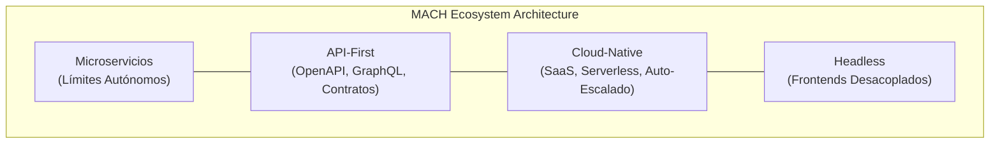
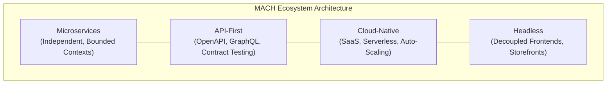

# Ecosistema MACH y Recursos Externos

Bienvenido al **Centro de Recursos y Ecosistema de MACH Playbook**. La ingeniería de software empresarial moderna se fundamenta en estándares abiertos, capacidades certificadas de proveedores y principios arquitectónicos probados en batalla.

Este directorio curado te conecta directamente con los organismos oficiales de estandarización, especificaciones fundacionales y el panorama de la industria que define el futuro de las arquitecturas **Microservicios, API-First, Cloud-Native y Headless (MACH)**.

---

## 1. The MACH Alliance y Estándares de Certificación

La [MACH Alliance](https://machalliance.org/){:target="_blank" rel="noopener"} es la organización sin fines de lucro dedicada a promover ecosistemas tecnológicos empresariales abiertos y de máxima especialización (*best-of-breed*).

### Referencias Oficiales de la Alianza
- **[Manifiesto y Estándares MACH](https://machalliance.org/about){:target="_blank" rel="noopener"}:** Principios clave que rigen la certificación de proveedores (componibilidad, entrega SaaS, cero bloqueo propietario).
- **[Directorio de Miembros Certificados](https://machalliance.org/members){:target="_blank" rel="noopener"}:** Plataformas evaluadas bajo estrictos criterios de cumplimiento MACH.
- **[Reportes Anuales de Investigación](https://machalliance.org/insights){:target="_blank" rel="noopener"}:** Métricas de adopción empresarial, benchmarks de ROI y desafíos de transición.

### Panorama de Categorías Principales en MACH

| Dominio | Proveedores y Herramientas Open-Source | Guías Arquitectónicas en MACH Playbook |
| :--- | :--- | :--- |
| **CMS Headless** | Contentful, Strapi, Sanity, Amplience, Storyblok | [Entendiendo el CMS Headless](/posts/understanding-headless-cms-decoupling-content-from-presentation/) |
| **Motores de Comercio** | commercetools, Commerce Layer, BigCommerce, Elastic Path | [Composición Tecnológica Best-of-Breed](/posts/composing-best-of-breed-technology-why-specialized-vendors-beat-all-in-one-suites/) |
| **Gateways de APIs** | Kong, Apigee, Envoy, Tyk, Traefik | [Service Mesh vs API Gateway](/posts/service-mesh-vs-api-gateway-choosing-the-right-tool-for-the-right-layer/) |
| **Edge & Frontend** | Next.js, Cloudflare Workers, Fastly Compute, Vercel | [Desarrollo Headless con Next.js y Supabase](/posts/desarrollo-headless-nextjs-supabase/) |
| **Gestión de Estado** | Redux Toolkit, TanStack Query, IndexedDB, Workbox | [State Management & Offline-First en PWA](/posts/state-management-y-offline-first-en-progressive-web-apps-pwa-de-alto-trafico/) |

---

## 2. Cloud Native Computing Foundation (CNCF)

La [Cloud Native Computing Foundation (CNCF)](https://www.cncf.io/){:target="_blank" rel="noopener"} alberga las tecnologías de infraestructura open-source esenciales para la capa cloud-native de MACH.

### Proyectos Clave de la CNCF
- **[Landscape Interactivo de la CNCF](https://landscape.cncf.io/){:target="_blank" rel="noopener"}:** Panorama de gestión de contenedores, mallas de servicios y observabilidad.
- **[OpenTelemetry](https://opentelemetry.io/){:target="_blank" rel="noopener"}:** Estándar neutral para trazas distribuidas, métricas y logs estructurados.
  - *Guía:* [Observabilidad Centralizada y Trazas Distribuidas](/posts/centralized-observability-distributed-tracing-logging-and-metrics-for-microservices/)
- **[Envoy Proxy](https://www.envoyproxy.io/){:target="_blank" rel="noopener"} & [Istio](https://istio.io/){:target="_blank" rel="noopener"}:** Comunicación en malla de servicios, encriptación mTLS y enrutamiento inteligente.
  - *Guía:* [Service Mesh vs API Gateway](/posts/service-mesh-vs-api-gateway-choosing-the-right-tool-for-the-right-layer/)
- **[ArgoCD](https://argo-cd.readthedocs.io/){:target="_blank" rel="noopener"}:** Entrega GitOps, despliegues canarios progresivos y blue/green.
  - *Guía:* [CI/CD para Microservicios Multi-Repositorio](/posts/ci-cd-microservicios-multi-repositorio/)

---

## 3. Gobernanza de APIs y Especificaciones de Contratos

La arquitectura API-First exige contratos legibles por máquina para evitar fallos de compatibilidad entre servicios distribuidos.

### Estándares y Herramientas
- **[OpenAPI Specification (OAI v3.1)](https://spec.openapis.org/oas/latest.html){:target="_blank" rel="noopener"}:** Estándar canónico para diseño de contratos RESTful.
  - *Guía:* [El Rol de OpenAPI en Desarrollo Guiado por Contratos](/posts/the-role-of-openapi-in-contract-driven-development/)
- **[AsyncAPI Initiative (v3.0)](https://www.asyncapi.com/){:target="_blank" rel="noopener"}:** Estándar abierto para mensajería asíncrona, flujos Kafka y webhooks.
  - *Guía:* [AsyncAPI para Gobernanza de Event Streams y Webhooks](/posts/asyncapi-para-la-gobernanza-de-event-streams-y-webhooks-en-tiempo-real/)
- **[gRPC & Protocol Buffers](https://grpc.io/){:target="_blank" rel="noopener"}:** Framework RPC de alto rendimiento para comunicación interna entre microservicios.
  - *Guía:* [Diseño de APIs de Alto Rendimiento con gRPC y Protocol Buffers](/posts/diseno-de-apis-de-alto-rendimiento-con-grpc-y-protocol-buffers-para-comunicacion-interna/)
- **[Seguridad en APIs (OWASP)](https://owasp.org/www-project-api-security/){:target="_blank" rel="noopener"}:** Mejores prácticas OWASP y validación de tokens.
  - *Guía:* [Seguridad Esencial en APIs: OAuth 2.0, JWT y Rate Limiting](/posts/api-security-essentials-oauth-2-0-jwt-and-rate-limiting-for-headless-backends/)

---

## 4. Literatura Arquitectónica de Referencia

Patrones y marcos metodológicos fundamentales de líderes reconocidos en la industria:

- **Martin Fowler ([martinfowler.com](https://martinfowler.com/){:target="_blank" rel="noopener"}):**
  - [Patrón Strangler Fig](/posts/the-strangler-fig-pattern-migrating-a-monolith-without-a-big-bang-rewrite/) para migración progresiva de monolitos.
  - [Patrón Circuit Breaker](/posts/circuit-breaker-pattern-protecting-your-services-from-cascading-failures/) para contención de fallos en cascada.
  - [CQRS y Event Sourcing](/posts/cqrs-and-event-sourcing-separating-reads-and-writes-in-data-heavy-services/) para separación de lectura y escritura.
  - [Revisión en Video: Ideas Clave de Martin Fowler sobre Microservicios](/posts/video-review-martin-fowler-on-microservices-key-takeaways/)
- **Sam Newman (*Building Microservices* / *Monolith to Microservices*):**
  - [Dimensionamiento y Granularidad de Microservicios](/posts/sizing-your-microservices-how-to-find-the-right-service-granularity/)
  - [Propiedad de Datos y Regla de Base de Datos por Servicio](/posts/data-ownership-in-microservices-why-services-must-own-their-databases/)
  - [La Trampa del Monolito Distribuido](/posts/the-distributed-monolith-trap-how-microservices-become-what-they-replace/)
- **Gregor Hohpe (*Enterprise Integration Patterns* & *Cloud Strategy*):**
  - [Patrón Saga Asíncrono para Transacciones Distribuidas](/posts/the-saga-pattern-managing-distributed-transactions-without-two-phase-commit/)
  - [Arquitectura Guiada por Eventos en Comercio Electrónico](/posts/event-driven-architecture-in-e-commerce-async-messaging-for-orders-inventory-and-shipping/)
  - [FinOps y Desmantelamiento Controlado en Cloud](/posts/finops-desmantelamiento-gcp/)
- **DORA & Google Cloud State of DevOps ([dora.dev](https://dora.dev/){:target="_blank" rel="noopener"}):**
  - Métricas de frecuencia de despliegue, tiempo de entrega de cambios, tasa de fallo en cambios y tiempo de recuperación (MTTR).

---

> [!TIP]
> **Explora Nuestra Biblioteca Completa:** Para consultar implementaciones específicas y patrones de producción, navega por nuestras [Categorías](/categories/) y [Etiquetas](/tags/).

# MACH Ecosystem & External Resources

Welcome to the **MACH Playbook Ecosystem & Resource Center**. Modern enterprise software engineering is built on open standards, certified vendor capabilities, and battle-tested architectural principles.

This curated directory connects you directly with the official standards bodies, foundational specifications, and industry landscapes shaping the future of **Microservices, API-First, Cloud-Native, and Headless (MACH)** architectures.

---

## 1. The MACH Alliance & Certification Standards

The [MACH Alliance](https://machalliance.org/){:target="_blank" rel="noopener"} is the non-profit industry advocacy group dedicated to promoting open, best-of-breed enterprise technology ecosystems.

### Official Alliance References
- **[MACH Manifesto & Standards](https://machalliance.org/about){:target="_blank" rel="noopener"}:** Core principles governing vendor certification (composability, SaaS delivery, zero proprietary vendor lock-in).
- **[Certified Member Directory](https://machalliance.org/members){:target="_blank" rel="noopener"}:** Evaluated platforms meeting strict MACH compliance criteria.
- **[Annual MACH Research Reports](https://machalliance.org/insights){:target="_blank" rel="noopener"}:** Enterprise adoption metrics, ROI benchmarks, and transition hurdles.

### Leading MACH Category Landscapes

| Domain | Reference Vendors & Open-Source Tools | Key Architectural Guides on MACH Playbook |
| :--- | :--- | :--- |
| **Headless CMS** | Contentful, Strapi, Sanity, Amplience, Storyblok | [Understanding Headless CMS](/posts/understanding-headless-cms-decoupling-content-from-presentation/) |
| **Commerce Engines** | commercetools, Commerce Layer, BigCommerce, Elastic Path | [Composing Best-of-Breed Technology](/posts/composing-best-of-breed-technology-why-specialized-vendors-beat-all-in-one-suites/) |
| **API Gateways** | Kong, Apigee, Envoy, Tyk, Traefik | [Service Mesh vs API Gateway](/posts/service-mesh-vs-api-gateway-choosing-the-right-tool-for-the-right-layer/) |
| **Edge & Frontend** | Next.js, Cloudflare Workers, Fastly Compute, Vercel | [Desarrollo Headless con Next.js y Supabase](/posts/desarrollo-headless-nextjs-supabase/) |
| **State Management** | Redux Toolkit, TanStack Query, IndexedDB, Workbox | [State Management & Offline-First en PWA](/posts/state-management-y-offline-first-en-progressive-web-apps-pwa-de-alto-trafico/) |

---

## 2. Cloud Native Computing Foundation (CNCF)

The [Cloud Native Computing Foundation (CNCF)](https://www.cncf.io/){:target="_blank" rel="noopener"} hosts critical open-source infrastructure technologies powering the cloud-native tier of MACH architectures.

### Key CNCF Projects & Specifications
- **[CNCF Interactive Landscape](https://landscape.cncf.io/){:target="_blank" rel="noopener"}:** High-level overview of container management, service mesh, and observability tools.
- **[OpenTelemetry](https://opentelemetry.io/){:target="_blank" rel="noopener"}:** Vendor-neutral standard for distributed tracing, metrics, and logs.
  - *Deep Dive:* [Centralized Observability & Tracing for Microservices](/posts/centralized-observability-distributed-tracing-logging-and-metrics-for-microservices/)
- **[Envoy Proxy](https://www.envoyproxy.io/){:target="_blank" rel="noopener"} & [Istio](https://istio.io/){:target="_blank" rel="noopener"}:** Service mesh communication, mTLS encryption, and traffic shaping.
  - *Deep Dive:* [Service Mesh vs API Gateway](/posts/service-mesh-vs-api-gateway-choosing-the-right-tool-for-the-right-layer/)
- **[ArgoCD](https://argo-cd.readthedocs.io/){:target="_blank" rel="noopener"}:** GitOps delivery, progressive canary rollouts, and blue/green deployments.
  - *Deep Dive:* [CI/CD para Microservicios Multi-Repositorio](/posts/ci-cd-microservicios-multi-repositorio/)

---

## 3. API Governance & Contract Specifications

API-First architecture requires rigorous machine-readable contracts to prevent breaking changes across decoupled services.

### Standards & Tools
- **[OpenAPI Specification (OAI v3.1)](https://spec.openapis.org/oas/latest.html){:target="_blank" rel="noopener"}:** Canonical standard for RESTful service contract definition.
  - *Guide:* [The Role of OpenAPI in Contract-Driven Development](/posts/the-role-of-openapi-in-contract-driven-development/)
- **[AsyncAPI Initiative (v3.0)](https://www.asyncapi.com/){:target="_blank" rel="noopener"}:** Open standard for asynchronous messaging, Kafka streams, and webhooks.
  - *Guide:* [AsyncAPI para la Gobernanza de Event Streams y Webhooks en Tiempo Real](/posts/asyncapi-para-la-gobernanza-de-event-streams-y-webhooks-en-tiempo-real/)
- **[gRPC & Protocol Buffers](https://grpc.io/){:target="_blank" rel="noopener"}:** High-performance RPC framework for high-throughput internal microservice communication.
  - *Guide:* [Diseño de APIs de Alto Rendimiento con gRPC y Protocol Buffers](/posts/diseno-de-apis-de-alto-rendimiento-con-grpc-y-protocol-buffers-para-comunicacion-interna/)
- **[API Security & Tokens](https://owasp.org/www-project-api-security/){:target="_blank" rel="noopener"}:** OWASP API Security best practices and token validation.
  - *Guide:* [API Security Essentials: OAuth 2.0, JWT & Rate Limiting](/posts/api-security-essentials-oauth-2-0-jwt-and-rate-limiting-for-headless-backends/)

---

## 4. Architectural Literature & Thought Leadership

Foundational patterns and methodology frameworks from industry pioneers:

- **Martin Fowler on Distributed Architecture ([martinfowler.com](https://martinfowler.com/){:target="_blank" rel="noopener"}):**
  - [The Strangler Fig Pattern](/posts/the-strangler-fig-pattern-migrating-a-monolith-without-a-big-bang-rewrite/) for incremental monolith deprecation.
  - [Circuit Breaker Pattern](/posts/circuit-breaker-pattern-protecting-your-services-from-cascading-failures/) for cascading failure prevention.
  - [CQRS and Event Sourcing](/posts/cqrs-and-event-sourcing-separating-reads-and-writes-in-data-heavy-services/) for read/write model segregation.
  - [Video Review: Martin Fowler on Microservices Key Takeaways](/posts/video-review-martin-fowler-on-microservices-key-takeaways/)
- **Sam Newman (*Building Microservices* / *Monolith to Microservices*):**
  - [Sizing Your Microservices & Domain Granularity](/posts/sizing-your-microservices-how-to-find-the-right-service-granularity/)
  - [Data Ownership & Database-per-Service Rules](/posts/data-ownership-in-microservices-why-services-must-own-their-databases/)
  - [The Distributed Monolith Trap](/posts/the-distributed-monolith-trap-how-microservices-become-what-they-replace/)
- **Gregor Hohpe (*Enterprise Integration Patterns* & *Cloud Strategy*):**
  - [Asynchronous Saga Pattern for Distributed Transactions](/posts/the-saga-pattern-managing-distributed-transactions-without-two-phase-commit/)
  - [Event-Driven Architecture in E-Commerce](/posts/event-driven-architecture-in-e-commerce-async-messaging-for-orders-inventory-and-shipping/)
  - [FinOps y Desmantelamiento Controlado en Cloud](/posts/finops-desmantelamiento-gcp/)
- **DORA & Google Cloud State of DevOps ([dora.dev](https://dora.dev/){:target="_blank" rel="noopener"}):**
  - Metrics tracking Deployment Frequency, Lead Time for Changes, Change Failure Rate, and Time to Restore Service (MTTR).

---

> [!TIP]
> **Explore Our Full Library:** To explore specific architecture implementations, patterns, and production blueprints, browse our [Categories](/categories/) and [Tags](/tags/) archives.

