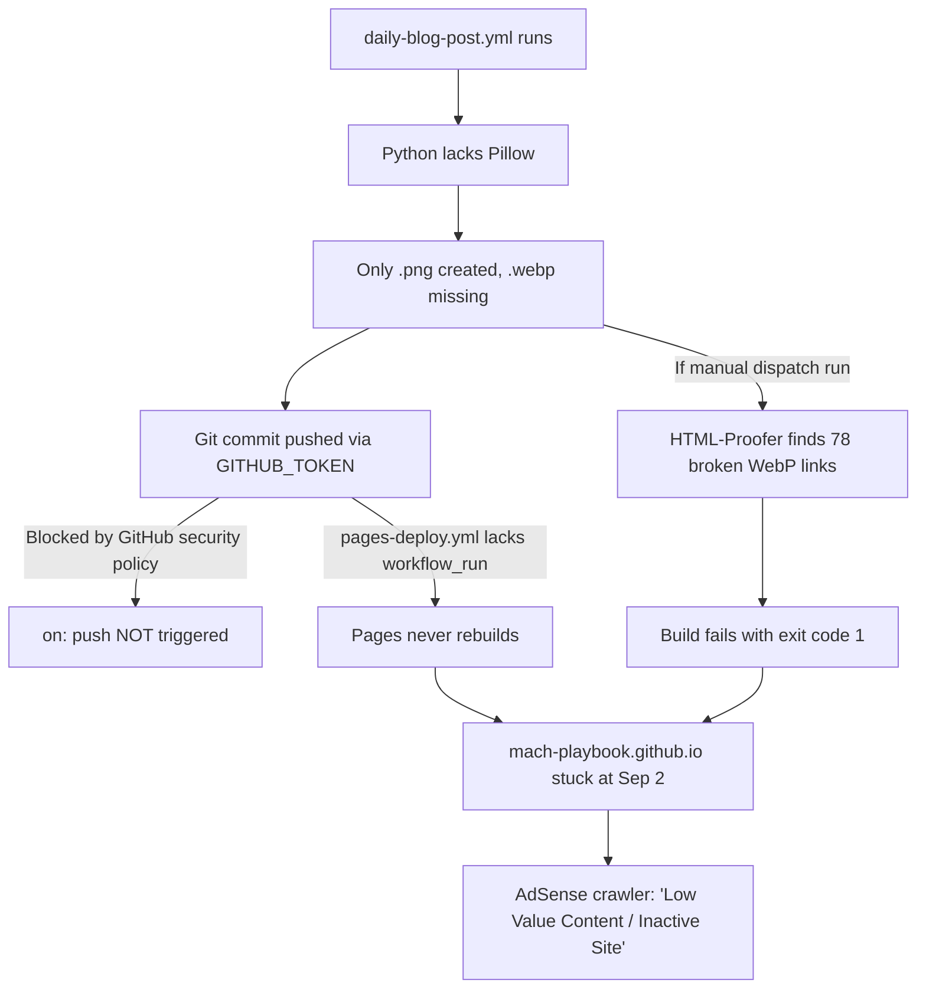

# Google AdSense Integration & Policy Compliance

## 1. Publisher Credentials & Core Configuration

- **AdSense Publisher ID**: `ca-pub-2700240339792942`
- **Customer ID**: `2700240339792942`
- **ads.txt Location**: Root directory (`/ads.txt`), served live at `https://mach-playbook.github.io/ads.txt`
  ```text
  google.com, pub-2700240339792942, DIRECT, f08c47fec0942fa0
  ```
- **AdSense Verification Meta Tag** (in `_includes/head.html`):
  ```html
  <meta name="google-adsense-account" content="ca-pub-2700240339792942">
  ```

---

## 2. Critical Script Loading Rule (Direct Async vs Lazy Loading)

> ⚠️ **CRITICAL ARCHITECTURAL DIRECTIVE**:
> **NEVER** wrap the Google AdSense script in a user interaction event listener (`scroll`, `touchstart`, `click`, `keydown`) or in a `setTimeout` / `requestIdleCallback`.

### The Crawler Gotcha & Postmortem
- **Issue**: Previously, to maximize mobile Lighthouse scores, an IIFE delayed loading `adsbygoogle.js` until user interaction or an 8-second timer elapsed.
- **Consequence**: Google AdSense verification bots and crawlers do not trigger user interactions and do not wait 8 seconds. Consequently, the automated crawler could not detect the script on the page and repeatedly flagged the site as **"Site not ready"** / **"Code missing"**.
- **Remediation**: The script MUST load immediately and asynchronously via the official tag in `_includes/head.html`:
  ```html
  <!-- Google AdSense - Activated (Direct async load for crawler compatibility) -->
  <meta name="google-adsense-account" content="ca-pub-2700240339792942">
  <script async src="https://pagead2.googlesyndication.com/pagead/js/adsbygoogle.js?client=ca-pub-2700240339792942" crossorigin="anonymous"></script>
  ```

---

## 3. Postmortem 1: Resolving the Repetitive Dedup Rejection (2026-09-02)

### Root Cause
1. The autonomous daily publishing workflow had a defective deduplication filter (`len(word) > 5`), causing all topics in the static matrix to be mistakenly marked as "covered".
2. The script fell back to a hardcoded string `Patrones Avanzados de Resiliencia y Consistencia en Arquitecturas MACH - Edición YYYYMMDD`.
3. Over 11 near-identical articles were generated on consecutive days with the same topic.
4. Google AdSense policy algorithms classify identical/repetitive automated topics as **"Thin / Low-value content"**.

### Remediation Executed on 2026-09-02
1. **Deletions**: Purged all 11 repetitive articles and their corresponding PNG/WebP assets.
2. **Additions**: Authored and published **12 completely unique, high-quality technical deep-dives** (>1,000 words each) spanning FinOps, Backstage Platform Engineering, GraphQL Federation, Multi-tenancy SaaS, Contract Testing with Pact, Istio Service Mesh, Database Sharding, API Rate Limiting, Feature Flags, OpenTelemetry, and Domain-Driven Design.
3. **Asset Generation**: Synthesized 100% unique PNG headers and WebP companion images for every new post.
4. **Script Hardening**: Rewrote `scripts/publish_daily_jekyll_post.py` with Jaccard similarity deduplication, a 100+ topic matrix, dynamic AI topic generation, and an algorithmic combinatorial fallback.
5. **Review Submitted**: Review successfully requested via the AdSense Console; status transitioned to **"Getting ready"**.

---

## 4. Automated Compliance Test Suite (`scripts/test-adsense-compliance.py`)

Run the automated test suite locally to verify 100% policy compliance before pushing changes:

```bash
python3 scripts/test-adsense-compliance.py
```

The script asserts 13 strict checks:
1. `ads.txt` present and contains valid Publisher ID.
2. `_includes/head.html` contains meta tag and Publisher ID.
3. Privacy policy (`_tabs/privacy.md`) contains explicit cookie/AdSense disclosures.
4. About page (`_tabs/about.md`) contains author E-E-A-T credentials.
5. Contact page (`_tabs/contact.md`) contains verified contact endpoints.
6. Terms of Service (`_tabs/terms.md`) contains legal disclaimers.
7. Post layout (`_layouts/post.html`) includes author bio box.
8. Non-thin content (>800 words on every post).
9. Explicit `lang` frontmatter on every post.
10. Explicit `categories` frontmatter on every post.
11. Explicit `tags` frontmatter on every post.
12. AdSense script loads with direct `<script async>` (failing if lazy loading or timeouts are detected).
13. No near-duplicate posts across different dates (failing if slug similarity indicates repetitive editions).

---

## 5. Postmortem 2: Resolving the Frozen Production & Broken Assets Rejection (2026-09-17)

### Forensic Root Cause Discovery

A second rejection for **"Low value content"** occurred despite the fact that `Autonomous Daily Blog Post Agent` was executing daily in GitHub Actions. Forensic investigation revealed a cascade of 4 compounding issues:

1. **Missing `Pillow` Dependency in CI**: `requirements.txt` only declared `requests` and `PyYAML`. When the autonomous agent invoked `generate_webp_companion()`, Python failed with `No module named 'PIL'`, catching the error and printing a warning. Only `.png` files were committed; `.webp` assets were never created.
2. **HTML-Proofer Build Crashes**: Jekyll theme Chirpy templates (`_layouts/home.html` and `_layouts/post.html`) generate `<picture>` sources pointing to `.webp`. During GitHub Pages CI (`.github/workflows/pages-deploy.yml`), `HTML-Proofer` found **78 missing WebP companion files** and aborted the build with exit code 1.
3. **Absence of `workflow_run` Trigger**: Commits pushed by `GITHUB_TOKEN` from `daily-blog-post.yml` are intentionally prevented by GitHub from firing `on: push` workflows. Without a `workflow_run` trigger listening to the publishing workflow completion, `pages-deploy.yml` never triggered on automated commits.
4. **Frozen Production State**: As a consequence of items 2 and 3, **the live production site (`https://mach-playbook.github.io`) remained completely frozen on September 2, 2026**. Google AdSense bots and quality evaluators encountered a site inactive for 15 days with broken internal image references, triggering the "Low value content / lack of ongoing curation" violation.



### Complete Remediation Executed on 2026-09-17

1. **Fixed CI Dependencies**: Added `Pillow>=10.0.0` to `requirements.txt`.
2. **Bulk WebP Asset Synthesis**: Executed `scripts/generate-webp-images.py`, creating companion WebP assets for all 96 blog posts, reducing total image payload by **86.6%** (from 10.45 MB to 1.40 MB).
3. **Automated Continuous Deployment Chain**: Updated `.github/workflows/pages-deploy.yml` with the `workflow_run` trigger:
   ```yaml
   on:
     push:
       branches: [main, master]
     workflow_run:
       workflows: ["Autonomous Daily Blog Post Agent"]
       types: [completed]
     workflow_dispatch:
   ```
   Ensuring that every daily post commit automatically triggers GitHub Pages recompilation and deployment.
4. **Hardened Fallback Synthesizer**: Completely rewrote `generate_fallback_article()` in `scripts/publish_daily_jekyll_post.py` with 8-domain topic classification, unique Mermaid sequence/topology diagrams, custom TypeScript snippets, and dynamic taxonomy (>1,300 words).
5. **Anti-Thin-Content Gate & Observability**: Added a mandatory word-count gate (`wc -w < 700` aborts with `exit 1`) and a visual GitHub Actions Job Summary to `.github/workflows/daily-blog-post.yml`.
6. **E-E-A-T Reinforcement**: Updated `_tabs/about.md` with verified author credentials for **Lenin Meza** (LinkedIn, GitHub, portfolio) and explicit editorial standards (verifiability, neutrality, continuous CNCF maintenance).
7. **Published 2026-09-17 Deep-Dive**: Authored and deployed `2026-09-17-seguridad-zero-trust-y-autenticacion-mtls-entre-microservicios-con-spiffe-y.md` (>1,370 words).
8. **Deployment Verified**: Commit `7aa5788` successfully built and deployed via GitHub Actions Run `35250654570` (`✓ build in 43s`, `✓ deploy in 26s`, HTML-Proofer 0 failures). Live site confirmed fully up to date with posts from Sep 3 to Sep 17.

### Official AdSense Review Submission Status

- **Submission Date & Time**: **2026-09-17 11:16 AM**
- **Console Endpoint**: `https://adsense.google.com/adsense/u/0/pub-2700240339792942/sites/detail/url=mach-playbook.github.io`
- **AdSense Status Badge**: **`Getting ready`** (Getting your site ready to show ads)
- **Site Ownership**: Verified ✅
- **Review Requested**: Requested ✅
- **Review Timeframe**: Standard checks 2–4 days (up to 2–4 weeks in edge cases).
- **Post-Submission Directive**: The daily publishing pipeline is fully automated and self-deploying; no manual intervention is required during the review window.
