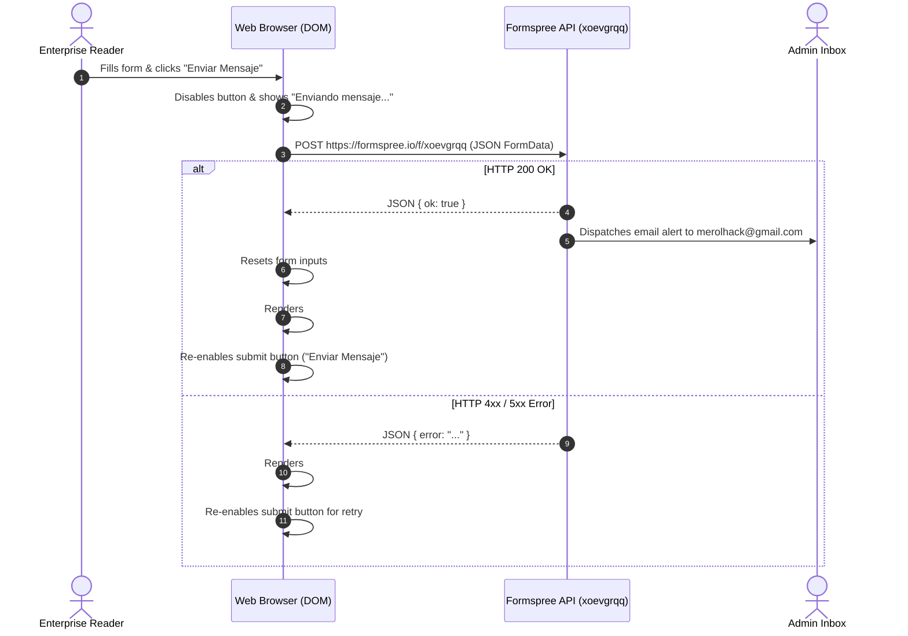

# Serverless Contact Architecture & Formspree Integration

> **MANDATORY SPECIFICATION**:  
> Governs the Jamstack serverless contact form architecture, Formspree API endpoint integration, silent honeypot anti-spam defense, and asynchronous client feedback lifecycle for [`_tabs/contact.md`](file:///ubuntu-20.04/home/merolhack/fl/mach-playbook/_tabs/contact.md).

---

## 1. Architectural Overview & Jamstack Philosophy

MACH Playbook operates as a purely decoupled, static site hosted on GitHub Pages. To support direct communication from enterprise architects, readers, and prospective partners without provisioning or maintaining dedicated backend servers, PHP scripts, or SMTP mail relays, the platform utilizes a **Serverless Form Processing Architecture** powered by [Formspree](https://formspree.io).

### Architectural Benefits
- **Zero Server Maintenance**: No LAMP/LEMP stacks, no security patching of mail transfer agents (MTAs).
- **Zero Third-Party CLS or Script Bloat**: Eliminates heavy third-party widget embeds (e.g. Typeform, HubSpot, or Google Forms) that inject render-blocking JavaScript and degrade Mobile Lighthouse scores.
- **Data Privacy & Direct Routing**: Messages are forwarded directly to the administrator's authenticated inbox (`merolhack@gmail.com`) with spam filtering handled upstream.

---

## 2. API Endpoint & Field Schema

The contact form in `_tabs/contact.md` targets the dedicated Formspree form endpoint:

- **Form Action URL**: `https://formspree.io/f/xoevgrqq`
- **HTTP Method**: `POST`
- **Request Headers**: `Accept: application/json`

### Field Schema & Parameters

| Field Name | Type | Required | Purpose & Behavior |
| :--- | :--- | :---: | :--- |
| `name` | `text` | Yes | Sender's full name or organization name. |
| `email` / `_replyto` | `email` | Yes | Sender's reply-to address; configured so replying to the email in Gmail routes directly to the sender. |
| `_subject` | `text` | No | Subject line; pre-formatted to clarify the inquiry domain. |
| `message` | `textarea` | Yes | Core message body; minimum length validation in client. |
| `_gotcha` | `text` | **Honeypot** | Silent anti-spam trap; strictly hidden via CSS. |

---

## 3. Anti-Spam Security: Silent Honeypot Defense

### The Problem with CAPTCHAs on Static Sites
Traditional reCAPTCHA or hCaptcha implementations:
1. Download 200+ KB of third-party JavaScript.
2. Introduce layout reflow and client CPU delays, dragging Mobile Lighthouse Performance below the mandatory 90 target.
3. Impose cognitive friction on legitimate enterprise users.

### The Silent Honeypot Solution
The form implements a **silent honeypot input field**:

```html
<!-- Anti-spam honeypot: hidden from real users, filled by bots -->
<div style="position: absolute; left: -9999px; top: -9999px; display: none !important;" aria-hidden="true">
  <label for="gotcha-field">Leave this field empty</label>
  <input type="text" id="gotcha-field" name="_gotcha" tabindex="-1" autocomplete="off">
</div>
```

**How it works**:
- Legitimate human visitors and screen readers cannot see or interact with the field (`aria-hidden="true"`, `tabindex="-1"`, `display: none !important`).
- Automated spam bots parsing raw HTML fill in all input fields indiscriminately.
- When Formspree's ingest API detects a non-empty `_gotcha` payload, the submission is silently dropped without alerting the bot or polluting the inbox.

---

## 4. Asynchronous Client Feedback Lifecycle (AJAX UX)

To deliver an exceptional user experience, form submission does not redirect the visitor to Formspree's external hosted thank-you page. Instead, it utilizes an **asynchronous AJAX loop**:



### Implementation Details (`_tabs/contact.md`)
```javascript
const form = document.getElementById('contact-form');
const submitBtn = document.getElementById('contact-submit-btn');
const successAlert = document.getElementById('form-success');
const errorAlert = document.getElementById('form-error');

form.addEventListener('submit', async function (e) {
  e.preventDefault();
  
  // Update button state to prevent double submissions
  submitBtn.disabled = true;
  submitBtn.innerHTML = '<i class="fas fa-spinner fa-spin me-2"></i>Enviando mensaje...';
  successAlert.classList.add('d-none');
  errorAlert.classList.add('d-none');

  try {
    const response = await fetch(form.action, {
      method: 'POST',
      body: new FormData(form),
      headers: { 'Accept': 'application/json' }
    });

    if (response.ok) {
      form.reset();
      successAlert.classList.remove('d-none');
      successAlert.scrollIntoView({ behavior: 'smooth', block: 'nearest' });
    } else {
      errorAlert.classList.remove('d-none');
    }
  } catch (err) {
    errorAlert.classList.remove('d-none');
  } finally {
    submitBtn.disabled = false;
    submitBtn.innerHTML = '<i class="fas fa-paper-plane me-2"></i>Enviar Mensaje';
  }
});
```

---

## 5. Graceful Degradation Fallback

If a visitor browses with JavaScript disabled (e.g. strict enterprise firewall, Tor, or CLI browsers):
- The `<form action="https://formspree.io/f/xoevgrqq" method="POST">` standard HTML attributes remain fully functional.
- The browser submits the form via native HTTP POST multipart request.
- Formspree handles the request natively and serves a default confirmation screen.
- **Result**: Zero broken user paths across all browser capabilities.

---

## 6. Automated Validation in Test Pyramid

The integrity of the serverless contact architecture is continuously validated across all test tiers:
- **Tier 1 (`scripts/test-ui-components.py`)**: Asserts that `_tabs/contact.md` targets `https://formspree.io/f/xoevgrqq`, includes the `_gotcha` honeypot, and defines both `#form-success` and `#form-error` alert elements.
- **Tier 2 (`scripts/test-bdd-specs.py`)**: Implements `Feature: Serverless Contact Form and Honeypot Protection` with scenarios validating field attributes, async handlers, and honeypot invisibility.
- **Tier 3 (`scripts/test-e2e-browser.py`)**: Confirms the contact page renders cleanly without JavaScript console errors in desktop and mobile viewports.
