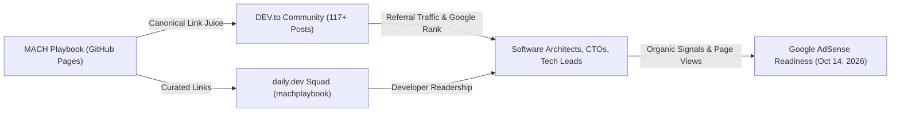
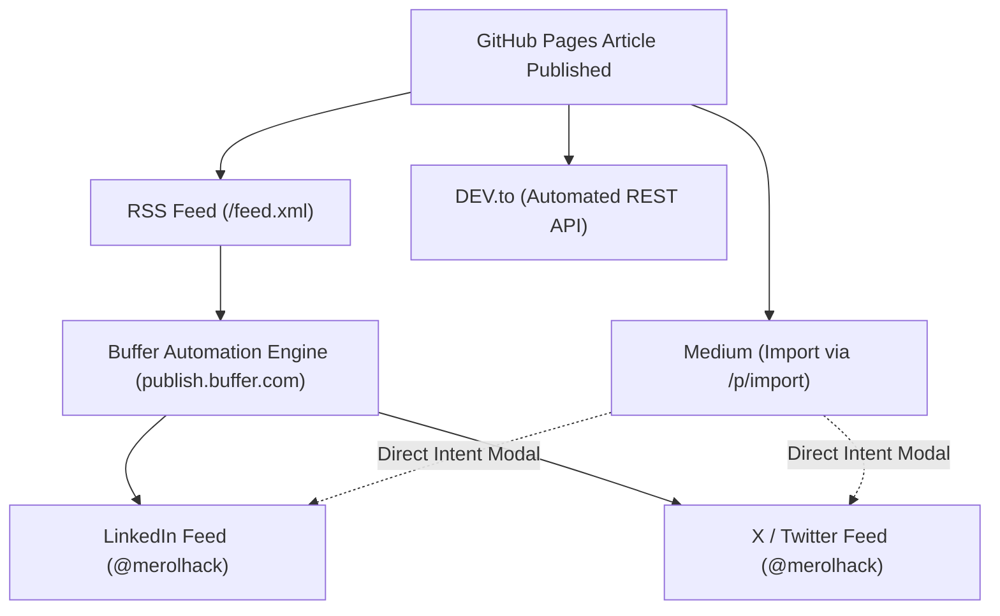

# Content Syndication & Multi-Platform Distribution Architecture

> **MANDATORY DIRECTIVE**:  
> All automated syndication mechanisms MUST strictly preserve the primary canonical URL (`canonical_url: https://mach-playbook.github.io/posts/{slug}/`). Any syndication that lacks canonical protection risks Google search duplication penalties and damages primary domain authority.

---

## 1. Architectural Strategy & Motivation

Google AdSense review rejections citing **"Low value content"** often stem not from article depth or code quality, but from a deficit of external organic traffic signals, human engagement, and community interaction. For a technical publication hosted on GitHub Pages (`mach-playbook.github.io`), developer community syndication solves three critical objectives:



1. **E-E-A-T & Authority Building**: Establishing author presence (`@merolhack`) across reputable developer hubs creates cross-domain citation graph signals.
2. **Organic Commercial Traffic**: Attracting senior engineers, cloud architects, and CTOs interested in MACH (Microservices, API-first, Cloud-native, Headless).
3. **100% SEO Canonical Protection**: Every syndicated article explicitly declares `mach-playbook.github.io` as the original source via standard `<link rel="canonical">` metadata, transferring search engine rank back to the root blog.

---

## 2. DEV.to Syndication Engine (`scripts/publish_to_devto.py`)

### 2.1 Technical Specifications

- **Endpoint**: `https://dev.to/api/articles` (REST API v0/v1)
- **Authentication**: Custom HTTP header `api-key: <DEVTO_API_KEY>`
- **Local State Tracking**: `.devto_synced.json` (stores post mapping, remote DEV.to ID, article URL, canonical URL, and timestamp)
- **Cost**: **$0 USD (100% Free)**

### 2.2 Core Features & Constraints

1. **Canonical URL Calculation**:
   Extracts Jekyll filename pattern `YYYY-MM-DD-{slug}.md` and injects:
   ```python
   canonical_url = f"https://mach-playbook.github.io/posts/{slug}/"
   ```
2. **Tag Normalization & Sanitization**:
   DEV.to enforces strict tag constraints: maximum of 4 tags, alphanumeric characters only (no spaces, hyphens, or special accents). The parser sanitizes and filters frontmatter tags automatically:
   ```python
   clean_tags = []
   for t in raw_tags:
       sanitized = re.sub(r"[^a-zA-Z0-9]", "", str(t)).lower()
       if sanitized and sanitized not in clean_tags:
           clean_tags.append(sanitized)
       if len(clean_tags) >= 4:
           break
   ```
3. **Adaptive Rate-Limit Resilience (HTTP 429)**:
   DEV.to enforces a rate limit threshold (~30 requests / 30 seconds). The publishing engine includes an adaptive backoff loop:
   - Baseline delay: 3.0 seconds between consecutive posts.
   - On `HTTP 429 Too Many Requests`: automatically pauses execution for 32 seconds and retries up to 4 times without process failure.

### 2.3 Historical Backfill Status

- **Total Local Posts Analyzed**: 117 articles
- **Articles Successfully Syndicated**: 117 / 117 (100%)
- **Status Ledger**: All 117 records committed in `.devto_synced.json`
- **Execution Command**:
  ```bash
  python3 scripts/publish_to_devto.py --api-key "$DEVTO_API_KEY" --all
  ```

---

## 3. GitHub Actions CI/CD Syndication Pipeline

Every newly generated daily post published by the autonomous agent (`scripts/publish_daily_jekyll_post.py`) is syndicated immediately to DEV.to.

### 3.1 Workflow Configuration (`.github/workflows/daily-blog-post.yml`)

```yaml
      - name: Syndicate to DEV.to
        if: "${{ github.event.inputs.dry_run != 'true' && env.DEVTO_API_KEY != '' }}"
        env:
          DEVTO_API_KEY: ${{ secrets.DEVTO_API_KEY }}
          GITHUB_TOKEN: ${{ secrets.GH_PAT || secrets.GITHUB_TOKEN }}
        run: |
          echo "Starting automatic syndication to DEV.to..."
          python3 scripts/publish_to_devto.py
          git config --global user.name 'github-actions[bot]'
          git config --global user.email 'github-actions[bot]@users.noreply.github.com'
          git add .devto_synced.json
          if ! git diff --cached --quiet; then
            git commit -m "chore(syndication): update dev.to sync registry [skip ci]"
            git pull --rebase origin main
            git push origin main
            echo "DEV.to syndication logged and pushed."
          else
            echo "No syndication changes to commit."
          fi
```

### 3.2 Critical Repository Secrets Gotcha

> [!CAUTION]
> **Repository Scope Verification**:
> GitHub Secrets are strictly scoped per repository. The secret `DEVTO_API_KEY` must be saved in:
> **`https://github.com/mach-playbook/mach-playbook.github.io/settings/secrets/actions`**
> 
> Saving this secret in an unrelated personal repository (e.g., `merolhack/dqro.mx`) will NOT expose the secret to the MACH Playbook automated pipeline.

---

## 4. daily.dev Community Squad Integration

### 4.1 Architecture & Limitations

- **Platform URL**: [https://daily.dev/squads/machplaybook](https://daily.dev/squads/machplaybook)
- **Feed vs Squad Discrepancy**:
  - Direct RSS Feed integration (`/feed.xml`) on daily.dev requires an established reputation threshold or manual partner approval.
  - **The Squad Solution**: Creating a specialized community Squad (`machplaybook`) bypasses the reputation requirement, enabling immediate sharing of key articles, architecture tools, and release announcements.

### 4.2 Squad Best Practices

1. **Cover Banner & Avatar**: Use the high-resolution vector/PNG branding from `assets/img/favicons/android-chrome-512x512.png`.
2. **Pinned Resources**: Pin the main site [https://mach-playbook.github.io](https://mach-playbook.github.io) and the interactive tools hub [https://mach-playbook.github.io/tools/](https://mach-playbook.github.io/tools/).
3. **Cross-Linking**: Squad link is permanently integrated into `README.md` and `_tabs/resources.md`.

---

## 5. Hashnode Platform Investigation & Postmortem

During architectural evaluation of multi-platform syndication, Hashnode was thoroughly investigated:

### 5.1 Findings

1. **GraphQL API Deprecation & Redirection**:
   Requests to `https://gql.hashnode.com` returned `HTTP 301 Moved Permanently` pointing to an announcement regarding API modernization and migration.
2. **Paywall Lockout (Hashnode Pro)**:
   Both the programmatic publication GraphQL mutation and the bulk import dashboard (`/import`) are strictly gated behind **Hashnode Pro** ($19+/month paid plan).

### 5.2 Architectural Decision

In accordance with the project's strict **$0 budget constraint**, programmatic Hashnode syndication was intentionally **abandoned**. Focus is concentrated 100% on DEV.to REST API and daily.dev Squads, which offer zero-cost, high-velocity distribution.

---

## 6. Medium Syndication Protocol (`medium.com/p/import`)

### 6.1 Workflow & Canonical Attribution
- **Import Tool**: `https://medium.com/p/import`
- **Mechanism**: Single-URL crawl extracting title, text, code blocks, and companion images.
- **Canonical Preservation**: Medium automatically injects canonical metadata pointing back to `https://mach-playbook.github.io/posts/{slug}/` and appends an editorial footer:
  > *“Originally published at https://mach-playbook.github.io...”*
- **Recommended Tagging Strategy**: Use 5 high-intent technical tags (`Kubernetes`, `Security`, `DevOps`, `Software Architecture`, `Cloud`).
- **Published Live Post**: [Blindaje de Identidad Criptográfica en Kubernetes](https://medium.com/@merolhack/blindaje-de-identidad-criptogr%C3%A1fica-gobernanza-zero-trust-y-mtls-en-cl%C3%BAsteres-kubernetes-3fe5fbf6ca9c).

---

## 7. Social Media Amplification Architecture (LinkedIn, X & Buffer)



### 7.1 LinkedIn Sharing Protocol
- **Endpoint**: `https://www.linkedin.com/sharing/share-offsite/?url={target_url}`
- **Card Pre-rendering**: OpenGraph image, title, and site domain are extracted automatically.
- **Copy Structure**:
  1. Headline (problem and technical domain).
  2. Core technical themes (SPIFFE/SPIRE, mTLS, zero trust).
  3. Hashtags: `#Kubernetes #ZeroTrust #CloudArchitecture #DevOps #MACH`.
- **Live Verification**: Post successfully published on LinkedIn profile (Lenin José Meza Zarco).

### 7.2 X (Twitter) Sharing Protocol
- **Endpoint**: `https://twitter.com/intent/tweet?text={text}&url={target_url}`
- **Character Budget Optimization**: Under 280 characters with encoded title, 4 core tags, and link.
- **Live Verification**: Published and active in feed (`@merolhack`).

### 7.3 Buffer GraphQL API Automated Engine (`scripts/publish_to_buffer.py`)
Buffer acts as the programmatic API bridge between GitHub Actions and social networks via its new official GraphQL API:
- **Endpoint**: `https://api.buffer.com/graphql`
- **Auth**: `Authorization: Bearer <BUFFER_API_KEY>`
- **Organization**: `MACH Playbook` (ID: `6ac92ed28ee0d41b34aefac8`)
- **Connected Channels**:
  - **Twitter / X**: `@merolhack` (Channel ID: `6ac9378e6a5c39ccb6658af6`)
  - **LinkedIn**: `Lenin José Meza Zarco` (Channel ID: `6ac9375c6a5c39ccb66587b3`)
- **Script**: `scripts/publish_to_buffer.py`
- **Mutation Used**: `createPost(input: { channelId, text, mode: addToQueue, schedulingType: automatic, assets: [] })`
- **State Ledger**: `.buffer_synced.json` (avoids duplicate scheduling across runs)
- **CI/CD Integration**: Integrated into `.github/workflows/daily-blog-post.yml` triggered automatically if `BUFFER_API_KEY` is present in GitHub Secrets.

### 7.4 Social Rate Limits & Anti-Spam Governance
> [!WARNING]
> **Anti-Spam / Shadowban Constraint**:  
> Never bulk-post the 117 historical articles to X or LinkedIn simultaneously. Both platforms detect high-velocity automated posting and flag accounts for algorithmic shadowbans or account suspension.  
> **Rule**: Maintain a strict cadence of **1 post per day** aligned with the autonomous daily publishing schedule.


---

## 8. Verification & Monitoring Playbook

Verify syndication health locally at any time:

```bash
# 1. Verify all posts are recorded in sync ledger
python3 -c "import json; data=json.load(open('.devto_synced.json')); print(f'Synced articles: {len(data)}')"

# 2. Check for any pending or un-synced post
python3 scripts/publish_to_devto.py --api-key "$DEVTO_API_KEY" --all

# 3. Verify canonical headers on live DEV.to article
curl -sI "https://dev.to/merolhack/blindaje-de-identidad-criptografica-gobernanza-zero-trust-y-mtls-en-clusteres-kubernetes-k53" | grep -i "canonical"
```


