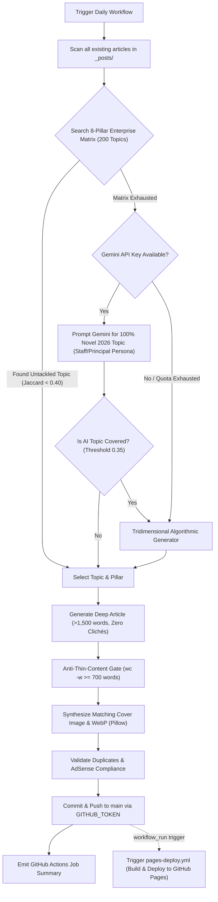

# Autonomous Daily Publishing Pipeline & Deduplication Engine

## 1. Pipeline Overview

- **Script**: `scripts/publish_daily_jekyll_post.py`
- **Workflow**: `.github/workflows/daily-blog-post.yml`
- **Schedule**: Daily at `13:00 UTC` (07:00 AM CDMX).
- **Core AI Model Fleet**: Google Gemini 3 fleet (`gemini-3.7-flash`, `gemini-3.6-flash`, `gemini-3.5-flash`, `gemini-3.1-flash-lite`, `gemini-flash-latest`) with autonomous local synthesis fallback when APIs are unavailable.

---

## 2. Topic Deduplication Engine & 200+ Enterprise Matrix

To avoid Google AdSense "Low-value content" violations and ensure fresh, diverse architectural coverage, `publish_daily_jekyll_post.py` employs an expanded **8-Pillar Enterprise Matrix (200 Topics)** and a 3-tier selection engine:



### The 8 Enterprise Architecture Pillars (25 Topics Each = 200 Total)
1. **Microservicios & Cloud Native**: Cell-based architecture, eBPF/Cilium, Dapr, KEDA, LitmusChaos, reactive streams, multi-region active-active.
2. **API-First & Integraciones Distribuidas**: Apollo Federation v2, OpenAPI 3.1 schema validation, HMAC webhooks, gRPC/Protobuf, Event Mesh.
3. **Headless & Frontend Moderno**: Edge caching/purging, React Server Components, hybrid SSG/ISR, offline-first PWAs, WCAG 2.2 AA.
4. **Composable Commerce & Transición**: Strangler Fig on legacy ERP/monoliths, multi-acquirer checkout, distributed OMS, reverse logistics PBCs.
5. **Consistencia de Datos & Transaccionalidad Multi-SaaS**: Outbox pattern, CDC with Debezium, Vector Clocks, Read-Your-Own-Writes, dual-write prevention.
6. **Operaciones Día 2, Observabilidad & Resiliencia**: W3C TraceContext propagation, high-cardinality metrics, blameless post-mortems, error budgets.
7. **FinOps, Unit Economics & Gestión Multi-Vendor**: Cost per API call, network egress optimization, multi-vendor billing sprawl, build vs buy vs compose.
8. **Seguridad Zero Trust & AI Composable**: SPIFFE/SPIRE mTLS, OWASP API Top 10 mitigation, autonomous AI agents consuming OpenAPI/GraphQL, Turnstile bot defense.

### Jaccard Keyword Similarity & Anti-Repetition Rules
Instead of naive word matching, the engine strips common stop words and computes set similarity:

$$\text{Similarity}(A, B) = \frac{|\text{Keywords}(A) \cap \text{Keywords}(B)|}{|\text{Keywords}(A) \cup \text{Keywords}(B)|}$$

A candidate topic is rejected if:
1. Its sanitized slug matches an existing slug exactly.
2. Its keyword similarity with any existing title or slug exceeds `0.40`.
3. Banned introductory clichés are strictly forbidden (e.g., glossary definitions of MACH or repetitive title formulas like *"Estrategias de..."*).

### Tridimensional Algorithmic Fallback
When Gemini AI is offline and the static matrix is exhausted, the generator dynamically intersects:
$$\mathbf{\text{Padrón / Capacidad Core}} \times \mathbf{\text{Problema Técnico en Producción}} \times \mathbf{\text{Contexto Enterprise / Industria}}$$
- **Rule**: Every combination is dynamically checked against all historical posts. The hardcoded repetitive string `Edición YYYYMMDD` is **strictly prohibited**.


---


### CI/CD Deployment Automation & Continuous Pages Delivery
To prevent production freeze and ensure every article is immediately available to search engine and AdSense crawlers:
1. **Pillow Dependency**: Declared in `requirements.txt` (`Pillow>=10.0.0`) so CI runners never fail during WebP companion generation.
2. **Anti-Thin-Content Quality Gate**: The publishing workflow checks `wc -w < 700` before git commit; thin articles are blocked with `exit 1`.
3. **Automated `workflow_run` Trigger**: `.github/workflows/pages-deploy.yml` listens for `completed` events from `Autonomous Daily Blog Post Agent`. This bypasses GitHub's default recursive trigger block on `GITHUB_TOKEN` pushes, ensuring that Jekyll automatically compiles and deploys each daily post to GitHub Pages.
4. **Job Summary Observability**: Each execution logs a Markdown report into the GitHub Actions run summary displaying the published post slug, date, and URL.

---

## 3. Workflow CLI Usage

Run dry-run tests locally without modifying git:
```bash
# Dry run with automatic topic selection
python3 scripts/publish_daily_jekyll_post.py --dry-run

# Force a specific manual topic
python3 scripts/publish_daily_jekyll_post.py --topic "eBPF y Cilium en Arquitecturas Cloud-Native" --dry-run

# Run with custom language
python3 scripts/publish_daily_jekyll_post.py --lang en --dry-run
```
